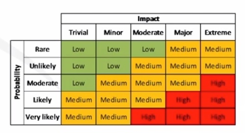

# Domain 5: Risk Management

1. Explain the importance of policies, plans and procedures related to organizational security.
2. Summarize business impact analysis concepts.
3. Explain risk management processes and concepts.

--- --- --- --- --- --- --- --- --- --- --- --- --- --- --- --- --- --- --- --- --- --- --- --- --- --- --- --- --- --- 

## 1. Policies, Plans & Procedures

* Policies
  * Document Types
  * Elements
  * Common policies
* Procedures (SOP: Standard Operating Procedure)
  * Agreements
  * Personal Management

### Policies

Policies form the foundation of any security program.

* How IT will approach security
* How users approach security
* How certain situations will be handled

#### Policy Document Types

* __Policies__: general management rules.
* __Standards__: specific mandatory controls, based on a given policy.
* __Guidelines__: recommendation or good practices.
* __Procedures__: instructions on how to implement a policy or standard.

#### Policy Elements

* Overview
* Purpose
* Scope
* Target Audience
* Definitions
* Version
* Implementation Date
* Compliance / Exceptions
* Policy Statements

#### Common Policies

* Acceptable Use Policy (AUP)
* Access
* Authentication
* Backup & Recovery
* Data Classification
* Email / Messaging
* Social Media
* Physical Security
* Incident Response
* Mobile Device
* Network Security (Wireless, Remote)

### Procedures (SOP: Standard Operating Procedure)

Standard set of instructions for workers to carry out routine operations. Aim to achieve efficiency and consistent output.

#### Agreements

* __Non-Disclosure Agreement (NDA)__: protects against sensitive information disclosure.
* __Business Partner Agreement (BPA)__: specifies partner financial and dfiduciary responsibilities (profit sharing).
* __Service-level Agreement (SLA)__: specifies nature and level of service by a provider (uptime).
* __Memorandum of Understanding (MOU)__ and __Memorandum of Agreement (MOA)__: outlines the terms and details of an agreement.
* __Interconnection Security Agreement (ISA)__.

#### Personnel Management

* Mandatory vacations
* Job rotation
* Separation of duties
* Clean desk
* Role-based awareness training (based on job responsibilities)
* Continuing education

--- --- --- --- --- --- --- --- --- --- --- --- --- --- --- --- --- --- --- --- --- --- --- --- --- --- --- --- --- --- 

## 2. Business Impact Analysis

* The process of evaluating all of the critical systems (important to core business functions) in an organization to define impact and recovery plans.
* Determining the potential impacts (costs, resources, time) resulting from the interruption of time-sensitive or critcal business processes.
* Identify crtical business functions, systems, services, and technologies along with the cost associated with their loss and the maximum acceptable outage period.

### Critical Functions

Mission-essential functions, roles, services, systems, applications or data required to sustain business.

1. Identification & Analysis
2. Prioritization
3. Calcuating a timeframe for critical system loss
4. Estimating the tangible and intangible impact on the organization

### Single Point of Failure

* One fault or malfunction can compromise an entire system or enterprise
* Can be people or technology
* Are avoided with redundancy and fault-tolerant protocols/procedures (HA - High Availability)

### Recovery Objectives

* __RTO__: maximum amount of time that a process or service is allowed to be down and the consequences still to be considered acceptable.
* __RPO__: point last known good data prior to an uotage that is used to recover systems.

### Average time measurement

* __Mean Time To Failure (MTTF)__: Average time to failure for a nonrepairable system. Represents how long a product can reasonably be expected to perform, based on specific testing.
* __Mean Time Between Failures (MTBF)__: Measure of the anticipated incidence of failure for a system or component.
* __Mean Time to Recovery/Restore/Repair (MTTR)__: Average time required to repair a failed system, device, or component, and return it to operational status.

### Privacy Assessments

* __Personally Identifiable Information (PII)__: Information that can be used to distinguish or trace an individual's identity, such as name, social security number, biometric records, etc. Alone, or when combined with other personal or identifying information that is linked or linkable to a specific individual, such as date and place of birth, mother's maiden name, etc. (NIST)

* __Personal Health Information (PHI)__.

* __Privacy Impact Assessment (PIA)__: identifies the adverse impacts that can be associated with the destruction, loss, corruption, or accidental disclosure of sensitive, personal or private data for the organization. Required for any organization that collects, uses, stores, or porcesses PII or PHI.

* __Privacy Treshold Assessment (PTA)__: Determines whether a system contains PII or PHI.

--- --- --- --- --- --- --- --- --- --- --- --- --- --- --- --- --- --- --- --- --- --- --- --- --- --- --- --- --- --- 

## 3. Risk Management

* Risk & Threat Defintions
* Threat Assessment
* Risk Assessment Process
  * Quantitative vs Qualitative
* Risk Response / Strategies
* Risk Register
* Supply Chain Assessments
* Change Management
* Testing

### Definitions

Check [NIST Glossary](https://csrc.nist.gov/glossary).

* __Risk__: Level of impact on organizational operations (mission, functions, image or reputation), organizational assets, or individuals resulting from the operation of an information system given the potential impact of a threat and the likelihood of that threat ocurring.

* __Threat__: Any circumstance or event with the potential to adversely impact organizational operations, assets, or individuals through an information system via unauthorized access, destruction, dissclosure, modification of information, and/or denial of service. Also, the potential for a threat-source to successfully exploit a particular information system vulnerability.

* __Impact__: Magnitude of harm that can be expected to result from the consequences of a threat ocurring.

* __Vulnerability__: Weakness in an information system, security procedures, internal controls, or implementation, that could be exploited or triggered by a threat source.

* __Exploit__: Piece of software, chunk of data, or sequence of commands, that takes advantage of a bug or vulnerability, to cause unintended or unanticipated behavior to occur on a system.

* __Risk Assessment/Analysis__: Process of identifying risks to organizational operations, assets, individuals, other organizations, and nations, resulting from the operation of an information system. Part of risk management, incorporates threat and vulnerability analysis, and considers mitigations provided by security controls planned or in place.
  * Also known as _Risk Analysis_ or _Risk Calculation_.

* __Risk Management__: Process of managing risks resulting from the operation of an information system, includes:
  * Conduct of a Risk Assessment
  * Implementation of a Risk Mitigation Strategy
  * Employment of techniques and procedures for the continuous monitoring of the security state of the information system. 

### Threat Assessment

Structured process used to identify and evaluate various risks or threats that an organization might be exposed to.

* __Threat Agent / Source__: intent and method targeted at the intentional exploitation of a vulnerability or a situation hat may accidentally exploit a vulnerability.
* __Threat Vector__: method or path a threat uses to access a target.

#### Threat Assessment Types

* __Environmental__: natural events, such as wheather, storms, flooding, earthquakes, fire, etc.
* __Manmade__: human cause, such as flooding, fire, accidents, etc.
* __Internal vs External__: origin of the threat source, is the threat agent inside your organization?

### Risk Assessment Process

1. Identify assets
2. Identify associated threats & vulnerabilities
3. Determine likelihood of explit or compromise
4. Determine impact of exploit or compromise
5. Prioritize risk activities / security controls

#### Quantitative vs Qualitative Risk Analysis

* __Qualitative__
  * Estimating risk values (likelihood & impact).
  * Normally using a scale (1-5).
    * Impact: trivial, minor, moderate, major, extreme.
    * Probability: rare, unlikely, moderate, likely, very likely.
* __Quantitative__
  * Using real numeric values to calculate risk equation.
  * Return on Investment (ROI) / Return on Security Investment (ROSI).
  * Formula: `SLE x ARO = ALE`.
    * _SLE (Single Loss Expectancy)_: how much you could expect to lose at any one time.
      * _AV (asset value)_: value of item.
      * _EF (exposure factor)_: percentage of loss.
    * _ARO (Annualized rate of ocurrence)_: likelihood, often drawn from historical data, of an event ocurring within a year.
    * _ALE (Annual loss expectancy)_: monetary measure of how much loss you could expect in a year.

### Risk Response / Strategies

* __Avoidance__: deciding not to engage in the actions associated with that risk.
* __Transfer__: sharing the burden of the risk with another party (_insurance_).
* __Mitigation__: taking steps to reduce the likelihood or impact of a risk.
* __Acceptance__: choosing consciously to live with a risk.

### Risk Register

* Recording information about an identified risk.
* Can be specialized software program, cloud service, or master document.
* Contains details about the risks, risk decisions, mitigating controls, risk owner, time frames, residual risk, etc.
* Ensures organization risk tolerance / appetite is aligned.

### Supply Chain Assessments

* Aka Third-Party assessments.
* Review vendor's security posture.
* Any organization connected to yours virtual or physical.

### Change Management

* Change (IT) such as addition, removal, or altering of environment, should be managed.
* Change management seeks to allow for change without disruption, or with only minimal disruption, to systems and services.
* Need to reassess security risks with any change.

### Testing

* Part of the Risk Analysis process.
* Provides visibility into the risk components.
* Vulnerability assessments.
* Pentration tests.