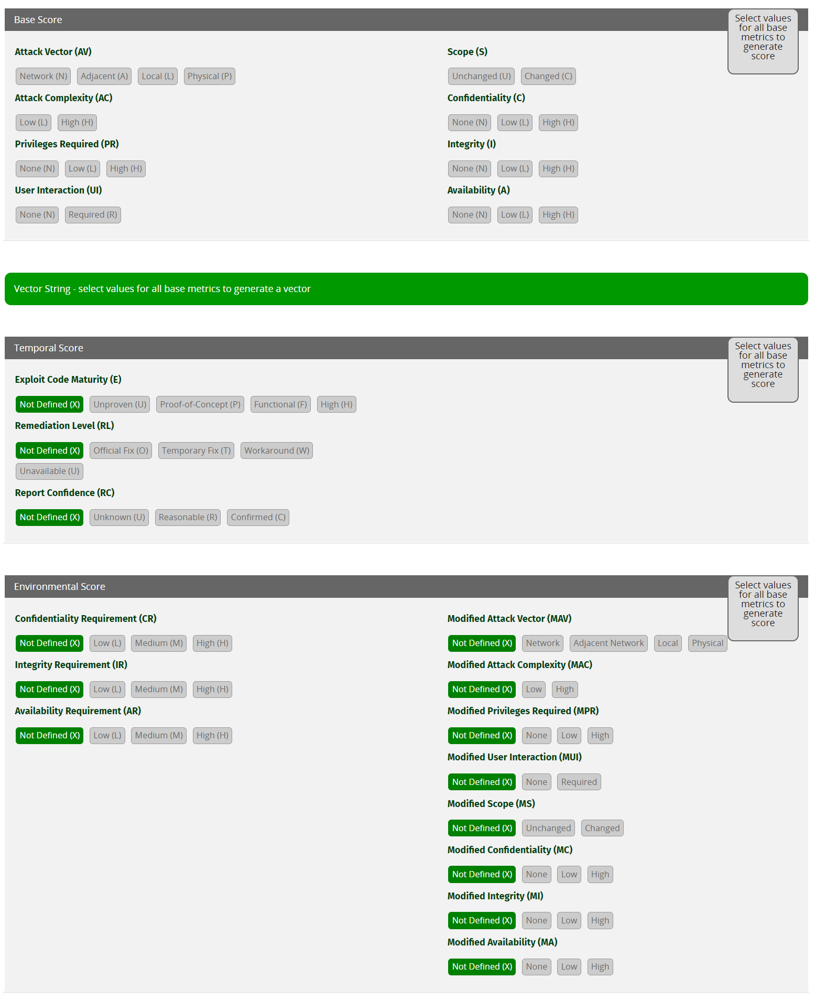

# CWE and CVSS

## CWE

MITRE describes [Common Weaknesses Enumeration (CWE)](https://cwe.mitre.org/) as a community-developed list of common software and hardware security weaknesses. It serves as a common language, a measuring stick for security tools, and as a baseline for weakness identification, mitigation, and prevention efforts.

For example:

- Stored XSS: [CWE-79: Improper Neutralization of Input During Web Page Generation ('Cross-site Scripting')](https://cwe.mitre.org/data/definitions/79.html).
- CSRF: [CWE-352: Cross-Site Request Forgery (CSRF)](https://cwe.mitre.org/data/definitions/352.html).
- RCE: [CWE-502: Deserialization of Untrusted Data](https://cwe.mitre.org/data/definitions/502.html).

## CVSS

When it comes to communicating the severity of an identified vulnerability, then [Common Vulnerability Scoring System (CVSS)](https://www.first.org/cvss/) is the industry standard for doing so. CVSS attempts to assign severity scores to vulnerabilities, allowing responders to prioritize responses and resources according to threat.

### CVSS calculator

We can use the [CVSS v3.1 calculator](https://www.first.org/cvss/calculator/3.1) to identify the severity of an identified vulnerability.

Consider the `Base Score` area:

#### Attack vector (AV)

Shows how the vulnerability can be exploited.

- `Network (N)`: Attackers can only exploit this vulnerability through the network layer (remotely exploitable).
- `Adjacent (A)`: Attackers can only exploit this vulnerability through the adjacent physical or logical network (e.g. Bluetooth, Wi-Fi, VPN, etc.).
- `Local (L)`: Attackers can exploit this vulnerability only by accessing the target system locally (e.g., keyboard, terminal, etc.) or remotely (e.g., SSH) or through user interaction.
- `Physical (P)`: Attackers can exploit this vulnerability through physical interaction/manipulation.

#### Attack complexity (AC)

Depicts the conditions beyond the attackers' control and must be present to exploit the vulnerability successfully.

- `Low (L)`: No special preparations should take place to exploit the vulnerability successfully. The attackers can exploit the vulnerability repeatedly without any issue.
- `High (H)`: Special preparations and information gathering should take place to exploit the vulnerability successfully.

#### Privileges required (PR)

Show the level of privileges the attacker must have to exploit the vulnerability successfully.

- `None (N)`: No special access related to settings or files is required. It can be exploited from an unauthorized perspective.
- `Low (L)`: Attackers should posses standard user privileges to exploit the vulnerability successfully. The exploitation usually affects files and settings owned by a user or non-sensitive assets.
- `High (H)`: Attackers should possess admin-level privileges. The exploitation usually affects the entire vulnerable system.

#### User interaction (UI)

Shows if attackers can successfully exploit the vulnerability on their own or user interaction is required.

- `None (N)`: Attackers can successfully exploit the vulnerability independently.
- `Required (R)`: A user should take some action before the attackers can successfully exploit the vulnerability.

#### Scope (S)

Shows if successful exploitation of the vulnerability can affect components other than the affected one.

- `Unchanged (U)`: Successful exploitation affects the vulnerable component or resources managed by the same security authority.
- `Changed (C)`: Successful exploitation can affect components other than the affected one or resources beyond the scope of the affected component's security authority.

#### Confidentiality (C)

Shows how much the vulnerable component's confidentiality is affected upon successfully exploiting the vulnerability. Confidentiality limits information access and disclosure to authorized users only and prevents unauthorized users from accessing information.

- `None (N)`: Confidentiality of the vulnerable component does not get impacted.
- `Low (L)`: Vulnerable component will experience some loss of confidentiality upon successful exploitation. Attackers do not have control over what information is obtained.
- `High (H)`: Vulnerable component will experience total (or serious) loss of confidentiality upon successful exploitation. Attackers have total (or some) control over what information is obtained.

#### Integrity (I)

Shows how much the vulnerable component's integrity is affected upon successfully exploiting the vulnerability. Integrity refers to the trustworthiness and veracity of information.

- `None (N)`: Integrity of the vulnerable component does not get impacted.
- `Low (L)`: Attackers can modify data in a limited manner on the vulnerable component upon successfully exploiting the vulnerability. Attackers do not have control over the consequence of a modification, and the vulnerable component does not get seriously affected in this case.
- `High (H)`: Attackers can modify all or critical data on the vulnerable component upon successfully exploiting the vulnerability. Attackers have control over the consequence of a modification, and the vulnerable component will experience a total loss of integrity.

#### Availability (A)

Shows how much the vulnerable component's availability is affected upon successfully exploiting the vulnerability. Availability refers to the accessibility of information resources in terms of network bandwidth, disk space, processor cycles, etc.

- `None (N)`: Availability of the vulnerable component does not get impacted.
- `Low (L)`:  The vulnerable component will experience some loss of availability upon successfully exploiting the vulnerability. The attacker does not have complete control over the vulnerable component's availability and cannot deny the service to users, and performance is just reduced.
- `High (H)`: The vulnerable component will experience total (or severe) availability loss upon successfully exploiting the vulnerability. The attacker has complete (or significant) control over the vulnerable component's availability and can deny the service to users. Performance is significantly reduced.
