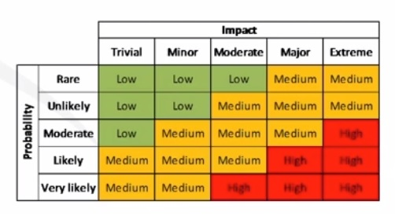

# Domain 5: Risk Management

1. Explain the importance of policies, plans and procedures related to organizational security.
2. Summarize business impact analysis concepts.
3. Explain risk management processes and concepts.
4. Given a scenario, follow incident response procedures.
5. Summarize basic concepts of forensics.
6. Explain disaster recovery and continuity of operations concepts.
7. Compare and contrast various types of controls.
8. Given a scenario, carry out data security and privacy practices.

--- --- --- --- --- --- --- --- --- --- --- --- --- --- --- --- --- --- --- --- --- --- --- --- --- --- --- --- --- --- 

## 1. Policies, Plans & Procedures

* Policies
  * Document Types
  * Elements
  * Common policies
* Procedures (SOP: Standard Operating Procedure)
  * Agreements
  * Personal Management

### Policies

Policies form the foundation of any security program.

* How IT will approach security
* How users approach security
* How certain situations will be handled

#### Policy Document Types

* __Policies__: general management rules.
* __Standards__: specific mandatory controls, based on a given policy.
* __Guidelines__: recommendation or good practices.
* __Procedures__: instructions on how to implement a policy or standard.

#### Policy Elements

* Overview
* Purpose
* Scope
* Target Audience
* Definitions
* Version
* Implementation Date
* Compliance / Exceptions
* Policy Statements

#### Common Policies

* Acceptable Use Policy (AUP)
* Access
* Authentication
* Backup & Recovery
* Data Classification
* Email / Messaging
* Social Media
* Physical Security
* Incident Response
* Mobile Device
* Network Security (Wireless, Remote)

### Procedures (SOP: Standard Operating Procedure)

Standard set of instructions for workers to carry out routine operations. Aim to achieve efficiency and consistent output.

#### Agreements

* __Non-Disclosure Agreement (NDA)__: protects against sensitive information disclosure.
* __Business Partner Agreement (BPA)__: specifies partner financial and dfiduciary responsibilities (profit sharing).
* __Service-level Agreement (SLA)__: specifies nature and level of service by a provider (uptime).
* __Memorandum of Understanding (MOU)__ and __Memorandum of Agreement (MOA)__: outlines the terms and details of an agreement.
* __Interconnection Security Agreement (ISA)__.

#### Personnel Management

* Mandatory vacations
* Job rotation
* Separation of duties
* Clean desk
* Role-based awareness training (based on job responsibilities)
* Continuing education

--- --- --- --- --- --- --- --- --- --- --- --- --- --- --- --- --- --- --- --- --- --- --- --- --- --- --- --- --- --- 

## 2. Business Impact Analysis

* The process of evaluating all of the critical systems (important to core business functions) in an organization to define impact and recovery plans.
* Determining the potential impacts (costs, resources, time) resulting from the interruption of time-sensitive or critcal business processes.
* Identify crtical business functions, systems, services, and technologies along with the cost associated with their loss and the maximum acceptable outage period.

### Critical Functions

Mission-essential functions, roles, services, systems, applications or data required to sustain business.

1. Identification & Analysis
2. Prioritization
3. Calcuating a timeframe for critical system loss
4. Estimating the tangible and intangible impact on the organization

### Single Point of Failure

* One fault or malfunction can compromise an entire system or enterprise
* Can be people or technology
* Are avoided with redundancy and fault-tolerant protocols/procedures (HA - High Availability)

### Recovery Objectives

* __RTO__: maximum amount of time that a process or service is allowed to be down and the consequences still to be considered acceptable.
* __RPO__: point last known good data prior to an uotage that is used to recover systems.

### Average time measurement

* __Mean Time To Failure (MTTF)__: Average time to failure for a nonrepairable system. Represents how long a product can reasonably be expected to perform, based on specific testing.
* __Mean Time Between Failures (MTBF)__: Measure of the anticipated incidence of failure for a system or component.
* __Mean Time to Recovery/Restore/Repair (MTTR)__: Average time required to repair a failed system, device, or component, and return it to operational status.

### Privacy Assessments

* __Personally Identifiable Information (PII)__: Information that can be used to distinguish or trace an individual's identity, such as name, social security number, biometric records, etc. Alone, or when combined with other personal or identifying information that is linked or linkable to a specific individual, such as date and place of birth, mother's maiden name, etc. (NIST)

* __Personal Health Information (PHI)__.

* __Privacy Impact Assessment (PIA)__: identifies the adverse impacts that can be associated with the destruction, loss, corruption, or accidental disclosure of sensitive, personal or private data for the organization. Required for any organization that collects, uses, stores, or porcesses PII or PHI.

* __Privacy Treshold Assessment (PTA)__: Determines whether a system contains PII or PHI.

--- --- --- --- --- --- --- --- --- --- --- --- --- --- --- --- --- --- --- --- --- --- --- --- --- --- --- --- --- --- 

## 3. Risk Management

* Risk & Threat Defintions
* Threat Assessment
* Risk Assessment Process
  * Quantitative vs Qualitative
* Risk Response / Strategies
* Risk Register
* Supply Chain Assessments
* Change Management
* Testing

### Definitions

Check [NIST Glossary](https://csrc.nist.gov/glossary).

* __Risk__: Level of impact on organizational operations (mission, functions, image or reputation), organizational assets, or individuals resulting from the operation of an information system given the potential impact of a threat and the likelihood of that threat ocurring.

* __Threat__: Any circumstance or event with the potential to adversely impact organizational operations, assets, or individuals through an information system via unauthorized access, destruction, dissclosure, modification of information, and/or denial of service. Also, the potential for a threat-source to successfully exploit a particular information system vulnerability.

* __Impact__: Magnitude of harm that can be expected to result from the consequences of a threat ocurring.

* __Vulnerability__: Weakness in an information system, security procedures, internal controls, or implementation, that could be exploited or triggered by a threat source.

* __Exploit__: Piece of software, chunk of data, or sequence of commands, that takes advantage of a bug or vulnerability, to cause unintended or unanticipated behavior to occur on a system.

* __Risk Assessment/Analysis__: Process of identifying risks to organizational operations, assets, individuals, other organizations, and nations, resulting from the operation of an information system. Part of risk management, incorporates threat and vulnerability analysis, and considers mitigations provided by security controls planned or in place.
  * Also known as _Risk Analysis_ or _Risk Calculation_.

* __Risk Management__: Process of managing risks resulting from the operation of an information system, includes:
  * Conduct of a Risk Assessment
  * Implementation of a Risk Mitigation Strategy
  * Employment of techniques and procedures for the continuous monitoring of the security state of the information system. 

### Threat Assessment

Structured process used to identify and evaluate various risks or threats that an organization might be exposed to.

* __Threat Agent / Source__: intent and method targeted at the intentional exploitation of a vulnerability or a situation hat may accidentally exploit a vulnerability.
* __Threat Vector__: method or path a threat uses to access a target.

#### Threat Assessment Types

* __Environmental__: natural events, such as wheather, storms, flooding, earthquakes, fire, etc.
* __Manmade__: human cause, such as flooding, fire, accidents, etc.
* __Internal vs External__: origin of the threat source, is the threat agent inside your organization?

### Risk Assessment Process

1. Identify assets
2. Identify associated threats & vulnerabilities
3. Determine likelihood of exploit or compromise
4. Determine impact of exploit or compromise
5. Prioritize risk activities / security controls

#### Quantitative vs Qualitative Risk Analysis

* __Qualitative__
  * Estimating risk values (likelihood & impact).
  * Normally using a scale (1-5).
    * Impact: trivial, minor, moderate, major, extreme.
    * Probability: rare, unlikely, moderate, likely, very likely.
* __Quantitative__
  * Using real numeric values to calculate risk equation.
  * Return on Investment (ROI) / Return on Security Investment (ROSI).
  * Formula: `SLE x ARO = ALE`.
    * _SLE (Single Loss Expectancy)_: how much you could expect to lose at any one time.
      * _AV (asset value)_: value of item.
      * _EF (exposure factor)_: percentage of loss.
    * _ARO (Annualized rate of ocurrence)_: likelihood, often drawn from historical data, of an event ocurring within a year.
    * _ALE (Annual loss expectancy)_: monetary measure of how much loss you could expect in a year.

### Risk Response / Strategies

* __Avoidance__: deciding not to engage in the actions associated with that risk.
* __Transfer__: sharing the burden of the risk with another party (_insurance_).
* __Mitigation__: taking steps to reduce the likelihood or impact of a risk.
* __Acceptance__: choosing consciously to live with a risk.

### Risk Register

* Recording information about an identified risk.
* Can be specialized software program, cloud service, or master document.
* Contains details about the risks, risk decisions, mitigating controls, risk owner, time frames, residual risk, etc.
* Ensures organization risk tolerance / appetite is aligned.

### Supply Chain Assessments

* Aka Third-Party assessments.
* Review vendor's security posture.
* Any organization connected to yours virtual or physical.

### Change Management

* Change (IT) such as addition, removal, or altering of environment, should be managed.
* Change management seeks to allow for change without disruption, or with only minimal disruption, to systems and services.
* Need to reassess security risks with any change.

### Testing

* Part of the Risk Analysis process.
* Provides visibility into the risk components.
* Vulnerability assessments.
* Pentration tests.

--- --- --- --- --- --- --- --- --- --- --- --- --- --- --- --- --- --- --- --- --- --- --- --- --- --- --- --- --- --- 

## 4. Incident Response

__Incident__ (NIST) is an ocurrence that actually or potentially jeopardizes the confidentiality, integrity, or availability of an information system or the information the system processes, stores, or transmits, or that constitutes a violation or inminent threat of violation of security policies, procedures, or use policies.

It can be conceived as an unplanned disruption or degration of a service.

* Incident Response Process
* Incident Response Plan
* Cyber Incident Response Teams
* Reporting requirements/escalation
* Training
* Incident Preparation
* Incident Detection/Identification/Analysis
* Incident Containment
* Eradication
* Incident Recovery
* Post Incident

### NIST Incident Response Process

1. Preparation
2. Detection & Analysis
3. Containment, Erradication & Recovery (go back to 2 if needed)
4. Post Incident Activity (go back to 1)

### Incident Response Plan (IRP)

Documentation of a predetermined set of instructions or procedures to detect, respond to, and limit consequences of a malicious attack against an organization's information system(s).

NIST _Computer Security Incident Handling Guide (SP 800-61)_ provides guidance on exact elements to include:

* Mission, strategies, and goals of incident response.
* Senior management aproval.
* Approach to incident response.
* Resposne team communications.
* Metrics for measuring response capabilities and effectiveness.
* Roadmap for maturing response capability.
* How the incident response program fits into the organization.
* Document incident types/category definitions
  * Natural
  * Mechanical
  * Accidental / Human error
  * Malicious / Compromise
  * Policy violation
* Roles & responsibilities
  * Granting clear authority for actions to be taken during an incident.
  * Who can / does perform IRP activities:
    * Incident alerting
    * Identification / Triage
    * Decisions making (organizational executive)
    * Equipment collection / confiscation
    * Forensics (independence / segregation of duties)
    * Repair / Recovery
    * Reporting
    * Communicating

### Cyber-incident Response Teams

* Computer Emergency Response Team (CERT)
* Cyber Incident Response Team (CIRT)
* Computer Security Incident Response Team (CSIRT)

#### Types

* Formalized, standing or ad-hoc
* Internal or external
* Central, distributed or coordinating

#### Personnel

* Systems, network, database administrators
* Legal
* HR
* Management

### Reporting requirements/escalation

* Documents
* Included in many help desk systems
* Collecting evidence (physical, virtual, etc)
* Reporting / disclosing to:
  * Internal Management (Legal, HR, CEO, CFO)
  * Legal authorities, law enforcment (local, international)
  * Affected organizations, clients or costumers
  * CERT (www.cert.org)
  * Internet Crime Complaint Center (IC3, www.ic3.org)
  * Insurance

### Testing, exercises & training

* Be prepared
* Prepare each role with training
* Practice using real world scenarios
* Test systems and processes to find issues

### Incident Preparation

* Creating the Incident Response Plan
* Hardware / Software / Communications
* Testing & exercises
* Creating checklists (technical, procedures, contacts)

### Incident Detection/Identification/Analysis

* Alerting
  * Logs (IDS, SIEM, AV)
  * Humans
* Incident triage / validation
* Determine incident scope
  * What and who is affected
  * Identification of incident type (system, data, personnel, etc)
* Analysis, impact and recoverability effort
* Escalation
* Documentation & Notification

### Incident Containment

* Ensuring incident doesn't continue or spread
* Securing scene, limitating access, isolating systems (quarantine)
  * Physical
  * Network
  * Logical
* Gathering evidence

### Eradication

* Find and eliminate root cause
* AV clean-up
* Patching/updating software
* Re-imaging systems
* Restoring from backup

### Incident Recovery

Process of restoring and returning affected systems and devices back into your business environment.

* Repair
  * Restoring from backup
  * Patching
  * Hardening systems
  * Access control
  * Authentication
* Procedural changes
* Documentation

### Post Incident

* Lessons learned
* After-action meeting with all Incident Response Team members
* Capture actions such as the cause, cost, and recommendations for preventing future incidents
* Regulatory or legal requirements
* Update Incident Response Plan

--- --- --- --- --- --- --- --- --- --- --- --- --- --- --- --- --- --- --- --- --- --- --- --- --- --- --- --- --- --- 

## 5. Forensics

* Strategic intelligence / Counterintelligence
* Order of volatility
* Chain of custody
* Data acquisition
* Network traffic & logs
* Record time offset
* Take Hashes
* Documentation

### Strategic intelligence / Counterintelligence

* Gathering information regarding an incident
* Nature of the threat actor / source / vector
* Pull from multiple data sources (internal/external)
* Use of active logging

### Order of volatility

* Order for collecting evidence (incident identification)
* Volatile data is easily or quickly lost
  * Resident computer memory
  * Caches / temporary storage
  * Physical media (USB)
* Capture data that will be lost first

### Chain of custody

Provides a clear record of the path that evidence takes from acquisition to disposal. Any items taken must be secured to preserve its integrity.

Documentation / tracking / evidence must be:

* Admissible
* Authentic
* Complete
* Reliable
* Believable

#### Legal hold

Preservation on all forms of relevant information when litigation is reasonable anticipated. Do not destroy what might be relevant to a legal matter.

### Data Acquisition

* Capture system image in its exploited state
  * Disk to disk
  * Disk to an image file
  * Image file to disk
  * Tools: Encase, Forensics Toolkit, Native Linux (`dd`)
* Network traffic & logs
* Record time offset
* System hashes
* Screenshots
* Interview witnesses

### Network traffic & logs

* Capture logs from static network systems
  * VMs
  * Firewalls, IDS, VPN, routers, switches
  * Servers
  * Security Incident & Event Management (SIEM) / Centralized logging systems
* Active network scanning (Wireshark)

### Record time offset

* Coordinating time to accurately track events (time zone differences)
* NTP: Network Time Protocol

### Take Hashes

* Hash as unique "fingerprint" of system files or data.
* Tracks integirty or any changes.

### Documentation

* Document everything
* Written narrative
* When and what was done
* Evidence
* Images / Videos

--- --- --- --- --- --- --- --- --- --- --- --- --- --- --- --- --- --- --- --- --- --- --- --- --- --- --- --- --- --- 

## 6. Disaster Recovery / Business Continuity

* Planning documents
* Recovery sites
* Order of restoration
* Types of backups
* Geographic considerations
* Continuity of operations planning (COOP)

### Planning documents

Should be determined and written prior to an incident, and include a contingency plan.

* _Business Continuity Plan (BCP)_: ensure the restoration of organizational functions in the shortest possible time, even if services resume at a reduced level of effectiveness or availability.

* _Disaster Recovery Plan (DRP)_: ensure a full recovery of operational capacity following a disaster (natural or man-made).

### Recovery sites

Locations for recovering systems and/or business operations.

* _Hot site_: servers, networks, and telecommunications equipment in place & on-line to reestablish service.

* _Warm site_: some equipment in place/online that requires administrators to install and configure systems to resume operations.

* _Cold site_: facility isn't immediately ready to use and may need to bring your own equipment.

### Order of restoration

* Prioritized restore sequence
* Based on _Business Impact Assessment (BIA)_
* Most critical systems restored first
* __RTO__: maximum amount of time that a process or service is allowed to be down and the consequences still to be considered acceptable.
* __RPO__: point last known good data prior to an outage that is used to recover systems.

### Types of backups

* _Full_: complete backup of all data (most time and resource intesive)
* _Incremental_: capture what has changed since the last incremental backup. Requires each incremental backup along with the full backup for complete restoration.
* _Differential_: saves data that has changed since last full backup. Requires full backup and most recent differential backup.
* _Copies and snapshots_: Like a full backup.

### Geographic considerations

* Alternate site planning
* Location for recovery
* Utilities
* Proximity to main site
* Personnel
* Legal implications
* Use of cloud services

### Continuity of operations planning (COOP)

* Policies and procedures designed to ensure that an organization can recover from a potentially destructive incident and resume operations as quickly as possible following that event.
* Ensures systems, data, and personnel availability.
* Failover, system redundancy.
* Availability of alternate processing, work sites and facilities.
* Alternate business practices.
* Testing, training and exercises.

--- --- --- --- --- --- --- --- --- --- --- --- --- --- --- --- --- --- --- --- --- --- --- --- --- --- --- --- --- --- 

## 7. Security Controls

Controls are defenses or countermeasures put in places to manage risk.

> ISACA: Means of managing risk, including policies, procedures, guidelines, practices, or organizational structures, which can be of an administrative, technical, management, or legal nature.

* Technical/Logical
* Administrative/Management
* Physical/Operational
* Categorization by functionality

### Technical/Logical controls

* Implemented through technology.
* Patching, Firewalls, IDS/IPS, Access Controls.

### Administrative/Management

* Documents policies, procedures and guidelines.
  * Acceptable Use Policy
  * Incident Response Plan
* People / personnel
  * SOC
  * Guards/Surveillance
  * Security awareness training

### Physical/Operational

Reduce the risk of harm coming to physical property, systems or other assets.

* Hardened facilities
* Locks
* Badges

### Categorization by functionality

They can be clasiffied based on functionality:

* __Deterrent__: Discourage individuals from intentionally violating security (highly visible).
* __Preventive__: Stop an unwanted event with proactive measures.
  * Access, authentication, authorization, verification
  * Separation of duties
  * Technical standards
  * Network security (Firewalls, IPS, Internet Filtering)
* __Detective__: Reactive (automated or manual), warning of anomalies or violations.
  * Cameras
  * Motion sensor
  * IDS / SIEM
  * Audits
* __Corrective__: Measures to lessen harmful effects or restore system. Mostly reactive measures.
  * Patching / upgrades
  * Hardening (physical & logical)
  * Process improvements
* __Compensating__: Alternative controls that are intended to reduce the risk of an existing or potential control weakness.

--- --- --- --- --- --- --- --- --- --- --- --- --- --- --- --- --- --- --- --- --- --- --- --- --- --- --- --- --- --- 

## 8. Data Security and Privacy

* Data sensitivity labeling and handling
* Data sensitivity classifications
* Sensitive Data Types (Legal)
* Data Roles
* Data Retention & Disposal
* Data destruction and media sanitization

### Data sensitivity labeling and handling

Data is classified according to its value and level of sensitivity, so the appropriate level of security can be applied.

Process should be:

* Easy to apply
* Consistent
* Visible

### Data sensitivity classifications

There are common labels but classification terms and labeling is determined by the organization.

* __Public / Unclassified__: No harm if disclosed.

* __Confidential__: Limited harm if disclosed.

* __Secret__: Grave harm if disclosed.

* __Proprietary__: Limited to internal use only. Restricted externally.

* __Private__: Information regarding people.

### Sensitive Data Types (Legal)

* __PII: Personally Identifiable Information__
  * Data that identifies or is traceable to a specific individual.
  * Name, Social Security Number, BIometrics, Address
  * See NIST SP800-122
* __PHI: Protected/Personal Health Information__
    * HIPAA

### Data Roles

* Data Owner
* Data Custodian
* Privacy Officer

### Data Retention & Disposal

* Retention
  * US Federal Rules of Civil Procedure (FRCP)
  * Keep information for only as long as you need it and no longer
  * Set in a _Data Protection Policy_
* Disposal
  * Properly disposing of data and associated hardware

## Data destruction and media sanitization

* Trusting third parties for destruction.
* Observe transportation and destruction process.
* Best practice is to combine multiple methods.
  * _Burning_: not environmentally friendly.
  * _Shredding_: reduces size of object but may still be re-assembled, it's costly.
  * _Pulping_: reduces paper to liquid slurry and can be safely recycled.
  * _Pulverizing_: hydraulic or neumatic action, it's costly.
  * _Degaussing_: larget magnet to remove data from magnetic storage.
  * _Purging / Sanitization_: removing files and all traces of data.
  * _Wiping_: overwriting data with random 0's and 1's, and then removed.
