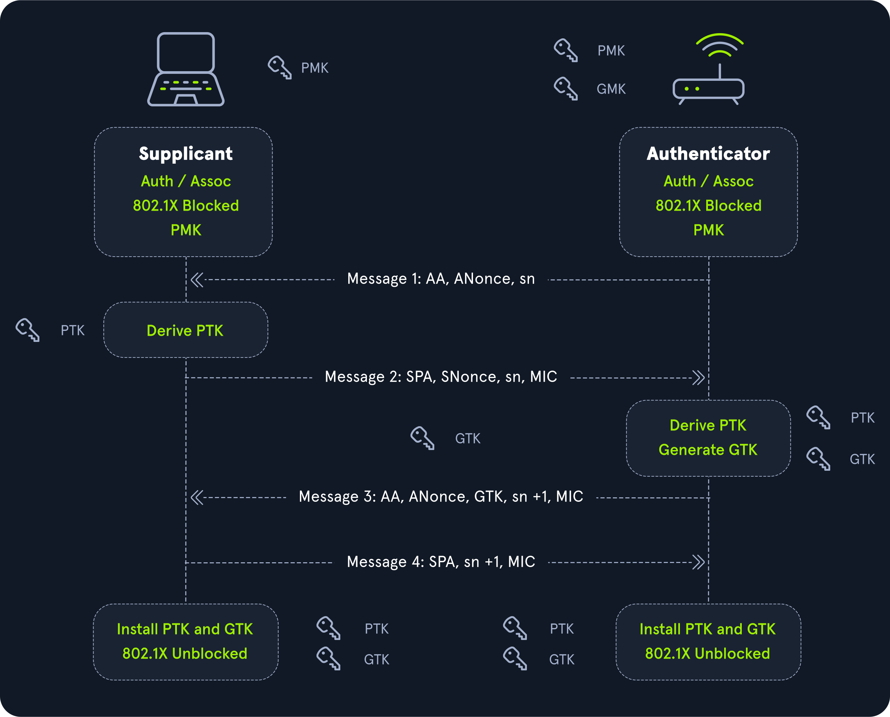
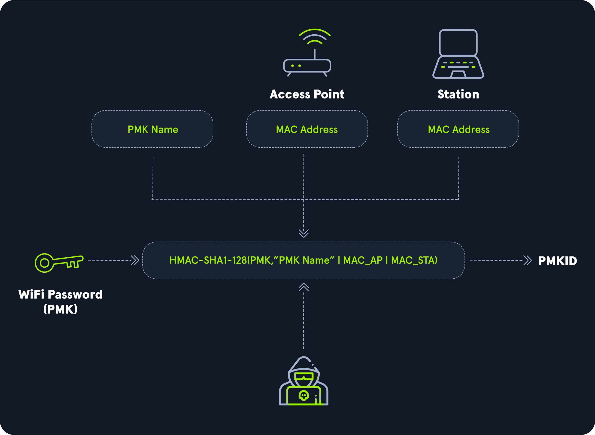

# Hashcat

## Introduction

### Overview

Password cracking attempts to recover the original data, from either hashed or encrypted data, by performing brute force attacks against various algorithms and divulge the cleartext password.

Weak and reused passwords are two major factors that can determine the success of this attack. Additionally, attackers can create fine-tuned wordlists and use rules to mutate the passwords based on the target application or environment.

:::warning
We'll start with a popular tool `Hashcat` but a variety of open-source tools exist.
:::

### Hashing

Hashing is the process of __converting some text to a string, which is unique to that particular text__. Usually, a hash function returns hashes with the same length irrespective of the type, length, or size of the data.

:::info
Hashing can be used for various purposes; for example, the _MD5_ and _SHA256_ algorithms are usually used to verify file integrity, while algorithms such as _PBKDF2_ are used to hash passwords before storage.
:::

It's a __one-way process__, meaning there is no way of reconstructing the original plaintext from a hash. Some hash functions can be _keyed_ (i.e., an additional secret is used to create the hash) like HMAC, which acts as a _checksum_ to mverify if a particular message was tampered with.

Because of this, the only way to attack it is to use a list containing possible passwords. Each password from the the list is hashed and compared to the original hash.

:::warning
Some hash functions, such as MD5, have been vulnerable to _collisions_, where two sets of plaintext can produce the same hash.
:::

#### Algorithms for password protection

Mainly four algorithms are used to protect passwords on Unix systems:

- _SHA-512_: Converts a long string of characters into a hash value fast and efficiently, but there are many _rainbow table attacks_.
- _Blowfish_ is a symmetric block cipher algorithm that encrypts a password with a key. It's more secure than SHA-512 but slower.
- _Bcrypt_ uses a slow hash function to make it hard for potential attackers to perform rainbow table attacks.
- _Argon2_ is a modern and secure algorithm explicitly designed for password hashing systems. It uses multiple rounds of hash functions and a large amount of memory to make it harder for attackers to guess passwords. It's considered __one of the most secure__ algorithms because of this.

#### Salting

Salting is a protection employed against the brute-forcing of hashes. A _salt_ is a random piece of data added to the plaintext before hashing it. An attacker trying to crack this hash will have to sacrifice extra time to append the salt before calculating the hash.

### Encryption

Encryption is the process of converting data into a format in which the original content is not accessible. Unlike hashing, __encryption is reversible__, it's possible to decrypt the ciphertext (encrypted data) and obtain the original content.

:::info
Some classic examples of encryption ciphers are the Caesar cipher, Bacon's cipher and Substitution cipher.
:::

There are two types of encryption algorithms: _Symmetric_ and _Asymmetric_.

#### Symmetric encryption

Symmetric algorithms use a key or secret to encrypt the data and use the same key to decrypt it (e.g., XOR algorithm).

#### Aymmetric encryption

Asymmetric algortihms divide the key into two parts (i.e., public and private). The public key can be given to anyone who wishes tn encrypt information and pass it securely to the owner. The owner then uses their private key to decrypt the content.

Some examples are RSA, ECDSA, and Diffie-Hellman.

One of the prominent uses of asymmetric encryption is _HTTPS (Hypertext Transfer Protocol Secure)_ protocol in the form of _SSL (Secure Socketys Layer)_.

:::info
When a client connects to a server using _HTTPS_, a public key exchange occurs. The client's browser uses this public key to encrypt any kind of data sent to the server. The server decrypts the incoming traffic before passing it on to the processing service.
:::

### Identifing hashes

Most hashing algorithms produce hashes of a constant length. Te length can be used to map it to the algorithm it was hashed with. For example, a hash of 32 characters in length can be an MD5 or NTLM hash.

Sometimes, hashes are stored in certain formats. For example, `hash:salt` or `$id$salt$hash`.

The hash `$6$vb1tLY1qiY$M.1ZCqKtJBxBtZm1gRi8Bbkn39KU0YJW1cuMFzTRANcNKFKR4RmAQVk4rqQQCkaJT6wXqjUkFcA/qNxLyqW.U/` contains three fields delimited by `$`, where the first field is the `id` (i.e., 6). This is used to identify the type of algorithm used for hashing.

```text
$1$  : MD5
$2a$ : Blowfish
$2y$ : Blowfish, with correct handling of 8 bit characters
$5$  : SHA256
$6$  : SHA512
```

Open and closed source software use many different kinds of hash formats. For exapmle, Apache web server stores its hashes in the format `$apr1$71850310$gh9m4xcAn3MGxogwX/ztb.` while Wordpress stores them in the form `$P$984478476IagS59wHZvyQMArzfx58u.`.

#### Hashid

Hashid is a Python tool used to detect various kinds of hashes. At the time of writing, `hashid` can be used to identify over 200 unique hash types, and for others, it will make a best-effort guess.

```console
$ pip install hashid
$ hashid '$apr1$71850310$gh9m4xcAn3MGxogwX/ztb.'

Analyzing '$apr1$71850310$gh9m4xcAn3MGxogwX/ztb.'
[+] MD5(APR) 
[+] Apache MD5
```

If known, `hashid` can also provide the corresponding _Hashcat_ mode with the `-m` flag if it is able to determine the hash type.

```console
$ hashid '$DCC2$10240#tom#e4e938d12fe5974dc42a90120bd9c90f' -m
Analyzing '$DCC2$10240#tom#e4e938d12fe5974dc42a90120bd9c90f'
[+] Domain Cached Credentials 2 [Hashcat Mode: 2100
```

#### Context is important

It is not always possible to identify the algorithm based on the obtained hash. Depending on the software, the plaintext might undergo multiple encryption rounds and salting transformations.

:::tip
Knowing where the hash came from will greatly help us narrow down the hash type and therefore, the Hashcat hash mode necessary to attmept to crack it.
:::

We usually have some context around tye type of hash we are looking to identify. Was it obtained via an Active Directory attack or from a Windows host? Was it obtained through the successful exploitation of a SQLi vunlerability?

## Hashcat specifics

### Hashcat overview

Hashcat can be downloaded from its [website](https://hashcat.net/hashcat/) or the official [repo](https://github.com/hashcat/hashcat). Any other repos (i.e., installing from `apt`), are left up to the 3rd party to keep up-to-date.

```console
sudo apt install hashcat
hashcat -h
```

The `-a` and `-m` arguments are used to specify the type of attack mode and hash type.

Hashcat supports the following attack modes:

- 0: Straight
- 1: Combination
- 3: Brute-force
- 6: Hybrid Wordlist + Mask
- 7: Hybrid Mask + Wordlist

You can see the list of hash types and examples with `hashcat --example-hashes | less` or [here](https://github.com/BrashEndeavours/brashendeavours.gitbook.io/blob/master/pentesting-cheatsheets/hashcat-hash-modes.md).

### Dictionary attack

Hashcat's most straightforward but extremley effective attack. The attack reads from a wordlist and tries to crack the supplied hashes.

```console
hashcat -a 0 -m <hash type> <hash file> <wordlist>
```

:::info
You can get password lists from different sources like [SecLists (rockyou.txt)](https://github.com/danielmiessler/SecLists/tree/master/Passwords) or [CrackStation's Password Cracking Dictionary](https://crackstation.net/crackstation-wordlist-password-cracking-dictionary.htm).
:::

For example, the following commands will crack a SHA256 hash:

```console
$ echo -n '!academy' | sha256sum | cut -f1 -d' ' > sha256_hash_example
$ hashcat -a 0 -m 1400 sha256_hash_example /opt/useful/SecLists/Passwords/Leaked-Databases/rockyou.txt

hashcat (v6.1.1) starting...

<SNIP>

Dictionary cache built:
* Filename..: /opt/useful/SecLists/Passwords/Leaked-Databases/rockyou.txt
* Passwords.: 14344392
* Bytes.....: 139921507
* Keyspace..: 14344385
* Runtime...: 2 secs

Approaching final keyspace - workload adjusted.  

006fc3a9613f3edd9f97f8e8a8eff3b899a2d89e1aabf33d7cc04fe0728b0fe6:!academy
                                                 
Session..........: hashcat
Status...........: Cracked
Hash.Name........: SHA2-256
Hash.Target......: 006fc3a9613f3edd9f97f8e8a8eff3b899a2d89e1aabf33d7cc...8b0fe6
Time.Started.....: Fri Aug 28 21:58:44 2020 (4 secs)
Time.Estimated...: Fri Aug 28 21:58:48 2020 (0 secs)
Guess.Base.......: File (/opt/useful/SecLists/Passwords/Leaked-Databases/rockyou.txt)
Guess.Queue......: 1/1 (100.00%)
Speed.#1.........:  3383.5 kH/s (0.46ms) @ Accel:1024 Loops:1 Thr:1 Vec:8
Recovered........: 1/1 (100.00%) Digests
Progress.........: 14344385/14344385 (100.00%)
Rejected.........: 0/14344385 (0.00%)
Restore.Point....: 14340096/14344385 (99.97%)
Restore.Sub.#1...: Salt:0 Amplifier:0-1 Iteration:0-1
Candidates.#1....: $HEX[216361726f6c796e] -> $HEX[042a0337c2a156616d6f732103]

Started: Fri Aug 28 21:58:05 2020
Stopped: Fri Aug 28 21:58:49 2020
```

Consider a more complex hash such as _Bcrypt_ (based on the _Blowfish cipher_). It utilizes a salt to protect it from rainbow table attacks and can have many rounds of the algorithm applied.

At any time during the cracking process, you can hit the "s" key to get a status on the cracking job, which shows that to attempt every password in the rockyou.txt wordlist will take over 1.5 hours. Applying more rounds of the algorithm will increase cracking time exponentially.

```text
[s]tatus [p]ause [b]ypass [c]heckpoint [q]uit => s

Session..........: hashcat
Status...........: Running
Hash.Name........: bcrypt $2*$, Blowfish (Unix)
Hash.Target......: $2a$05$ZdEkj8cup/JycBRn2CX.B.nIceCYR8GbPbCCg6RlD7uv...exEbVy
Time.Started.....: Mon Jun 22 19:43:40 2020 (3 mins, 10 secs)
Time.Estimated...: Mon Jun 22 21:20:28 2020 (1 hour, 33 mins)
Guess.Base.......: File (/usr/share/wordlists/rockyou.txt)
Guess.Queue......: 1/1 (100.00%)
Speed.#1.........:     2470 H/s (8.98ms) @ Accel:8 Loops:16 Thr:1 Vec:8
Recovered........: 0/1 (0.00%) Digests
Progress.........: 468576/14344385 (3.27%)
Rejected.........: 0/468576 (0.00%)
Restore.Point....: 468576/14344385 (3.27%)
Restore.Sub.#1...: Salt:0 Amplifier:0-1 Iteration:16-32
Candidates.#1....: septiembre29 -> sep1101
```

:::tip
In the case of hashes such as bcrypt, it is often better to use smaller, more targeted, wordlists.
:::

### Combination attack

The combination attack modes take in two wordlists as input and create combinations from them. This attack is useful because it is not uncommon for users to join two or more words together.

```console
hashcat -a 1 -m <hash type> <hash file> <wordlist1> <wordlist2>
```

### Mask attack

Mask attacks are used to generate words matching a specific pattern. It's particularly useful when the password length or format is known. A mask can be created using static characters, range of characters (e.g., [a-z] or [A-Z0-9]), or placeholders.

| Placeholder | Meaning                                                 |
|-------------|---------------------------------------------------------|
| ?l          | lower-case ASCII letters (a-z)                          |
| ?u          | upper-case ASCII letters (A-Z)                          |
| ?d          | digits (0-9)                                            |
| ?h          | 0123456789abcdef                                        |
| ?H          | 0123456789ABCDEF                                        |
| ?s          | special characters `«space»!"#$%&'()*+,-./:;<=>?@[]^_{` |
| ?a          | ?l?u?d?s                                                |
| ?b          | 0x00 - 0xff                                             |

Consider the company Inlane Freight, with password with the scheme `ILFREIGHT<userid><year>`, where userid is 5 characters long. The mask `ILFREIGHT?l?l?l?l?l20[0-1]?d` can be used to crack password with the specified pattern, where `?l` is a letter and `20[0-1]?d` will include all years from 2000 to 2019.

:::tip
Placeholders can be combined with options `-1` to `-4` which can be used for custom placeholders. For example providing the option `-1 01` enables you to use `?1` as a placeholder to specify just 0 and 1.
:::

For example, create a hash:

```console
echo -n 'ILFREIGHTabcxy2015' | md5sum | tr -d " -" > md5_mask_example_hash
```

And then, try to crack it:

```console
hashcat -a 3 -m 0 md5_mask_example_hash -1 01 'ILFREIGHT?l?l?l?l?l20?1?d'
```

:::tip
The `--increment` flag can be used to increment the mask length automatically, with a length limit that can be supplied using the `--increment-max`.
:::

### Hybrid attack

Hybrid mode is a variation of the combinator attack, wherein multiple modes can be used together for a fine-tuned wordlist creation. It's particularly useful when you know or have a general idea of the organization's password policy.

For example, consider a password such as `football1$`.

```console
echo -n 'football1$' | md5sum | tr -d " -" > hybrid_hash
```

Attack mode `6` reads words from the wordlist and appends a unique string based on the mask supplied. In this case, the mask `?d?s` tells hashcat to append a digit and a special character at the end of each word in the `rockyou.txt` wordlist.

```console
hashcat -a 6 -m 0 hybrid_hash /opt/useful/SecLists/Passwords/Leaked-Databases/rockyou.txt '?d?s'
```

As another example, consider the password `2015football`.

```console
echo -n '2015football' | md5sum | tr -d " -" > hybrid_hash_prefix 
```

Attack mode `7` can be used to prepend characters to words using a given mask. In this case, the mask `20?1?d` with custom character set `-1 01` will prepend various years to each word in the wordlist (i.e., 2010, 2011, 2012...).

```console
 hashcat -a 7 -m 0 hybrid_hash_prefix -1 01 '20?1?d' /opt/useful/SecLists/Passwords/Leaked-Databases/rockyou.txt
```

## Creating custom wordlists

There are many open-source tools that help creating wordlists ([see wordlists section](../../wordlists)).

By default, hashcate stores stores all cracked passwords in the `hashcat.potfile` file, in the format `hash:password`. You can display cracked passwords with the `--show` command. This can be used to create new wordlists of previously cracked passwords.

```console
cut -d: -f 2- ~/hashcat.potfile
```

Also, the [hashcat-utils repo](https://github.com/hashcat/hashcat-utils) contains many utilities that can be useful for more advanced password cracking. The tool [maskprocessor](https://github.com/hashcat/maskprocessor), for example, can be used to create wordlists using a given mask (e.g., append special characters to the end of a word):

```console
$ /mp64.bin Welcome?s
Welcome 
Welcome!
Welcome"
Welcome#
Welcome$
Welcome%
Welcome&
Welcome'
Welcome(
Welcome)
Welcome*
Welcome+

<SNIP>
```

## Working with rules

The _rule-based attack_ is the most advanced and complex password cracking mode. Rules help perform various operations on the input wordlist, such as prefixing, suffixing, toggling case, cutting, reversing, and much more. Rules take _mask-based attacks_ to another level and provide increased cracking rates. Additionally, the usage of rules saves disk space and processing time incurred as a result of larger wordlists.

A rule can be created using functions, which takes a word as an input and output its modified version. The following table describes some functions which are compatible with JtR as well as Hashcat ([here's the complete list](https://hashcat.net/wiki/doku.php?id=rule_based_attack#implemented_compatible_functions))

| Function        | Description                                                        | Input                                 | Output                                                                                                            |
|-----------------|--------------------------------------------------------------------|---------------------------------------|-------------------------------------------------------------------------------------------------------------------|
| l               | Convert all letters to lowercase                                   | InlaneFreight2020                     | inlanefreight2020                                                                                                 |
| u               | Convert all letters to uppercase                                   | InlaneFreight2020                     | INLANEFREIGHT2020                                                                                                 |
| c / C           | capitalize / lowercase first letter and invert the rest            | inlaneFreight2020 / Inlanefreight2020 | Inlanefreight2020 / iNLANEFREIGHT2020                                                                             |
| t / TN          | Toggle case : whole word / at position N                           | InlaneFreight2020                     | iNLANEfREIGHT2020                                                                                                 |
| d / q / zN / ZN | Duplicate word / all characters / first character / last character | InlaneFreight2020                     | InlaneFreight2020InlaneFreight2020 / IInnllaanneeFFrreeiigghhtt22002200 / IInlaneFreight2020 / InlaneFreight20200 |
| `{ / }`         | Rotate word left / right                                           | InlaneFreight2020                     | nlaneFreight2020I / 0InlaneFreight202                                                                             |
| ^X / $X         | Prepend / Append character X                                       | InlaneFreight2020 (^! / $! )          | !InlaneFreight2020 / InlaneFreight2020!                                                                           |
| r               | Reverse                                                            | InlaneFreight2020                     | 0202thgierFenalnI                                                                                                 |

Also, words with length less than N can be rejected with `>N`, while words greater than N can be rejected with `<N` [here's the list of rejection rules](https://hashcat.net/wiki/doku.php?id=rule_based_attack#rules_used_to_reject_plains).

:::tip
There are a variety of publicly available rules such as the [nsa-rules](https://github.com/NSAKEY/nsa-rules), [Hob0Rules](https://github.com/praetorian-code/Hob0Rules) and [corporate.rule](https://github.com/sparcflow/HackLikeALegend/blob/master/old/chap3/corporate.rule)
:::

### Example rule creation

`L33tspeak` is a common but efficient technique of replacing letters with similar numbers, like `o` can be replaced with `0` or `i` can be replaced with `1`.

Consider the following rules:

```console
c so0 si1 se3 ss5 sa@ $2 $0 $1 $9
```

1. The first letter word is capitalized with the `c` function.
2. The substitute function `s` is sued to replace `o` with `0`, `i` with `1`, `e` with `3`, and `a` with `@`. At the end.
3. At the end, the year `2019` is appended to it.

You can test this with a single word:

```console
$ hashcat -r rule.txt 'password_ilfreight' --stdout

P@55w0rd_1lfr31ght2019
```

### Example rule-based attack

Consider the password `St@r5h1p2019` hashed with `SHA1`:

```console
echo -n 'St@r5h1p2019' | sha1sum | awk '{print $1}' | tee hash
```

We can the use the rule `c so0 si1 se3 ss5 sa@ $2 $0 $1 $9` and the `rockyou.txt` dictionary file to crack the hash using Hashcat.

```console
echo 'c so0 si1 se3 ss5 sa@ $2 $0 $1 $9' > rule.txt

hashcat -a 0 -m 100 hash /opt/useful/SecLists/Passwords/Leaked-Databases/rockyou.txt -r rule.txt
```

:::tip

:::

### Built-in defaults

Hashcat installs with a variety of rules by default:

```console
]$ ls -l /usr/share/hashcat/rules/

total 2576
-rw-r--r-- 1 root root    933 Jun 19 06:20 best64.rule
-rw-r--r-- 1 root root    633 Jun 19 06:20 combinator.rule
-rw-r--r-- 1 root root 200188 Jun 19 06:20 d3ad0ne.rule
-rw-r--r-- 1 root root 788063 Jun 19 06:20 dive.rule
-rw-r--r-- 1 root root 483425 Jun 19 06:20 generated2.rule
-rw-r--r-- 1 root root  78068 Jun 19 06:20 generated.rule
drwxr-xr-x 1 root root   2804 Jul  9 21:01 hybrid
-rw-r--r-- 1 root root 309439 Jun 19 06:20 Incisive-leetspeak.rule
-rw-r--r-- 1 root root  35280 Jun 19 06:20 InsidePro-HashManager.rule
-rw-r--r-- 1 root root  19478 Jun 19 06:20 InsidePro-PasswordsPro.rule
-rw-r--r-- 1 root root    298 Jun 19 06:20 leetspeak.rule
-rw-r--r-- 1 root root   1280 Jun 19 06:20 oscommerce.rule
-rw-r--r-- 1 root root 301161 Jun 19 06:20 rockyou-30000.rule
-rw-r--r-- 1 root root   1563 Jun 19 06:20 specific.rule
-rw-r--r-- 1 root root  64068 Jun 19 06:20 T0XlC-insert_00-99_1950-2050_toprules_0_F.rule
-rw-r--r-- 1 root root   2027 Jun 19 06:20 T0XlC-insert_space_and_special_0_F.rule
-rw-r--r-- 1 root root  34437 Jun 19 06:20 T0XlC-insert_top_100_passwords_1_G.rule
-rw-r--r-- 1 root root  34813 Jun 19 06:20 T0XlC.rule
-rw-r--r-- 1 root root 104203 Jun 19 06:20 T0XlCv1.rule
-rw-r--r-- 1 root root     45 Jun 19 06:20 toggles1.rule
-rw-r--r-- 1 root root    570 Jun 19 06:20 toggles2.rule
-rw-r--r-- 1 root root   3755 Jun 19 06:20 toggles3.rule
-rw-r--r-- 1 root root  16040 Jun 19 06:20 toggles4.rule
-rw-r--r-- 1 root root  49073 Jun 19 06:20 toggles5.rule
-rw-r--r-- 1 root root  55346 Jun 19 06:20 unix-ninja-leetspeak.rule
```

Also, Hashcat provides an option to generate random rules on the fly and apply them to the input wordlists. The following command will generate 1000 random rules and apply them to each word from `rockyou.txt` by specifying the `-g` flag. There's no certainty to the success rate of this attack:

```console
hashcat -a 0 -m 100 -g 1000 hash /opt/useful/SecLists/Passwords/Leaked-Databases/rockyou.txt
```

## Cracking

### Cracking common hashes

#### Common hash types

Some hash types are extremely common to find. Hashcat team maintains a list of [example hashes](https://hashcat.net/wiki/doku.php?id=example_hashes). Here are the most commonly seen hash types:

| Hashmode | Hash Name                      | Example Hash                                                                                                                                                                   | Output                                                                                                            |
|----------|--------------------------------|--------------------------------------------------------------------------------------------------------------------------------------------------------------------------------|-------------------------------------------------------------------------------------------------------------------|
| 0        | MD5                            | 8743b52063cd84097a65d1633f5c74f5                                                                                                                                               | inlanefreight2020                                                                                                 |
| 100      | SHA1                           | b89eaac7e61417341b710b727768294d0e6a277b                                                                                                                                       | INLANEFREIGHT2020                                                                                                 |
| 1000     | NTLM                           | b4b9b02e6f09a9bd760f388b67351e2b                                                                                                                                               | Inlanefreight2020 / iNLANEFREIGHT2020                                                                             |
| 1800     | sha512crypt $6$, SHA512 (Unix) | $6$52450745$k5ka2p8bFuSmoVT1tzOyyuaREkkKBcCNqoDKzYiJL9RaE8yMnPgh2XzzF0NDrUhgrcLwg78xs1w5pJiypEdFX/                                                                             | iNLANEfREIGHT2020                                                                                                 |
| 3200     | bcrypt $2*$, Blowfish (Unix)   | $2a$05$LhayLxezLhK1LhWvKxCyLOj0j1u.Kj0jZ0pEmm134uzrQlFvQJLF6                                                                                                                   | InlaneFreight2020InlaneFreight2020 / IInnllaanneeFFrreeiigghhtt22002200 / IInlaneFreight2020 / InlaneFreight20200 |
| 5500     | NetNTLMv1 / NetNTLMv1+ESS      | u4-netntlm::kNS:338d08f8e26de93300000000000000000000000000000000:9526fb8c23a90751cdd619b6cea564742e1e4bf33006ba41:cb8086049ec4736c                                             | nlaneFreight2020I / 0InlaneFreight202                                                                             |
| 5600     | NetNTLMv2                      | admin::N46iSNekpT:08ca45b7d7ea58ee:88dcbe4446168966a153a0064958dac6:5c7830315c7830310000000000000b45c67103d07d7b95acd12ffa11230e0000000052920b85f78d013c31cdb3b92f5d765c783030 | !InlaneFreight2020 / InlaneFreight2020!                                                                           |
| 13100    | Kerberos 5 TGS-REP etype 23    | $krb5tgs$23$user$realm$test/spn$63386d22d359fe42230300d56852c9eb$ < SNIP >                                                                                                     | 0202thgierFenalnI                                                                                                 |

#### Example 1: Database dumps

MD5, SHA1, and bcrypt hashes are often seen in database dumps. These hashes may be retrieved following a successful SQLi attack or found in publicly available password data from breach database dumps.

Consider the following SHA1 hahes list:

```text
winter!
baseball1
waterslide
summertime
baconandeggs
beach1234
sunshine1
welcome1
password123
```

Create the SHA1 hash of each word:

```console
$ for i in $(cat words); do echo -n $i | sha1sum | tr -d ' -';done

fa3c9ecfc251824df74026b4f40e4b373fd4fc46
e6852777c0260493de41fb43918ab07bbb3a659c
0c3feaa16f73493f998970e22b2a02cb9b546768
b863c49eada14e3a8816220a7ab7054c28693664
b0feedd70a346f7f75086026169825996d7196f9
f47f832cba913ec305b07958b41babe2e0ad0437
08b314f0e1e2c41ec92c3735910658e5a82c6ba7
e35bece6c5e6e0e86ca51d0440e92282a9d6ac8a
cbfdac6008f9cab4083784cbd1874f76618d2a97
```

Then run a Hashcat dictionary attack using the `rockyou.txt` wordlist:

```console
hashcat -m 100 SHA1_hashes /opt/useful/SecLists/Passwords/Leaked-Databases/rockyou.txt
```

:::warning
Variations on the abovel ist, such as `Bas3b@ll1` or `Wat3rSl1de` would likely take longer to crack and may require additional techniques such as mask and hybrid attacks.
:::

#### Example 2: Linux shadow file

_Sha512crypt_ hashes are commonly found in the `/etc/shadow` file on Linux systems, which contains the password hashes for all accounts with a login shell assigned to them.

Let's look at a hash from a standard Ubuntu installation corresponding to `password123`.

```text
root:$6$tOA0cyybhb/Hr7DN$htr2vffCWiPGnyFOicJiXJVMbk1muPORR.eRGYfBYUnNPUjWABGPFiphjIjJC5xPfFUASIbVKDAHS3vTW1qU.1:18285:0:99999:7:::
```

The hash contains __nine fields separated by colons__. The first two fields contain the username and its encrypted hash. The rest fields contain various attributes such as password creation time, last change time, and expiry.

Coming to the hash, we know it contains three fields delimited by `$`. The value `6` stands for the `SHA-512` hashing algorithm, the next 16 characters represent the salt, while the rest of it is the actual hash.

```console
hashcat -m 1800 nix_hash /opt/useful/SecLists/Passwords/Leaked-Databases/rockyou.txt
```

#### Example 3: Common active directory hash types

In organizations using Active Directory, it's often possible to obtain credentials in cleartext or re-use password hashes to further access via _Pass-the-Hash_ or _SMB Relay attacks_. Still, some techniques will reslt in a password hash that must be creacked offline to further our access.

Some examples include a NetNTLMv1 or NetNTLMv2 ovtained through a MITM attack, a Kerberos 5 TGS-REP hash obtained through a Kerberoasting attack, or an NTLM hash obtained either by dumping credentials from memory using _Mimikatz_ tool or obtained from a Windows machine's local SAM database.

#### NTLM

Retrieve an NTLM password hash from a user that has _Remote Desktop_ (_RDP_) access to a server but is not a local administrator, so the NTLM hash cannot be used for a pass-the-hash attack. In this case, the cleartext password is necessary to further our access by connecting to the server via RDP and performing further enumeration within the network or looking for local privilege escalation vectors.

For example, quickly generate an NTLM hash of `Password01`:

```console
$ python3

Python 3.8.3 (default, May 14 2020, 11:03:12) 
[GCC 9.3.0] on linux
Type "help", "copyright", "credits" or "license" for more information.

>>> import hashlib,binascii
>>> hash = hashlib.new('md4', "Password01".encode('utf-16le')).digest()
>>> print (binascii.hexlify(hash))

b'7100a909c7ff05b266af3c42ec058c33'
```

Then run the resultant NTLM password through Hashcat using the standard `rockyou.txt` wordlist:

```console
hashcat -a 0 -m 1000 ntlm_example /opt/useful/SecLists/Passwords/Leaked-Databases/rockyou.txt
```

#### NetNTLMv2

In busy corporate networks it is common to retrieve many NetNTLMv2 password hashes using MITM attacks with tools like _Responder_. These can often be cracked and leveraged to establish a foothold in the AD environment. Consider the following password hash: `sqladmin::INLANEFREIGHT:f54d6f198a7a47d4:7FECABAE13101DAAA20F1B09F7F7A4EA:0101000000000000C0653150DE09D20126F3F71DF13C1FD8000000000200080053004D004200330001001E00570049004E002D00500052004800340039003200520051004100460056000400140053004D00420033002E006C006F00630061006C0003003400570049004E002D00500052004800340039003200520051004100460056002E0053004D00420033002E006C006F00630061006C000500140053004D00420033002E006C006F00630061006C0007000800C0653150DE09D201060004000200000008003000300000000000000000000000003000001A67637962F2B7BF297745E6074934196D5F4371B6BA3E796F2997306FD4C1C00A001000000000000000000000000000000000000900280063006900660073002F003100390032002E003100360038002E003100390035002E00310037003000000000000000000000000000`.

Some tools, such as _Responder_, will inform you what type of hash was received. A NetNTLMv2 hash relates to the mode `5600` in Hashcat.

```console
hashcat -a 0 -m 5600 inlanefreight_ntlmv2 /opt/useful/SecLists/Passwords/Leaked-Databases/rockyou.txt
```

### Cracking miscellaneous files & hashes

It's common to encounter password-protected documents such as Microsoft Word and Excel documents, OneNote notebooks, KeePass database files, SSH private key passphrases, PDF files, zip files, and more.

:::tip
Various tools exist to help us extract the password hashes from these files in a format that Hashcat can understand. For example, `JohnTheRipper` comes with [many of these tools](https://github.com/openwall/john/tree/bleeding-jumbo/src). One additional tool ported to Python is [keeypass2jhon.py](https://gist.github.com/HarmJ0y/116fa1b559372804877e604d7d367bbc#file-keepass2john-py) for extracting a crackable hash from KeePass 1.x/2.x databases.
:::

#### Example 1: Microsoft Office documents

Using the [office2john.py](https://raw.githubusercontent.com/magnumripper/JohnTheRipper/bleeding-jumbo/run/office2john.py) tool, you can extract password hashes from some Microsoft Office documents.

Hashcat supports the following hash modes for Microsoft Office documents:

- 9400: MS Office 2007
- 9500: MS Office 2010
- 9600: MS Office 2013

There are also several `$oldoffice$` hash modes for MS Office documents older than 2003.

Let's take a Word document protected with the password `pa55word`. We can first extrack the hash:

```console
$ python office2john.py hashcat_Word_example.docx 

hashcat_Word_example.docx:$office$*2013*100000*256*16*6e059661c3ed733f5730eaabb41da13a*aa38e007ee01c07e4fe95495934cf68f*2f1e2e9bf1f0b320172cd667e02ad6be1718585b6594691907b58191a6
```

Then, run the hash through Hashcat using mode `9600` and make short work of it with the `rockyou.txt` wordlist.

:::warning
This is a rather slow hash to crack and will take over 12 hours on a single CPU.
:::

```console
hashcat -m 9600 office_hash /opt/useful/SecLists/Passwords/Leaked-Databases/rockyou.txt
```

#### Example 2: ZIP files

We can extract the password hashes using [zip2john](https://github.com/magnumripper/JohnTheRipper/blob/bleeding-jumbo/src/zip2john.c).

Hashcat supports a variety of compressed file formats such as:

- 11600: 7-Zip
- 13600: WinZip
- 17200: PKZIP (Compressed)
- 17210: PKZIP (Uncompressed)
- 17220: PKZIP (Compressed Multi-File)
- 17225: PKZIP (Mixed Multi-File)
- 17230: PKZIP (Compressed Multi-File Checksum-Only)
- 23001: SecureZIP AES-128
- 23002: SecureZIP AES-192
- 23003: SecureZIP AES-256

For our example, take any documment and add it to a password protected file:

```console
$ zip --password zippyzippy blueprints.zip dummy.pdf 

adding: dummy.pdf (deflated 7%)
```

Then extract the hash:

```console
zip2john ~/Desktop/HTB/Academy/Cracking\ with\ Hashcat/blueprints.zip
```

To run this through Hashcat, we need the entire hash starting from `$pkzip2$1` and ending with `/pkzip2$`. Then, crack it:

```console
hashcat -a 0 -m 17200 pdf_hash_to_crack /opt/useful/SecLists/Passwords/Leaked-Databases/rockyou.txt
```

#### Example 3: KeePass files

We can extract the password hashes using [keepass2john](https://github.com/magnumripper/JohnTheRipper/blob/bleeding-jumbo/src/keepass2john.c).

```console
python keepass2john.py Master.kdbx 
```

Hashcat supportsthe following hash types for KeePass databases, all designated by the same hash mode:

- 13400: KeePass 1 AES / without keyfile
- 13400: KeePass 2 AES / without keyfile
- 13400: KeePass 1 Twofish / with keyfile
- 13400: Keepass 2 AES / with keyfile

```console
hashcat -a 0 -m 13400 keepass_hash /opt/useful/SecLists/Passwords/Leaked-Databases/rockyou.txt
```

#### Example 4: PDF files

We can extract the password hashes using [pdf2john](https://raw.githubusercontent.com/truongkma/ctf-tools/master/John/run/pdf2john.py).

```console
python pdf2john.py inventory.pdf | awk -F":" '{ print $2}'
```

Hashcat supports a variety of PDF file formats:

- 10400: PDF 1.1 - 1.3 (Acrobat 2 - 4)
- 10410: PDF 1.1 - 1.3 (Acrobat 2 - 4), collider #1
- 10420: PDF 1.1 - 1.3 (Acrobat 2 - 4), collider #2
- 10500: PDF 1.4 - 1.6 (Acrobat 5 - 8)
- 10600: PDF 1.7 Level 3 (Acrobat 9)
- 10700: PDF 1.7 Level 8 (Acrobat 10 - 11)

```console
hashcat -a 0 -m 10500 pdf_hash /opt/useful/SecLists/Passwords/Leaked-Databases/rockyou.txt
```

### Cracking WPA/WPA2 handshakes

Wireless networks are often not properly segmented from a company's corporate network, and successful authentication to it may grant full access to the internal corporate network.

Hashcat can be used to successfully crack both the `MIC` (4-way handshake) and `PMKID` (1st packet/handshake).

#### Cracking MIC

When a client connecting to the wireless network and the wireless access point (AP) communicate, the must ensure that they both have/know the wireless network key but are not transmitting the key across the network (it's encrypted and verified by the AP).

:::info
The handshake is a collection of keys exchanged during the authenticaton process between the client and the associated AP. These keys are used to generate a common key called the _Message Integrity Check (MIC)_ used by an AP to verify that each packet has not been compromised and received in its original state.
:::

To perform this type of offline cracking attack, we need to capture a valid 4-way handshake by sending de-authentication frames to force a client (user) to disconnect from an AP. When the client reauthenticates (usually automatically), the attacker can attempt to sniff out the WPA 4-way handshake without their knowledge.



Once we captured a 4-way handshake (with a tool such as `airodump-ng`), convert it to a format that can be supplied to Hashcat for cracking (i.e., `.cap` to `.hccapx`). Hashcat hosts an online service: [cap2hashcat online](https://hashcat.net/cap2hashcat) or you can use `hashcat-utils` repo offline.

```console
./cap2hccapx.bin corp_capture1-01.cap mic_to_crack.hccapx
```

Now, we can perform a straight dictionary attack to crack the WPA handshake with mode `22000`:

```console
hashcat -a 0 -m 22000 mic_to_crack.hccapx /opt/useful/SecLists/Passwords/Leaked-Databases/rockyou.txt
```

Armed with the cracked hey, we can now attempt to authenticate to the wireless network.

#### Cracking PMKID

This attack can be performed against wireless networks that use WPA/WPA2-PSK (pre-shared key) and allows us to obtain the PSK being used by the targeted wireless network by attacking the AP directly (i.e., it doesn't require deauthentication of any users).

The PMK is the same as in the MIC (4-way handshake) attack but can generally be obtained faster and without interrupting any users.

:::info
The _Pairwise Master Key Identifier (PMKID)_ is the AP's unique identifier to keep track of the _Pairwise Master Key (PMK)_ used by the client. The PMKID is located in the 1st pakcet of the 4-way handshake and can be easier to obtain since it does not require capturing the entire 4-way handshake. PMKID is calculated with __HMAC-SHA1__ with the PMK (Wirless network password) used as a key, the string "PMK Name", MAC address of the AP, and the MAC address of the station.
:::



To perform PMKID dracking, we need to obtain the PMKID hash. The first step is extracting it from the capture file (`.cap`) using a tool such as `hcxpcaptool` from `hcxtools`. You can install it using apt `sudo apt install hcxtools`.

:::note
This tool has since been replaced by `hcxpcapngtool` which we can compile and install from [hcxtools repo](https://github.com/ZerBea/hcxtools).
:::

For example, extract PMKID using hcxpcaptool:

```console
$ hcxpcaptool -z pmkidhash_corp cracking_pmkid.cap 

<SNIP...>
1 PMKID(s) written to pmkidhash_corp
```

Alternatively, use `hcxpcapngtool`:

```console
$ hcxpcapngtool cracking_pmkid.cap -o pmkidhash_corp2

<SNIP...>
PMKID written to combi hash file.........: 1
```

Now, we can try a straight dictionary attack with mode `22000`:

```console
hashcat -a 0 -m 22000 pmkidhash_corp /opt/useful/SecLists/Passwords/Leaked-Databases/rockyou.txt
```
