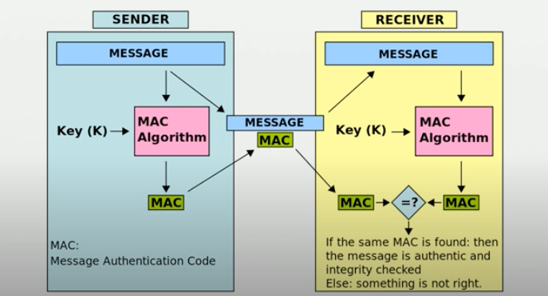

# MAC: Message Authentication Code

Generally based on hashes, but allow for message authentication. You can ensure the data has not been tampered with, as well as validating that the MAC itself has not been manipulating.

You have a shared key that is used for construction and validation of the MCA.

The most well-lnown MAC is called __HMAC__. It is based around a hash algorithm of your choosing, and is a fairly simply construct.

```txt
HMAC(key, message) = hash(key + hash(key + message))
```


