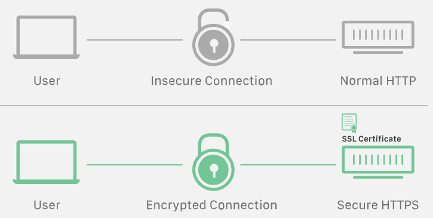

# SSL (Secure Sockets Layer)

SSL is an encryption-based Internet Security Protocol. In 1999 SSL was updated to become TLS. SSL has not been updated since 1996 and is now considered to be deprecated.

#### How it works

SSL encrypts data that is transmitted across the web. This means that anyone who tries to intercep this data will only see a garbled mix of characters.

1. SSL initiates an authentication process called a __handshake__ between two communicating devices to ensure tat both devices are really who they claim to be.
2. SSL digitally signs data in order ot provide __data integrit__, verifying that the data is not tampered with before reaching its inteded recipient.

