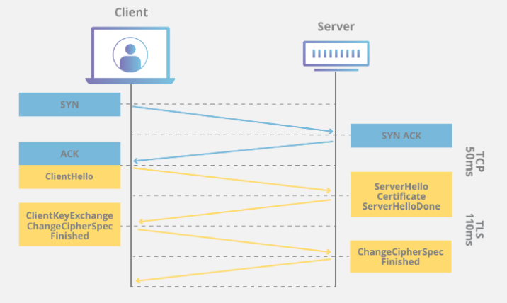

# TLS (Transport Layer Security)

- [TLS (Transport Layer Security)](#tls-transport-layer-security)
  - [Overview](#overview)
  - [Why use TLS?](#why-use-tls)
  - [How TLS works](#how-tls-works)
  - [Comparisons](#comparisons)
    - [TLS vs SSL](#tls-vs-ssl)
    - [TLS vs HTTPS](#tls-vs-https)
  - [Cypher Suite](#cypher-suite)
    - [The Handshake](#the-handshake)
    - [SSL/TLS Certificate](#ssltls-certificate)
      - [Information it includes](#information-it-includes)
      - [Public Key and Private Key](#public-key-and-private-key)
      - [Obtain a SSL Certificate](#obtain-a-ssl-certificate)
      - [Self-Signed SSL Certificate](#self-signed-ssl-certificate)

## Overview

TLS is a security protocol designed to facilitate privacy and data security for communications over the Internet.

It's primary used for encrypting communication between web applications and servers (web application security), but can also be used to encrypt other communications such as email, messaging and voice over IP (VOIP).

## Why use TLS?

TLS encryption can help protect web applications from attacks such as data breaches and DDoS attacks.

## How TLS works

TLS can be used on top of a transport-layer security protocol like TCP. There are three main components to TLS:

1. __Encryption__: hides data being transfered from third parties
2. __Authentication__: Ensures that the parties exchanging information are who they claim to be
3. __Integrity__: Verifies that the data has not been forged or tampered with

## Comparisons

### TLS vs SSL

TLS 1.0 actually began development as SSL 3.1, but the name of the protocol was hanged before publication in order to indicate that it was no longer associated with original SSL creator, Netscape. Because of this history, TLS and SSL are sometimes used interchangeably.

### TLS vs HTTPS

HTTPS is an implementation of TLS encryption on top of the HTTP protocol.

## Cypher Suite

The cypher suite is a set of algorithms that specifies details such as which shared encryption keys (__session keys__) will be used for that particular session. TLS is able to set the matching session keys over an unencrypted channel thanks to a technology known as __Public Key Cryptography__.

### The Handshake

A TLS connection is initiated using a sequence known as the __TLS Handshake__ which establishes a cypher suite for each communication session.

The handshake also handles authentication, which usually consists of the server providing its identity to the client. This is done using public keys. Public keys are encryption keys that use one-way encryption, meaning that anyone can unscramble data encrypted with the private key to ensure its authenticity, because only the original sender can encrypt data with the private key.

Once data is encrypted and authenticated, it is then signed with a __Message Authentication Code__ (MAC) to ensure the integrity of the data.

### SSL/TLS Certificate

SSL Certificates are what enable to move from HTTP to HTTPS. Is a data file hosted in a website's origin server.

It make SSL/TLS Encryption possible, and they contain the website's public key and the website's identity, along with related information.

Devices attempting to communicate with the origin server will reference this file to obtain the public key and verify the server's identity.

__The private key is kept secret and secure__.

#### Information it includes

* Domain name that certificate was issued for
* Which person, organization or device it was issued to
* Which certificate authority issued it
* Certificate authority's digital signature
* Associated subdomains
* Issue data of the certificate
* Expiration data of the certificate
* Public Key

#### Public Key and Private Key

Both are essentially long strings of characters used for encrypting/decrypting data. Data encrypted with the public key can only be decrypted with the private key, and vice versa.

#### Obtain a SSL Certificate

For an SSL certificate to be valid, domain need to obtain it from a certificate authority (CA), which is an outside organization, a trusted third party, that generaets and gives out SSL certificates. CA will also digitally sign the certificate with their own private key, allowing client devices to verify it. Most, but not all, CAs wil charge a fee for issuing an SSL certificate.

Once the certificate is issued, it needs to be installed and activated on the website's origin server. Web hosting services can usually handle this for website operators. Once it's activated on the origin server, the website will be able to load over HTTPS and all trafic to and from the website will be encrypted and secure.

#### Self-Signed SSL Certificate

Anyone can create their own SSL by generating a public-private key pairing and including all the information mentioned above. Such certificates are called self-signed certificates because the digital signature used, instead of beign from a CA, would be the website's own private key.

But in this case, there's no outside authority to verify that the origin server is who it claims to be. Browsers don't consider self-signed certificates trustworthy and may still mark sites with one as "not secure" despite using HTTPS.
