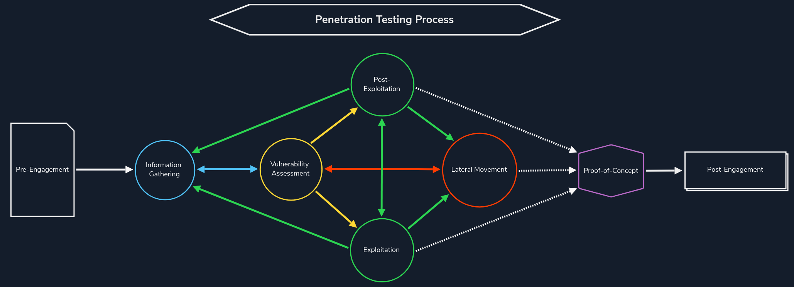

# Information Gathering

## Overview

> [OWASP - Information gathering](https://owasp.org/www-project-web-security-testing-guide/stable/4-Web_Application_Security_Testing/01-Information_Gathering/README)

It's the first step in every penetration test wherew we need to simulate external attackers without internal information from the target.

It's typically an _iterative process_. We discover assets (e.g., a subdomain or virtual host), fingerprint the technologies in use, look for hidden pages/directories, etc., which may lead us to discover another asset, and start the process again.

## Two main categories

### Passive information gathering

We do not interact directly with the target at this stage. Instead, we collect publicly available information using search engines, whois, certification information, etc.

The goal is to obtain as much information as possible to use as inputs to the active information gathering phase.

### Active information gathering

We directly interact with the target at this scope. Some of the techniques used in the active information gathering stage include port scanning, DNS enumeration, directory brute-forcing, virtual host enumeration, and web application crawling/spidering.

:::warning
Before, we need to ensure we have the required authorization to test. Otherwise, we will likely be engaging in illegal activities.
:::
