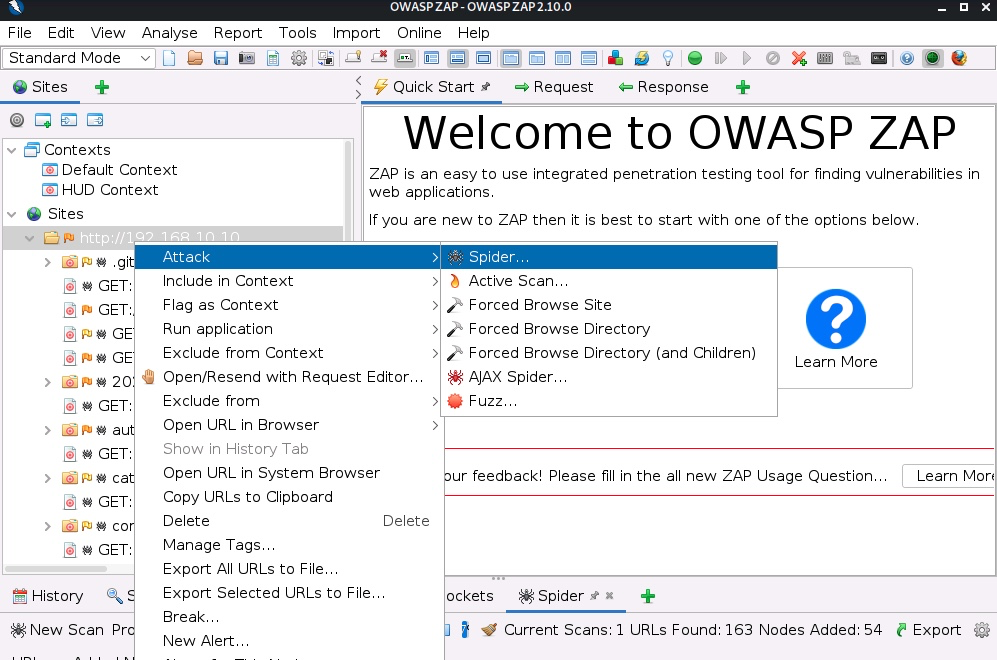

# Crawling

## Overview

Crawling a website is the systematic or automatic process of exploring a website to list all of the resources encountered along the way. It shows us the structure of the website we are auditing and an overview of the attack surface.

## ZAP

[Zed Attack Proxy](https://www.zaproxy.org/) (`ZAP`) is an open-source web proxy that belongs to the [Open Web Application Security Project](https://owasp.org/) (`OWASP`). It allows us to perform manual and automated security testing on web applications. Using it as a _proxy server_ will enable us to intercept and manipulate all the traffic that passes through it.

We can use the __spidering functionality__:



:::warning
ZAP spidering module can miss important information such as hidden folders or backup files.
:::

## FFuF

We can use [ffuf](https://github.com/ffuf/ffuf) to discover files and folders that we cannot spot by simply browsing the website.

```console
ffuf -recursion -recursion-depth 1 -u http://192.168.10.10/FUZZ -w /opt/useful/SecLists/Discovery/Web-Content/raft-small-directories-lowercase.txt
```

Using a recursive scan (i.e., `-recursion` and `-recursion-depth`), `ffuf` creates new jobs for every detected folders.

## Sensitive information disclosure

Backup or unreferenced files can be generated by creating snapshots, different versions of a file, or from a text editor without the web developer's knowledge. There are some common extensions that we can find in the `raft-[ small | medium | large ]-extensions.txt` files from the [SecLists](https://github.com/danielmiessler/SecLists/tree/master/Discovery/Web-Content).

For example, combine some of the folders we have found before, a list of common extensions, and some words extracted from the website to see if we can find something that should not be there.

Create a file with the following folder names and save it as `folders.txt`:

```console
wp-admin
wp-content
wp-includes
```

Next, extract some keywords using [CeWL](https://github.com/digininja/CeWL):

```console
cewl -m5 --lowercase -w wordlist.txt http://{TARGET}
```

We use `-m5` to extract words with a minimum length of 5 characters, `--lowercase` to convert them to lower case, and `-w <FILE>` to save them into a file.

The next step is using ffuf:

```console
ffuf -w ./folders.txt:FOLDERS,./wordlist.txt:WORDLIST,./extensions.txt:EXTENSIONS -u http://192.168.10.10/FOLDERS/WORDLISTEXTENSIONS
```
