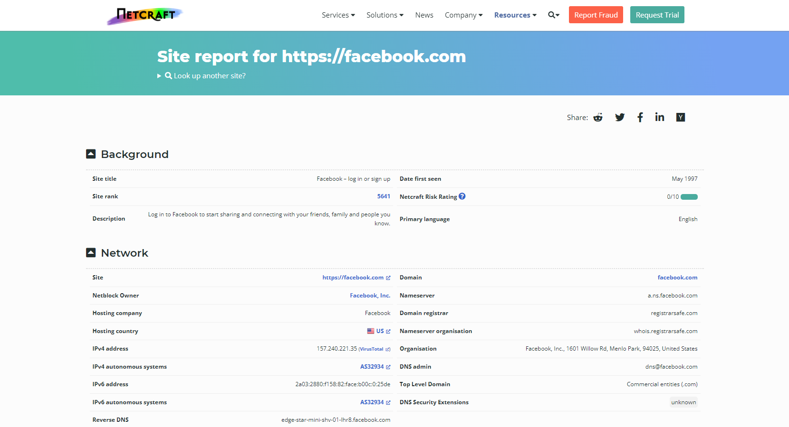

# Passive Infrastructure Identification

## Netcraft

[Netcraft](https://www.netcraft.com/) can offer us information about the servers without even interacting with them.

## Wayback machine

:::info
The [Internet Archive](https://en.wikipedia.org/wiki/Internet_Archive) is an American digital library that provides free public access to digitalized materials, including websites, collected automatically via its web crawlers.
:::

We can access several versions of the websites from the Internet Achive using the[Wayback Machine](https://web.archive.org/) to find old versions that may have interesting comments in the source code or files that shouldn't be there.
