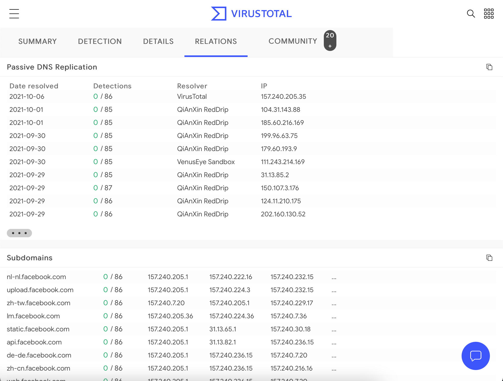

# Passive Subdomain Enumeration

:::tip
To learn more, I recommend the [OSINT: Corporate Recon module](https://academy.hackthebox.com/course/preview/osint-corporate-recon) from HackTheBox.
:::

## Overview

Subdomain enumeration refers to mapping all available subdomains within a domain name. It increases our attack surface and may uncover hidden management backend panels or intranet web applications that network administrators expected to keep hidden using the "security by obscurity" strategy.

### VirusTotal

VirusTotal maintains its DNS replication service, which is developed by preserving DNS resolutions made when users visit URLs given by them.



### Certificates

SSL/TLS certificates can provide additional domain names and subdomains because of _Certificate Transparency_ (CT) (i.e., a project that requires every SSL/TSL certificate issued by a _Certificate Authority_ (CA) to be published in a publicly accessible log).

- [](https://censys.io)
- [](https://crt.sh)

```console
export TARGET="facebook.com"
curl -s "https://crt.sh/?q=${TARGET}&output=json" | jq -r '.[] | "\(.name_value)\n\(.common_name)"' | sort -u > "${TARGET}_crt.sh.txt"
```

### TheHarvester - Automation

[TheHarvester](https://github.com/laramies/theHarvester) is a simple yet powerful tool for early-stage penetration testing and red team engagements.

The tool collects emails, names, subdomains, IP addresses, and URLs from various public data sources for passive information gathering.

Here are some modules:

| Baidu | Baidu search engine. |
|---|---|
| Bufferoverun | Uses data from Rapid7's Project Sonar - www.rapid7.com/research/project-sonar/ |
| Crtsh | Comodo Certificate search. |
| Hackertarget | Online vulnerability scanners and network intelligence to help organizations. |
| Otx | AlienVault Open Threat Exchange - https://otx.alienvault.com |
| Rapiddns | DNS query tool, which makes querying subdomains or sites using the same IP easy. |
| Sublist3r | Fast subdomains enumeration tool for penetration testers |
| Threatcrowd | Open source threat intelligence. |
| Threatminer | Data mining for threat intelligence. |
| Trello | Search Trello boards (Uses Google search) |
| Urlscan | A sandbox for the web that is a URL and website scanner. |
| Vhost | Bing virtual hosts search. |
| Virustotal | Domain search. |
| Zoomeye | A Chinese version of Shodan. |

## Certificate Search

[](https://crt.sh/) lets you enter a domain name and look for subdomain certificates.
