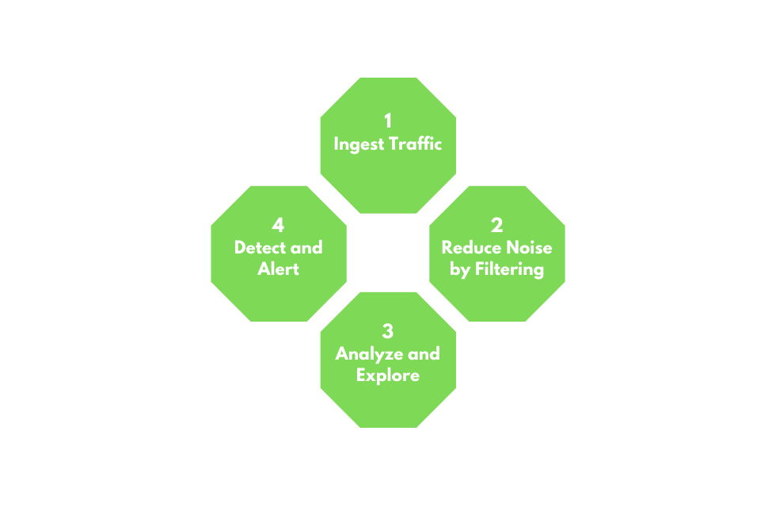
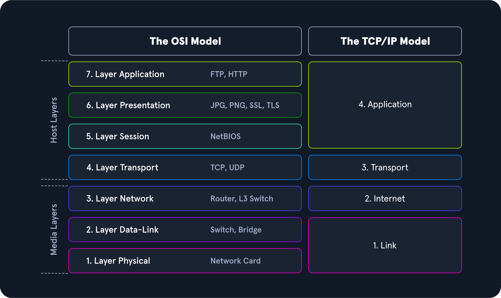
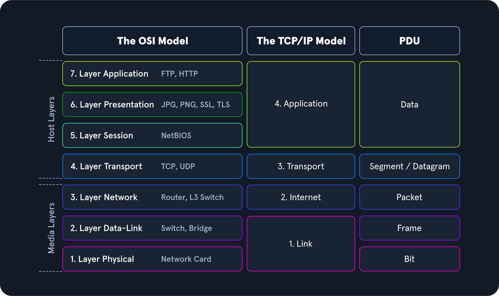
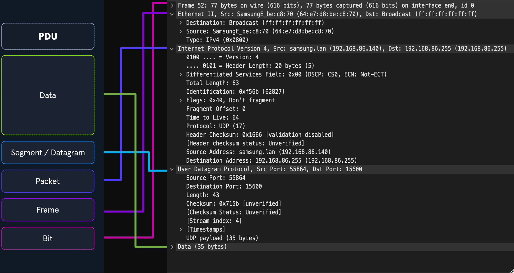
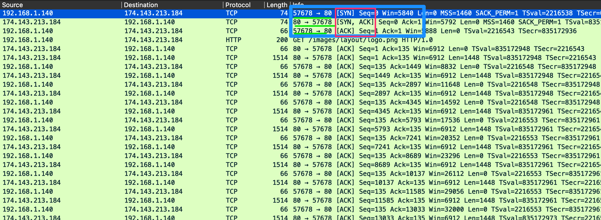
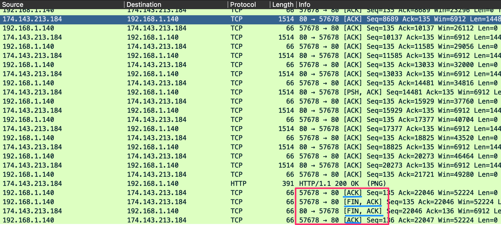
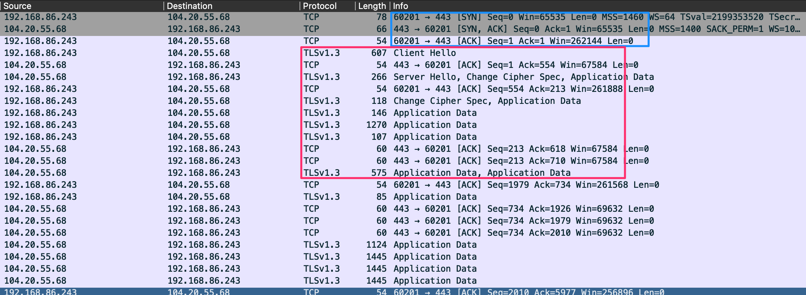
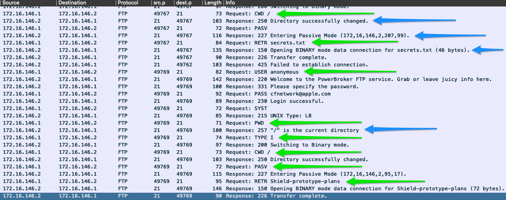
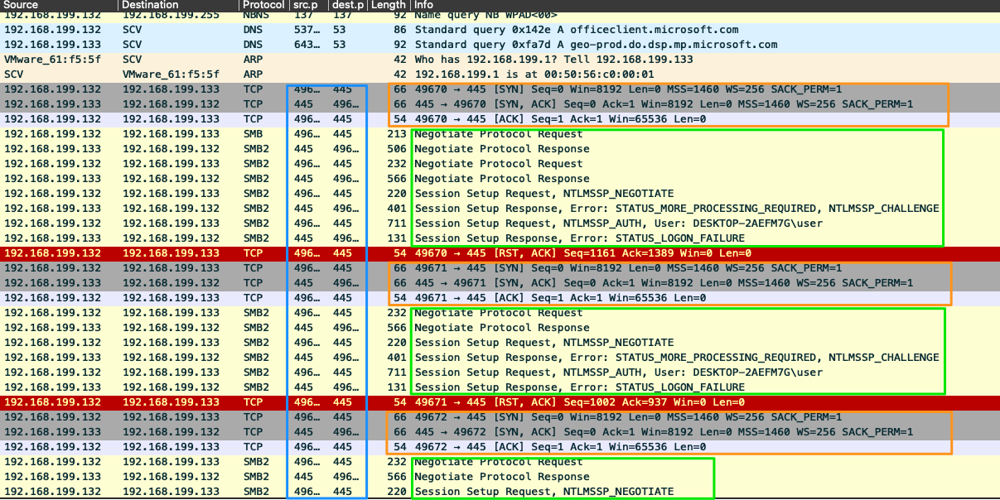

# Network traffic analysis

- [Network traffic analysis](#network-traffic-analysis)
  - [Introduction](#introduction)
    - [Useful knowledge](#useful-knowledge)
      - [TCP/IP stack \& OSI model](#tcpip-stack--osi-model)
      - [Common ports \& protocols](#common-ports--protocols)
      - [Concepts of IP packats and sublayers](#concepts-of-ip-packats-and-sublayers)
      - [Protocol transport encapsulation](#protocol-transport-encapsulation)
    - [Environment and equipment](#environment-and-equipment)
    - [BPF syntax](#bpf-syntax)
    - [NTA workflow](#nta-workflow)
  - [Networking primer](#networking-primer)
    - [OSI Layers 1-4](#osi-layers-1-4)
      - [OSI vs TCP/IP models](#osi-vs-tcpip-models)
      - [PDU example](#pdu-example)
      - [Addressing mechanisms](#addressing-mechanisms)
    - [TCP](#tcp)
      - [TCP vs UDP](#tcp-vs-udp)
      - [Three-way handshake](#three-way-handshake)
    - [OSI Lasyers 5-7](#osi-lasyers-5-7)
      - [HTTP: Hypertext Transfer Protocol (80)](#http-hypertext-transfer-protocol-80)
      - [HTTPS: HTTP Secure (443)](#https-http-secure-443)
      - [FTP: File Transfer Protocol (20/21)](#ftp-file-transfer-protocol-2021)
      - [SMB: Server Message Block (445)](#smb-server-message-block-445)
  - [Analysis](#analysis)
    - [The analysis process](#the-analysis-process)
      - [Analysis dependencies](#analysis-dependencies)
    - [Analysis in practice](#analysis-in-practice)
      - [Descriptive analysis](#descriptive-analysis)
      - [Diagnostic analysis](#diagnostic-analysis)
      - [Predictive analysis](#predictive-analysis)
      - [Prescriptive analysis](#prescriptive-analysis)
    - [Key components of an effective analysis](#key-components-of-an-effective-analysis)
    - [Analysis approach](#analysis-approach)

## Introduction

_Network traffic analysis (NTA)_ can be described as the act of examining network traffic to characterize common ports and protocol utilized, establish a baseline for our environment, monitor and repond to threats, and ensure the hreatest possible insight into the network.

This process helps determine anomalies, including security threats in the network, early and effectively pinpoint threats.

Everyday use cases of NTA include:

- _Collecting_ real-time traffic within the network to analyze threats.
- _Setting_ a baseline for day-to-day network communications.
- _Identifying_ and _analyzing_ traffic from non-standard ports, suspicious hosts, and issues with networking protocols (HTTP, TCP, etc).
- _Detecting_ malware on the wire, such as ransomware, exploits, and non-standard interactions.

### Useful knowledge

#### TCP/IP stack & OSI model

Understanding what types of traffic we'll see at each level includes understanding of the individual layers that make up the TCP/IP and OSI model and the concepts of switching anr routing

We'll grasp how networking traffic and the host applications interact.

#### Common ports & protocols

Standard ports and protocols facilitate identifying potentially malicious or malformed network traffic.

#### Concepts of IP packats and sublayers

Foundtional knowledge of how TCP and UDP communicate will, at a minimum, ensure we understand what we see or are searching for.

#### Protocol transport encapsulation

Each layer will encapsulate the previous. Being able to read or dissect when this encapsulation changes will help us move through data quicker.

### Environment and equipment

Different tools provide a different way to capture or dissect the traffic. Some offers ways to copy and capture, while others read and ingest.

| Tool                  | Description                                                                                                                                                                                                                                                                                                                                                                   |
|-----------------------|-------------------------------------------------------------------------------------------------------------------------------------------------------------------------------------------------------------------------------------------------------------------------------------------------------------------------------------------------------------------------------|
| tcpdump               | tcpdump is a command-line utility that, with the aid of LibPcap, captures and interprets network traffic from a network interface or capture file.                                                                                                                                                                                                                            |
| Tshark                | TShark is a network packet analyzer much like TCPDump. It will capture packets from a live network or read and decode from a file. It is the command-line variant of Wireshark.                                                                                                                                                                                               |
| Wireshark             | Wireshark is a graphical network traffic analyzer. It captures and decodes frames off the wire and allows for an in-depth look into the environment. It can run many different dissectors against the traffic to characterize the protocols and applications and provide insight into what is happening.                                                                      |
| NGrep                 | NGrep is a pattern-matching tool built to serve a similar function as grep for Linux distributions. The big difference is that it works with network traffic packets. NGrep understands how to read live traffic or traffic from a PCAP file and utilize regex expressions and BPF syntax. This tool shines best when used to debug traffic from protocols like HTTP and FTP. |
| tcpick                | tcpick is a command-line packet sniffer that specializes in tracking and reassembling TCP streams. The functionality to read a stream and reassemble it back to a file with tcpick is excellent.                                                                                                                                                                              |
| Network Taps          | Taps (Gigamon, Niagra-taps) are devices capable of taking copies of network traffic and sending them to another place for analysis. These can be in-line or out of band. They can actively capture and analyze the traffic directly or passively by putting the original packet back on the wire as if nothing had changed.                                                   |
| Networking Span Ports | Span Ports are a way to copy frames from layer two or three networking devices during egress or ingress processing and send them to a collection point. Often a port is mirrored to send those copies to a log server.                                                                                                                                                        |
| Elastic Stack         | The Elastic Stack is a culmination of tools that can take data from many sources, ingest the data, and visualize it, to enable searching and analysis of it.                                                                                                                                                                                                                  |
| SIEMS                 | SIEMS (such as Splunk) are a central point in which data is analyzed and visualized. Alerting, forensic analysis, and day-to-day checks against the traffic are all use cases for a SIEM.                                                                                                                                                                                     |

### BPF syntax

[Berkpley Packet Filter (BPF)](https://en.wikipedia.org/wiki/Berkeley_Packet_Filter) is a syntax/technology shared among tools that enables a raw interface to read and write from the Data-llink layer, providing filtering and decoding abilities.

### NTA workflow

NTA can be a very dynamic process and it's greatly influenced by what we are looking for (errors vs malicious actions) and where we have visibility into our network. Nevertheless, traffic analysis can distill down to a few basic tenants.

1. Ingest traffic.
2. Reduce noise by filtering (e.g., broadcast vs multicast traffic).
3. Analyze and explore (e.g., attempting unauthorized access, uncommon communications?).
4. Detect and root issue (e.g., IDS/IPS to run heuristics and signatures against the traffic).
5. (Extra) fix and monitor.

## Networking primer

### OSI Layers 1-4

#### OSI vs TCP/IP models

:::tip
Think of the OSI model as the theory behind how everything works, whereas the TCP/IP model is more closely aligned with the actual functionaloty of networking.
:::

Layers 1-4 of the OSI model are focused on controlling the transportation of data between hosts. This includes everything from the physical medium used for transmission to the protocol utilized to maange the conversation or lack thereof when transporting data.

Layers 5-7 handle the interpretation, management, and presentation of the encapsulated data presented to the end-user.

On the other hand, TCP/IP comprises four layers. Layers 5-7 of OSI align with layer 4 of TCP/IP. Layer 3 deals with transportation (layer 4 in OSI), layer 2 with the internet layer (layer 3 in OSI) and layer 1 is the link-layer (layer 1-2 OSI).

#### PDU example

A _Protocol Data Unit_ (PDU) is a data packet made up of control information and data encapsulated from each layer of the OSI model.

As our data moves down the protocol stack, each layer will wrap the previous layers' data in a new bubble we call encapsulation. This adds the necessary information of that layer into the header of the PDU.

The information can vary by level, but it includes what is held by the previous layer, operational flags, any options required to negotiate communications, source and destination IP, ports, tranport and application layer protocols, etc.

:::note
The image above shows us the makeup of a PDU side by side with a packet breakout from Wireshark's Packet Details pane. Note that when we see the breakout in Wireshak, it's in reverse order because it's in the order that it was _unencapsulated_.
:::

#### Addressing mechanisms

There are different addressing mechanisms that enable the delivery of our packets to  the correct hosts.

- _MAC-Addressing_: Each logical/physical interface attached to a host has a _Media Access Control_ address. It's utilized in OSI layer 2.
- _IP addressign_: IP is responsible for routing packets, the encapsulation of data, and fragmentation and reassembly of datagrams when they reach the destination host. By nature, IP is a connectionless protocol that provides no assurances that data will reach its intended recipient. For the reliability and validation of data delivery, IP relies on upper-layer protocols such as TCP

IPv6 es four main types of addresses within its schema:

- _Unicast_: Addresses for a single interface.
- _Anycast_: Addresses for multiple interfaces, where only one of them receives the packet.
- _Multicast_: Addresses for multiple interfaces, where all of them receive the same packet.
- _Broadcast_: Does not exist and is realized with multicast addresses.

:::note
Along with a much larger address space, IPv6 provides better support for _multicasting_ (traffic from one to many), global addressing per device, security within the protocol in the form of _IPSec_, simplified packet headers to allow easier processing and move from connection to connetion without being re-assigned an address.
:::

### TCP

#### TCP vs UDP

| Characteristic | TCP | UDP |
|---|---|---|
| Transmission | Connection-oriented | Connectionless. Fire and forget. |
| Connection Establishment | TCP uses a three-way handshake to ensure that a connection is established. | UDP does not ensure the destination is listening. |
| Data Delivery | Stream-based conversations | Packet by packet, the source does not care if the destination is active |
| Receipt of data | Sequence and Acknowledgement numbers are utilized to account for data. | UDP does not care. |
| Speed | TCP has more overhead and is slower because of its built-in functions. | UDP is fast but unreliable. |

#### Three-way handshake

To ensure the delivery of data from server to client, TCP uses sessions, which are established through a three-way handshake. For this, TCP uses an option in the TCP header called _flags_.

The common flags we'll see in a 3-way handshake are _Synchronization (`SYN`)_ and _Acknowledgment (`ACK`)_.

When a host requests to have a conversation with a server over TCP:

1. The `client` sends a packet with the `SYN` flag set to on along with other negotiable options in the TCP header.
2. The `server` will respond with a TCP packet that inlcudes a `SYN` flag set for the sequence number negotiation and an `ACK` flag set to acknowledge the previous `SYN` packet sent by the host.
3. The `client` will respond with a TCP packet with an `ACK`` flag set agreeing to the negotation.

We can also see how a session TCP gracefully shuts connections:

This set of packets is similar to the 3-way handshake. The `FIN` flag is used for signaling that the data transfer is finished and the sender is requesting termination of the connection. The client acknowledges the receipt of the data and then sends a `FIN` and `ACK` to begin session termination. The server responds with an acnknowledgement of the `FIN` and sends back its own `FIN`. Finally, the client acknowledges the session is complete and closes the connection.

We should see the pattern: `FIN, ACK` -> `FIN, ACK` -> `ACK`.

### OSI Lasyers 5-7

Here we look at the upper layer protocols that handle our applications.

#### HTTP: Hypertext Transfer Protocol (80)

HTTP is a _stateless_ Application Layer protocol that has been in use since 1990. It enables transfer of data in clear text between a client and server over TCP.

A client sends an HTTP request to the server, asking for a resource. A session is established, and the server responds with the requested media.

#### HTTPS: HTTP Secure (443)

HTTPS is designed to utilize _Transport Layer Security (TLS)_ or _Secure Sockets Layer (SSL)_ with older applications for data security. TLS is utilized as an encryption mechanism to secure the communications between a client and a server.

Before the TLS mechanism was in place, we were vulnerable to MiTM attacks and other types of resconnaissance or hijaking.

#### FTP: File Transfer Protocol (20/21)

FTP enables quick data transfer. It's established as an insecure protocol, and most users have moved to utilize tools such as SFTP.

FTP uses port 20 for data transfer and port 21 for issuing commands.

Here are some commands.

| Command | Description |
|---|---|
| USER | specifies the user to log in as. |
| PASS | sends the password for the user attempting to log in. |
| PORT | when in active mode, this will change the data port used. |
| PASV | switches the connection to the server from active mode to passive. |
| LIST | displays a list of the files in the current directory. |
| CWD | will change the current working directory to one specified. |
| PWD | prints out the directory you are currently working in. |
| SIZE | will return the size of a file specified. |
| RETR | retrieves the file from the FTP server. |
| QUIT | ends the session. |

#### SMB: Server Message Block (445)

SMB is most widely seen in Windows enterprise environments that enables sharing resources between hosts over common networking architectures. It's connection-oriented and requires user authentcation from the host to the resource to ensure the user has correct permissions.

:::note
In the past, SMB utilized NetBIOS as its transport mechanism over UDP ports 137 and 138. Since modern changes, SMB now supports direct TCP transport over port 445, NetBIOS over TCP port 139, and even the QUIC protocol.
:::

## Analysis

### The analysis process

NTA is a __detailed examination of an event or process__, determining its origin and impact. This means breaking down the data into understandble chunks, examining it for anything that deviates from regular network traffic. Also, we are looking to see what the trends look like within the traffic and determine if it matches a baseline of typical traffic.

On daily basis, NTA live can make it easy to troubleshoot a connection issue or determine if our infrastructure and the corresponding protocols are functioning correctly.

#### Analysis dependencies

Traffic capturing can be performed in two ways: `active` or `passive`.

With passive, we are just copying data that we can see without directly interacting with the packets.

With active (also referred to as `inline`), we have a more hands-on approach.

| Dependencies | Passive | Active | Description |
|---|---|---|---|
| Permission | ☑ | ☑ | Depending on the organization we are working in, capturing data can be against policy or even against the law in some sensitive areas like healthcare or banking. Be sure always to obtain permission in writing from someone with the proper authority to grant it to you. We may style ourselves as hackers, but we want to stay in the light legally and ethically. |
| Mirrored Port | ☑ | ☐ | A switch or router network interface configured to copy data from other sources to that specific interface, along with the capability to place your NIC into promiscuous mode. Having packets copied to our port allows us to inspect any traffic destined to the other links we could normally not have visibility over. Since VLANs and switch ports will not forward traffic outside of their broadcast domain, we have to be connected to the segment or have that traffic copied to our specific port. When dealing with wireless, passive can be a bit more complicated. We must be connected to the SSID we wish to capture traffic off of. Just passively listening to the airwaves around us will present us with many SSID broadcast advertisements, but not much else. |
| Capture Tool | ☑ | ☑ | A way to ingest the traffic. A computer with access to tools like TCPDump, Wireshark, Netminer, or others is sufficient. Keep in mind that when dealing with PCAP data, these files can get pretty large quickly. Each time we apply a filter to it in tools like Wireshark, it causes the application to parse that data again. This can be a resource-intensive process, so make sure the host has abundant resources. |
| In-line Placement | ☐ | ☑ | Placing a Tap in-line requires a topology change for the network you are working in. The source and destination hosts will not notice a difference in the traffic, but for the sake of routing and switching, it will be an invisible next hop the traffic passes through on its way to the destination. |
| Network Tap or Host With Multiple NIC's | ☐ | ☑ | A computer with two NIC's, or a device such as a Network Tap is required to allow the data we are inspecting to flow still. Think of it as adding another router in the middle of a link. To actively capture the traffic, we will be duplicating data directly from the sources. The best placement for a tap is in a layer three link between switched segments. It allows for the capture of any traffic routing outside of the local network. A switched port or VLAN segmentation does not filter our view here. |
| Storage and Processing Power | ☑ | ☑ | You will need plenty of storage space and processing power for traffic capture off a tap. Much more traffic is traversing a layer three link than just inside a switched LAN. Think of it like this; When we passively capture traffic inside a LAN, it's like pouring water into a cup from a water fountain. It's a steady stream but manageable. Actively grabbing traffic from a routed link is more like using a water hose to fill up a teacup. There is a lot more pressure behind the flow, and it can be a lot for the host to process and store. |

### Analysis in practice

#### Descriptive analysis

It serves to describe a data set based on individual characterics and detect possible errors in data collection and/or outliers in the data set.

- What is the issue?
- Define scope and goal (what are we looking for? which time period?).
- Define our target(s) (net/host(s)/protocol).

#### Diagnostic analysis

It clarifies the causes, effects, and interactions of conditions. It provides insights that are obtained through correlations and interpretation. It tries to __find reasons for events__.

- Capture network traffic.
- Identification of required network traffic components (filtering).
- Understanding of captured network traffic.

#### Predictive analysis

By evaluating historical and current data, predictive analysis creates a predictive model for future probabilities. It makes it possible to identify trends, detect deviations from expected values at an early stage, and predict future occurrences as accurately as possible.

- Note-taking and mind mapping of the found results.
- Summary of the analysis (what did we find?).

#### Prescriptive analysis

It aims to narrow down what actions to take to eliminate or prevente a future problem or trigger a specific activity or process. We can make sound decisions as to what actions are required. __To prescrive a solution is the culmination of this workflow__.

### Key components of an effective analysis

1. Know your environment.
2. Placement is key.
3. Persistence.

### Analysis approach

Some easy wins when looking at traffic and finding problems:

1. Start with standard protocols and work your way into the austere and specific only to the organization.
2. Look for paterns in our traffic data.
3. Check anything _host to host_ as they will rarely talk to each other.
4. Look for _unique_ events.
5. Don't be afraid to ask for help.
