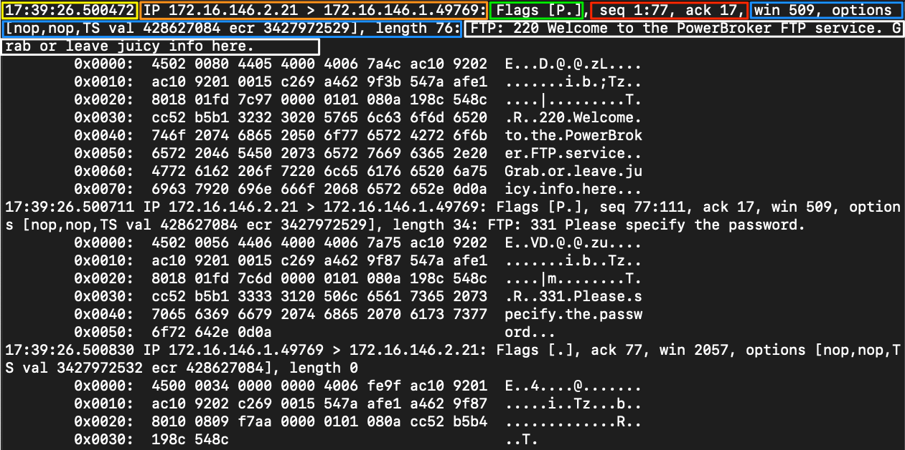

# TCPDump

## Fundamentals

`tcpdump` is a CLI packet sniffer that can directly capture and interpret data frames from a file or network interface.

To capture traffic from "off the wire", it uses the libraries `pcac` and `libpcap`, paired with an interface in promiscuous mode to listen for data. This allows the program to see and capture packets sourcing from or destined for any device in the LAN.

### Traffic captures

#### Basic capture options

Here are some basic Tcpdumps switches we can use to modify how our captures run and can be chained tohether:

| Switch Command | Result |
|---|---|
| D | Will display any interfaces available to capture from. |
| i | Selects an interface to capture from. ex. -i eth0 |
| n | Do not resolve hostnames. |
| nn | Do not resolve hostnames or well-known ports. |
| e | Will grab the ethernet header along with upper-layer data. |
| X | Show Contents of packets in hex and ASCII. |
| XX | Same as X, but will also specify ethernet headers. (like using Xe) |
| v, vv, vvv | Increase the verbosity of output shown and saved. |
| c | Grab a specific number of packets, then quit the program. |
| s | Defines how much of a packet to grab. |
| S | change relative sequence numbers in the capture display to absolute sequence numbers. (13248765839 instead of 101) |
| q | Print less protocol information. |
| r file.pcap | Read from a file. |
| w file.pcap | Write into a file. |

#### Tcpdump output

- Timestap: yellow.
- Protocol: orange.
- Source & destination IP: orange.
- Flags: green.
- Sequence & Acknowledgment numbers: red.
- Protocol options: blue.
- Notes / Next Header: white.

#### File I/O

Using `-w` will write our capture to a file: `sudo tcpdump -i eth0 -w ~/output.pcap`. Afterwards, we can read the output with: `sudo tcpdump -r ~/output.pcap`.

## Packet filtering

| Filter | Result |
|---|---|
| host | host will filter visible traffic to show anything involving the designated host. Bi-directional |
| src / dest | src and dest are modifiers. We can use them to designate a source or destination host or port. |
| net | net will show us any traffic sourcing from or destined to the network designated. It uses / notation. |
| proto | will filter for a specific protocol type. (ether, TCP, UDP, and ICMP as examples) |
| port | port is bi-directional. It will show any traffic with the specified port as the source or destination. |
| portrange | portrange allows us to specify a range of ports. (0-1024) |
| less / greater "< >" | less and greater can be used to look for a packet or protocol option of a specific size. |
| and / && | and && can be used to concatenate two different filters together. for example, src host AND port. |
| or | or allows for a match on either of two conditions. It does not have to meet both. It can be tricky. |
| not | not is a modifier saying anything but x. For example, not UDP. |
