# Wireshark

- [Wireshark](#wireshark)
  - [Overview](#overview)
    - [TShark](#tshark)
      - [Example: Select an interface \& write to a file](#example-select-an-interface--write-to-a-file)
      - [Example: Applying filters](#example-applying-filters)
    - [Termshark](#termshark)
    - [Wireshark GUI](#wireshark-gui)
    - [Processing and filtering](#processing-and-filtering)
      - [Capture filters](#capture-filters)
      - [Display filters](#display-filters)
  - [Advanced usage](#advanced-usage)
    - [Statistics tab](#statistics-tab)
    - [Analyze tab](#analyze-tab)
      - [Following TCP streams](#following-tcp-streams)
      - [Filter for a specific TCP stream](#filter-for-a-specific-tcp-stream)
      - [Extract data and files](#extract-data-and-files)
      - [FTP disector](#ftp-disector)
      - [FTP request-command filter](#ftp-request-command-filter)
      - [FTP data filter](#ftp-data-filter)
    - [Decrypt RDP connections](#decrypt-rdp-connections)

## Overview

Wireshark is a free and open-source NTA tool similar to tcpdump but with a GUI. It's capable of capturing live data off many different interface types (WiFI, USB, and Bluetooth) and saving the traffic to several different formats.

### TShark

TShark is a purporse-built terminal tool based on Wireshark. It shares many of the same features and it's perfect for use on machines with little or no desktop environment and can easily pass the capture information it receives to another tool via the command line.

Here are some basic TShark switches:

| Switch Command | Result |
|---|---|
| D | Will display any interfaces available to capture from and then exit out. |
| L | Will list the Link-layer mediums you can capture from and then exit out. (ethernet as an example) |
| i | choose an interface to capture from. (-i eth0) |
| f | packet filter in libpcap syntax. Used during capture. |
| c | Grab a specific number of packets, then quit the program. Defines a stop condition. |
| a | Defines an autostop condition. Can be after a duration, specific file size, or after a certain number of packets. |
| r (pcap-file) | Read from a file. |
| W (pcap-file) | Write into a file using the pcapng format. |
| P | Will print the packet summary while writing into a file (-W) |
| x | will add Hex and ASCII output into the capture. |
| h | See the help menu |

#### Example: Select an interface & write to a file

```console
sudo tshark -i eth0 -w /tmp/test.pcap
```

#### Example: Applying filters

```console
sudo tshark -i eth0 -f "host 172.16.146.2"
```

### Termshark

Termshark is a text-based user interface (TUI) application that provides a Wireshark-like interface right in your terminal window.

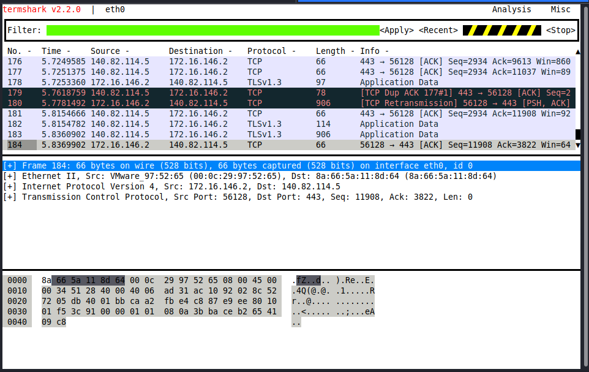

### Wireshark GUI

Here's how you start a capture:

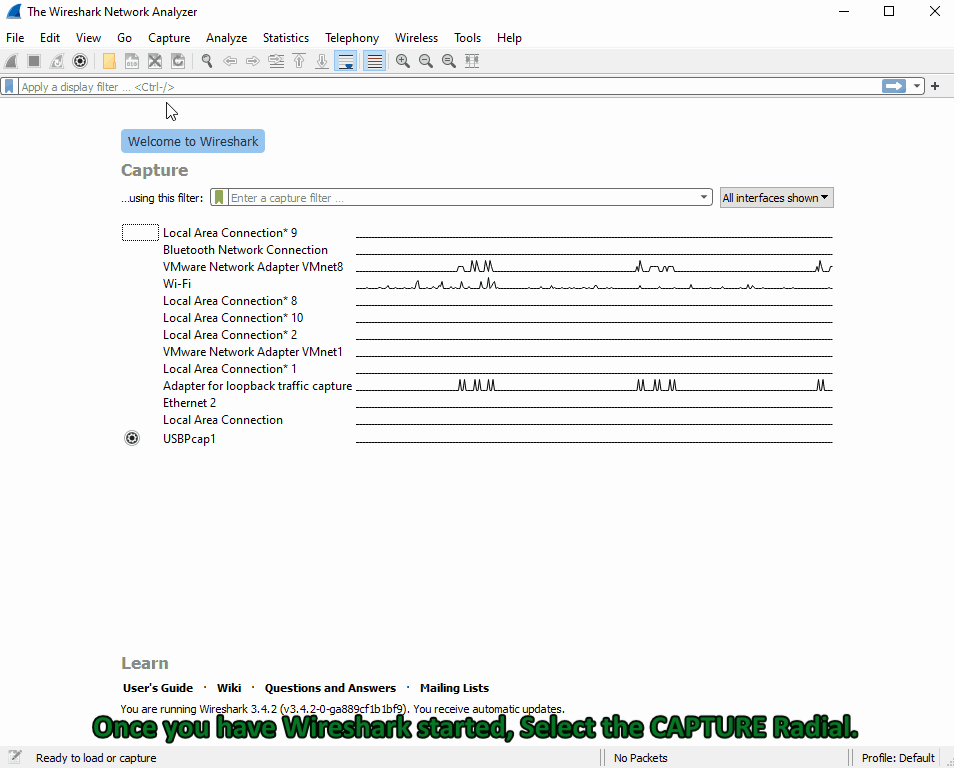

### Processing and filtering

#### Capture filters

The `Capture filters` are initiated before the capture starts and use BPF syntax. It will drop all other traffic not explicitly meeting the criteria set. It's a great way to trim down the data you write to disk.

You can apply those by clicking on the capture radial at the top of the Wireshark window -> select capture filters from the drop-down.

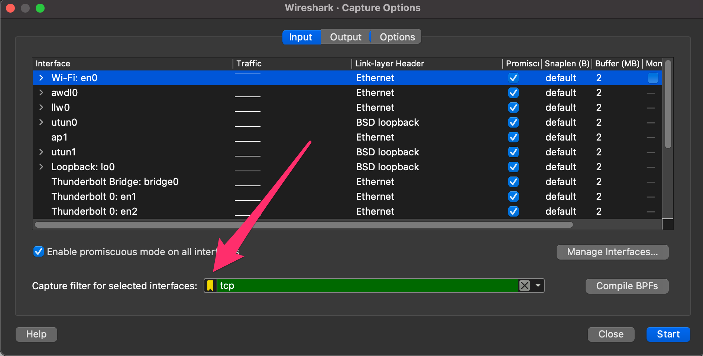

| Capture Filters | Result |
|---|---|
| host x.x.x.x | Capture only traffic pertaining to a certain host |
| net x.x.x.x/24 | Capture traffic to or from a specific network (using slash notation to specify the mask) |
| src/dst net x.x.x.x/24 | Using src or dst net will only capture traffic sourcing from the specified network or destined to the target network |
| port # | will filter out all traffic except the port you specify |
| not port # | will capture everything except the port specified |
| port # and # | AND will concatenate your specified ports |
| portrange x-x | portrange will grab traffic from all ports within the range only |
| ip / ether / tcp | These filters will only grab traffic from specified protocol headers. |
| broadcast / multicast / unicast | Grabs a specific type of traffic. one to one, one to many, or one to all. |

#### Display filters

The `Display filters` are used while the capture is running and after the capture has stopped.

Here are some common and helpful display filters:

| Display Filters | Result |
|---|---|
| ip.addr == x.x.x.x | Capture only traffic pertaining to a certain host. This is an OR statement. |
| ip.addr == x.x.x.x/24 | Capture traffic pertaining to a specific network. This is an OR statement. |
| ip.src/dst == x.x.x.x | Capture traffic to or from a specific host |
| dns / tcp / ftp / arp / ip | filter traffic by a specific protocol. There are many more options. |
| tcp.port == x | filter by a specific tcp port. |
| tcp.port / udp.port != x | will capture everything except the port specified |
| and / or / not | AND will concatenate, OR will find either of two options, NOT will exclude your input option. |

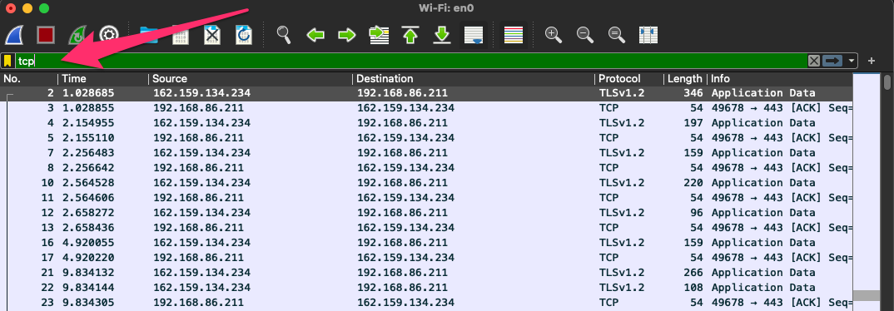

## Advanced usage

### Statistics tab

Detailed reports about the network traffic being utilized. It can show us everything from the top talkers in our environment to specific conversations and even breakdown by IP and protocol.

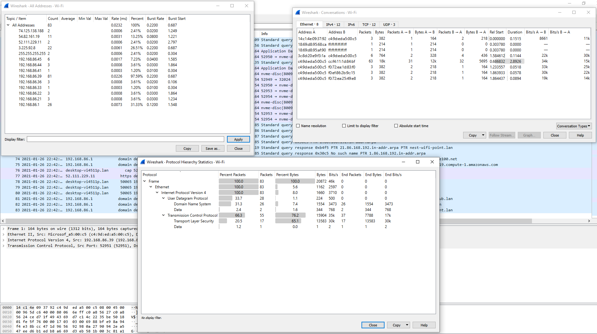

### Analyze tab

We can utilized plugins that allow us to do things such as following TCP streams, filter on conversation types, and examine the expert info Wireshark generates about the traffic.

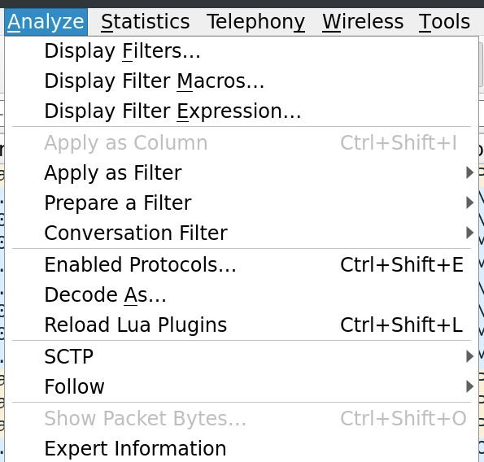

#### Following TCP streams

Wireshark can stitch TCP packets back together to recreate the entire stream in a readable format (e.g., pull data like images and files out of the capture).

1. Right-click on a packet from the stream.
2. Select `follow` -> `TCP`.
3. It will open a new window with the stream stitched back together.

#### Filter for a specific TCP stream

You can use the filter `tcp.stream eq #` to find and track conversations captured in the pcap file.

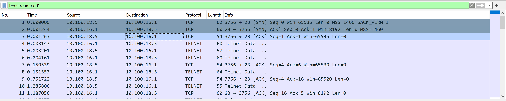

#### Extract data and files

1. Stop your capture.
2. Select the `File` radial -> `Export` -> select the protocol format to extract from (DICOM, HTTP, SMB, etc.).

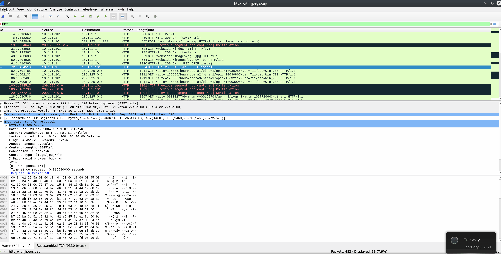

#### FTP disector

It will display anything about the FTP protocol (e.g., what hosts/servers are transferring data over FTP).

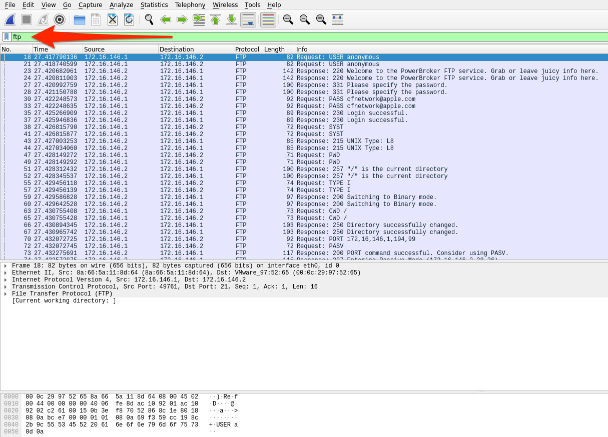

The basic steps to dissect FTP data from a pcac are:

1. Identify any FTP traffic using the `ftp` display filter.
2. Look at the command controls sent between the server and hosts to determine if anything was transferred and who did so with the `ftp.request.command` filter.
3. Choose a file, then filter for `ftp-data`. Select a packet that corresponds with our file of interest and follow the TCP stream that correlates to it.
4. Once done, change `Show and save data as` to `Raw` and save the content as the original file name.
5. Validate the extraction by checking the file type.

#### FTP request-command filter

 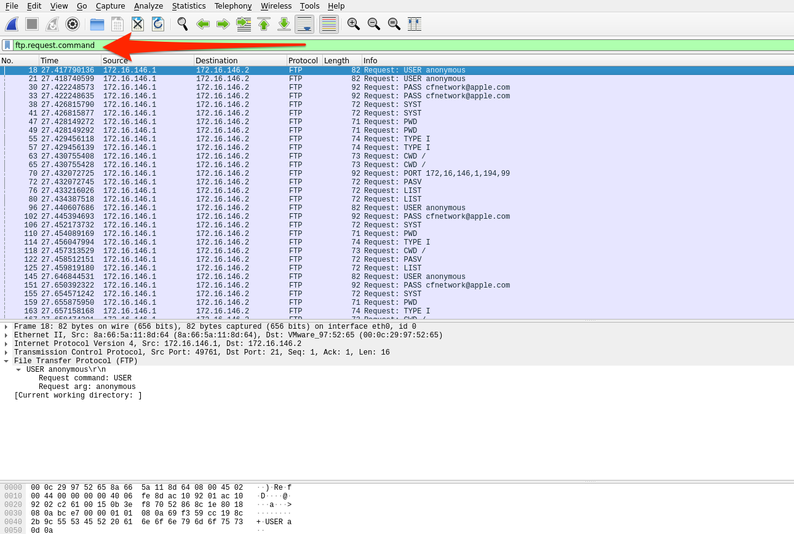

Using `ftp.request.command` will show any commands sent across the ftp-control channel (i.e., port 21). We can look for information like usernames, passwords, and filenames.

#### FTP data filter

Using `ftp-data` will show any data transferred over the data channel (i.e., port 20). We can reconstruct anything transferred by placing the raw data back into a new file and naming it appropriately.

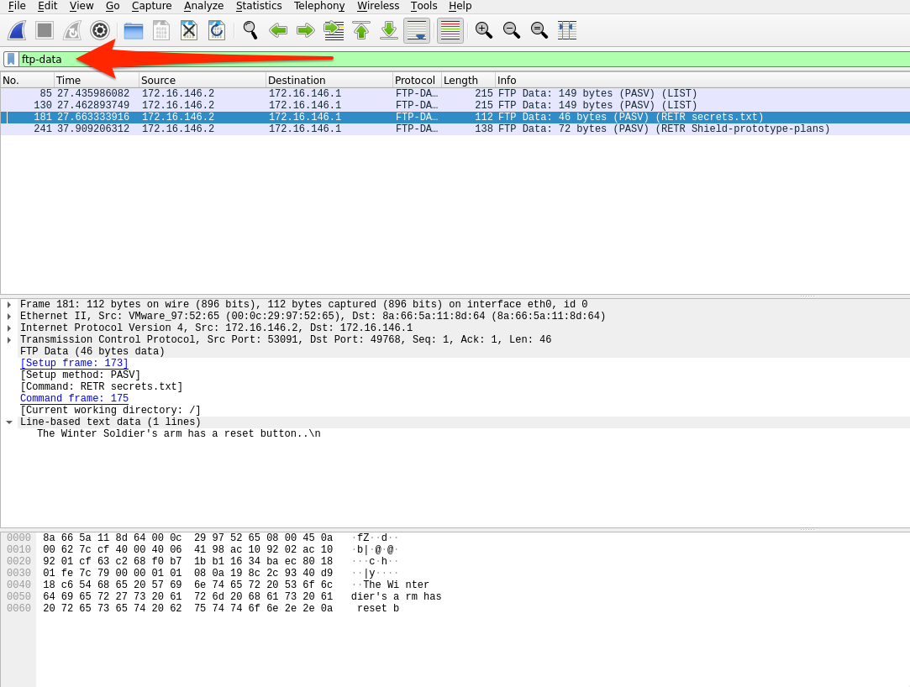

### Decrypt RDP connections

If we have the required key utilized between the two hosts for encrypting the traffic, Wireshark can deobfuscate the traffic for us.

You can filter for RDP data using `rdp` but if it's using TLS to encrypt data, you won't be able to find it that way. You can try to filter on the well-known port RDP uses typically (`tcp.port == 3389`).

Afterwards, provide the RDP-key in `Edit` -> `Preferences` -> `TLS` -> `RSA keys list - Edit`.

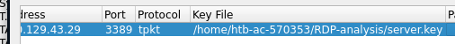

IP address should equal RDP server's address, the port used is either the default `3389` or a custom one, and protocol should equal `tpkt` or `blank`.

Once it's done, you should be able to filter on RDP.

:::tip
The steps for acquiring the RSA key used for encrypting the RDP session are a bit lengthy but the short of it is that if the RDP certificate is acquired from the server, `OpenSSL` can pull the private key out of it.
:::
