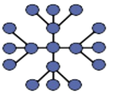

# Extended star

It **extends a physical star topology** by one or more repeaters between the central node and the peripheral (or *spoke*) nodes. These repeaters are used to extend the maximum transmission distance of the physical layer, the point-to-point distance between the central node and the peripheral nodes.

A physical extended star topology in which repeaters are replaced with hubs or switches is a type of **hybrid** network topology and is referred to as a **physical hierarchical star topology** or **tier-star topology**.
