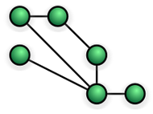

# Meshnet: Mesh network

Infrastructure **nodes connect directly, dynamically and non-hierarchically** to as many other nodes as possible and cooperate with one another to efficiently route data from/'to clients.

Mesh networks dynamically self-organize, and self-configure, which **can reduce installation overhead** and **enables dynamic distribution of worloads** particularly in the event a few nodes should fail.
