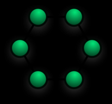

# Ring

* **Each node connects to exactly two other nodes**, forming a single continuous pathway for signals through each node, a ring. **Data travels from node to node**, with **each node along wthe way handling every packet**.

* Rings **can be unidirectional**, with all traffic travelling either clockwise or anticlockwise around the ring, or **bidirectional** (as in *SONET/SDH*).

  * Because a unidirectional ring topology provides only one pathway between any two nodes, unidirectional ring networks may be disrupted by the failure of a single link.

  * Some rings add a **C-Ring** (*counter-rotating ring*) to form a redundant topology: in the event of a break, data are wrapped back onto the complementary ring before reaching the end of the cable.

> Some networks avoid the weakness of a ring topology altogether by actually using a *start* topology at the *physical layer* and a *Media Access Unit (MAU)* to *imitate* a *ring* at the *data link layer*.

## Advantages

* Very **orderly network** where every device has access  to the token and the opportunity to transmit.

* Better performance than a *bus* under heavy network load.

* Does not require a central node to manage the connectivity between nodes.

* Due to the point-to-point line configuration of devices with a device on either side, it is quite easy to install or reconfigure a device (it requires moving just two connections).

* Easy to identify and isolate faults.

* *Ring Protection* reconfiguration for line faults of bidirectional rings can be very fast.

## Disadvantages

* One malfunctioning workstation can create problems for the entire network. This can be solved by using a dual ring or a switch that closes off the break.

* Moving, adding, and changing the devices, can affect the network.

* Communication delay is directly proportional to the number of nodes.

* Bandwidth is shared on all links between devices.

* More difficult to configure than a *star*: node adjuntion requires *ring* shutdown and reconfiguration.
