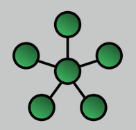

# Star

It is an implementation of a **spoke-hub distribution paradigm** in computer networks. **Every host is connected to a central hub**. In its simplest form, one central hub acts as a conduit to transmit messages.

Data passes through the hub before continuing to its destination. The hub manages and controls all functions of the network. It also acts as a *repeater* for the data flow.

## Advantages

* Reduced impact of node/connection failure.

> The star topology reduces the impact of a transmission line failure by independently connecting each host to the hub. The failure of a transmission line linking any host to will result in the isolation of that host from all others, but the rest of the network will be unaffected.

* Devices can be added or removed without disturbing the network.

* Works well under heavy load.

* Appropriate for a large network.

## Disadvantages

* Expensive due to the number and length of cables needed to wire each host to the central hub.

* The central hub is a **single point of failure** for the network.
