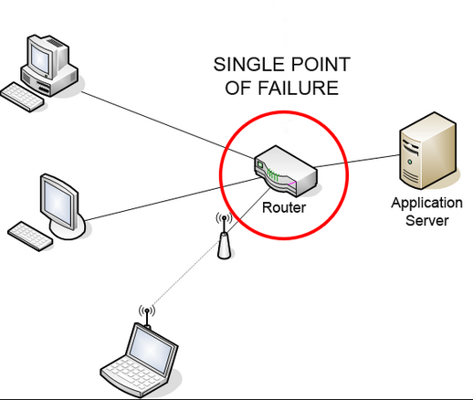
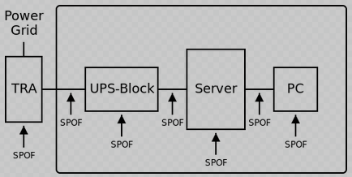
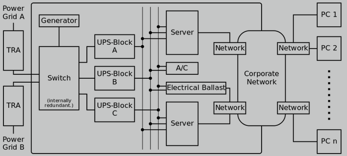

# Single point of failure

A *SPOF* is a part of a system that, if it fails, will stop the entire system from working.

## Redundacy

Systems can be made robust by adding redundancy in all potential SPOFs. This can be done in different levels.

The same system after adding some redundancy mechanisms:

By further adding redundancy, we could remove SPOFs making the system robust and reliable:

