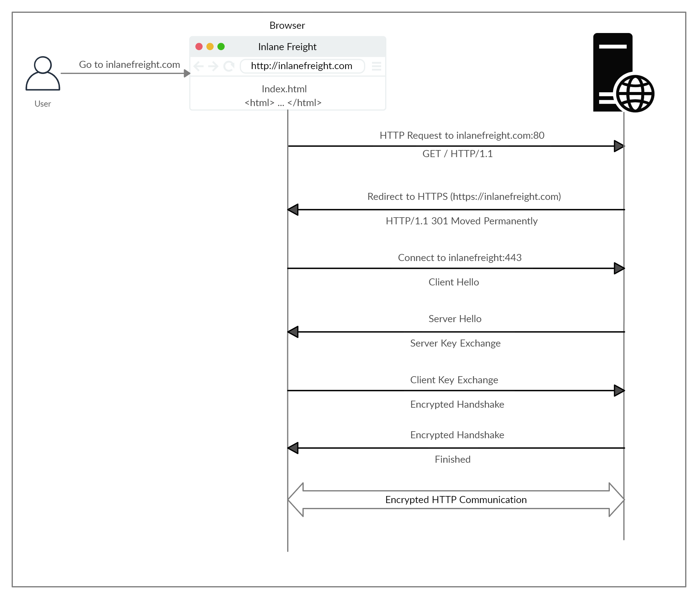

# HTTP / HTTPS

- [HTTP / HTTPS](#http--https)
  - [Overview](#overview)
  - [Role in Security](#role-in-security)
  - [HTTPS](#https)
  - [Data Encryption](#data-encryption)
  - [Web Server Autentication](#web-server-autentication)

## Overview

The World Wide Web is composed primarily of HTML documents transmitted from web servers to web browsers using the _Hypertext Transfer Protocol_ (HTTP). However, HTTP is used to serve images, sound, and other content, in addition to HTML.

To allow the web browser to know how to handle each document it receives, other information is transmitted along with the document. This _metadata_ usually includes a [MIME type](https://en.wikipedia.org/wiki/Media_type) (e.g., text/html or application/json) and the character encoding.

## Role in Security

There is a broad scope of vulnerabilities, security concerns, best practices, and factors overalls that are tightly related to HTTP, as it's involved in most of everyday communication and information transfer while over the internet, inclding website content and API calls.

Some common topics related to HTTP Cookies, Same-Origin Policy (SOP), and CSRF (Cross-Site Request Forgery).

## HTTPS

The only difference with the two protocols is that HTTPS uses TLS (SSL) to encrypt normal HTTP reuqests and responses. The "__S__" stands for __Secure__.

## Data Encryption

TLS uses a technology called __Public Key Encryption__. All HTTP requests and responses are encrypted using public key encryption's session keys, so that anyone who intercepts communications can onlysee a randomish looking string of characters.

## Web Server Autentication

When a client opens a channel with an origin server, possession of the private key that matches with the public key in a website's SSL certificate proves that the server is actually the legitimate host of the website. This prevents or helps blocks a number of attacks that are possible when there is no authentication, such as:

- Man in the middle attacks
- DNS hijacking
- BGP hijacking
- Domain spoofing
