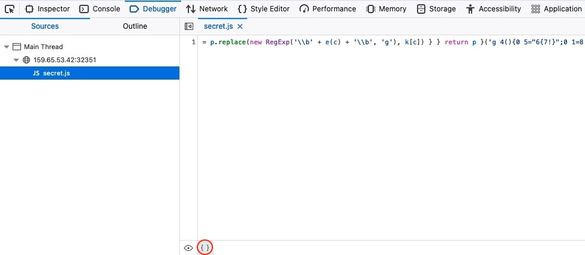

# JavaScript Deobfuscation

## Obfuscation

_Obfuscation_ is a technique used to make a script more difficult to read by humans but allows it to function the same from a technical point of view. This is usually achieved automatically by using an obfuscation tool.

:::note
While languages that resides on the server-side are hidden from end-users, JavaScript is usually used within browsers at the client-side and the code is sent to the user and executed in clear text. This is why obfuscation is very often used with JS.
:::

### Why?

There are many reasons. A common one is to hide the original code and its functions to prevent it from being reused or copied, making it more difficult to reverse engineer it.

The most common usage, however, is for malicious actions. It's common to obfuscate malicious scripts to prevent IDS/IPS from detecting them.

## Obfuscator

We can use  to obfuscate JS code using advanced options like `String Array Encoding: Base64`.

There are many JS obfuscators like [JSF](http://www.jsfuck.com/), [JJ Encode](http://www.jsfuck.com/) or [AA Encode](https://utf-8.jp/public/aaencode.html). However, such obfuscators usually make the code execution/compilation very slow, so it's not recommended to be used unless for an obvious reason, like bypassing web filters or restrictions.

## Beautify

When code is written in a single line, it's known as _minified JS_. In order to properly format the code, we need to _beautify_ it.

We can use our browser dev tools. For example, if using Firefox, open the _debugger_ (`CTRL+SHIFT+Z`), and then click on your JS file. You can click on the `{ }` button at the bottom to _pretty print_ the script.

.

Otherwise, there are online toos like [Prettier](https://prettier.io/playground/) and [Beautifier](https://beautifier.io/).

## Deobfuscate

There are good online tools such as [UnPacker](https://matthewfl.com/unPacker.html), which uses.
