# 1. Web proxies

- [1. Web proxies](#1-web-proxies)
  - [1.1. Introduction](#11-introduction)
    - [1.1.1. What ara web proxies?](#111-what-ara-web-proxies)
    - [1.1.2. Burp suite](#112-burp-suite)
    - [1.1.3. ZAP: OWASP zed attack proxy](#113-zap-owasp-zed-attack-proxy)
    - [1.1.4. CA Certificates](#114-ca-certificates)
  - [1.2. Intercepting requests](#12-intercepting-requests)
    - [1.2.1. Manipulating requests](#121-manipulating-requests)
  - [1.3. Intercepting responses](#13-intercepting-responses)
    - [1.3.1. Burp](#131-burp)
    - [1.3.2. ZAP](#132-zap)
  - [1.4. Automatic modification](#14-automatic-modification)
    - [1.4.1. Automatic request modification](#141-automatic-request-modification)
    - [1.4.2. Automatic response modification](#142-automatic-response-modification)
  - [1.5. Repeating requests](#15-repeating-requests)
    - [1.5.1. Proxy History](#151-proxy-history)
    - [1.5.2. Configure repetition](#152-configure-repetition)
  - [1.6. Encoding/Decoding](#16-encodingdecoding)
    - [1.6.1. URL Encoding](#161-url-encoding)
    - [1.6.2. Encoder/Decoder tool](#162-encoderdecoder-tool)
  - [1.7. Proxying tools](#17-proxying-tools)
    - [1.7.1. Proxychains](#171-proxychains)
    - [1.7.2. Nmap](#172-nmap)
    - [1.7.3. Metasploit](#173-metasploit)
  - [1.8. Web fuzzer](#18-web-fuzzer)
    - [1.8.1. Burp Intruder](#181-burp-intruder)
      - [1.8.1.1. Target](#1811-target)
      - [1.8.1.2. Positions](#1812-positions)
      - [1.8.1.3. Payloads](#1813-payloads)
      - [1.8.1.4. Options](#1814-options)
      - [1.8.1.5. Attack](#1815-attack)
  - [1.9. Web Scanner](#19-web-scanner)
    - [1.9.1. Burp Scanner](#191-burp-scanner)
      - [1.9.1.1. Target scope](#1911-target-scope)
      - [1.9.1.2. Crawler](#1912-crawler)
      - [1.9.1.3. Passive Scanner](#1913-passive-scanner)
      - [1.9.1.4. Active Scanner](#1914-active-scanner)
      - [1.9.1.5. Reporting](#1915-reporting)
    - [1.9.2. ZAP Scanner](#192-zap-scanner)
      - [1.9.2.1. Spider](#1921-spider)
      - [1.9.2.2. Passive scanner](#1922-passive-scanner)
      - [1.9.2.3. Active scanner](#1923-active-scanner)
      - [1.9.2.4. Reporting](#1924-reporting)
  - [1.10. Extensions](#110-extensions)
    - [1.10.1. Burp - BApp Store](#1101-burp---bapp-store)
    - [1.10.2. ZAP Marketplace](#1102-zap-marketplace)

## 1.1. Introduction

### 1.1.1. What ara web proxies?

Specialized tools that can be set up between a browser/mobile application and a backend server to capture and view all the web requests being sent between both ends, essentially acting as _main-in-the-middle_ (MITM) tools.

While other _network sniffing_ applications, like _Wireshark_, operate by analyzing all local traffic to see what is passing through a network, web proxies mainly work with web ports such as, but not limited to, `HTTP/80` and `HTTPS/443`.

### 1.1.2. [Burp suite](https://portswigger.net/burp)

Burp is the most common web proxy for web penetration testing. It has various features and provides a built-in Chromium browser to test web applications.

The _community free_ version should be enough for most penetration testers.

:::tip
For Firefox, you can use [Foxy Proxy](https://addons.mozilla.org/en-US/firefox/addon/foxyproxy-standard/) to easily and quickly change the Firefox proxy.
:::

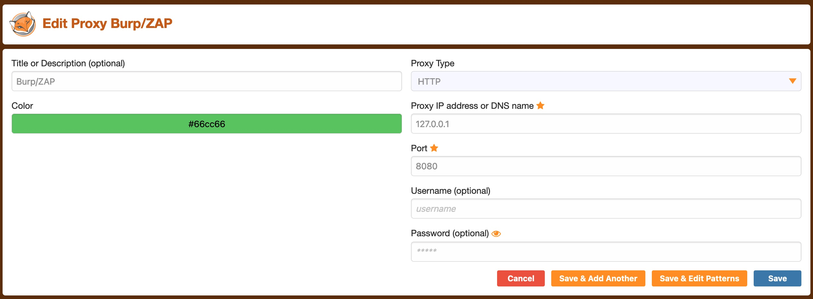

### 1.1.3. [ZAP: OWASP zed attack proxy](https://www.zaproxy.org/)

ZAP is a free and open-source project initiated by the OWASP and maintained by the community.

The main advantage is that we will not face any throttiling or limitations in our scans that are only lifted with a paid subscription.

### 1.1.4. CA Certificates

:::warning
Install the proxy's CA certificates. Otherwise, some HTTPS traffic may not get properly routed, or we may need to click _accept_ every time Firefox needs to send an HTTPS request
:::

For Burp, you can install it as soon as you configured it in _Foxy Proxy_ by browsing to `http://burp` and download the certificate from there.

To get's ZAP CA certificate, you can go to `Tools>Options>Dynamic SSL Certificate`.

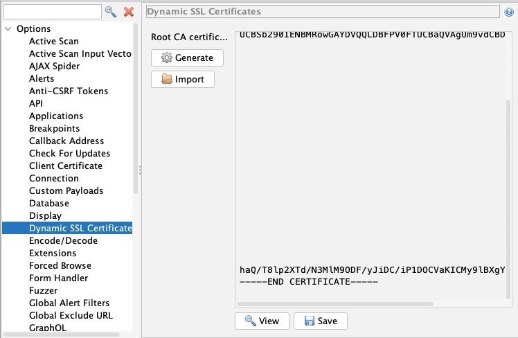

Once you have your certificates, you can install them within Firefox by navigating to [](about:preferences#privacy), and clicking `View Certificates`.

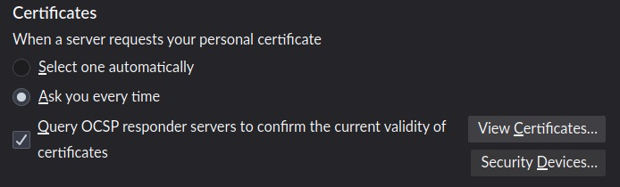

Then, select the `Authorities` tab, and then click on `import`.

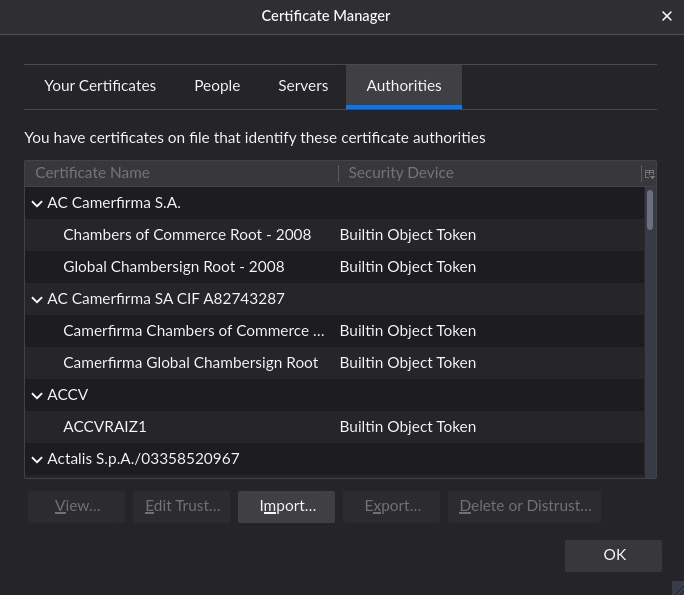

Finally, mark the options as checked:

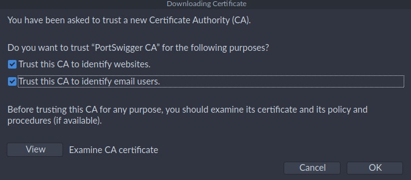

## 1.2. Intercepting requests

### 1.2.1. Manipulating requests

We can examine the request, manipulate it to make any changes we want, and then send it to its destination.

There are numeros applications for this in web penetration testing, such as testing for:

- SQL injections
- Command injections
- Upload bypass
- Authentication bypass
- XSS
- XXE
- Error handling
- Deserialization

For example, you might change an HTTP body param like `id=1` to `id=;ls;`.

## 1.3. Intercepting responses

In some instances, we may need to intercept the HTTP responses from the server before they reach the browser. This can be useful when we want to change how a specific page looks, like enabling certain disabled fields or showing certain hidden fields.

Consider the following example of an intercepted response:

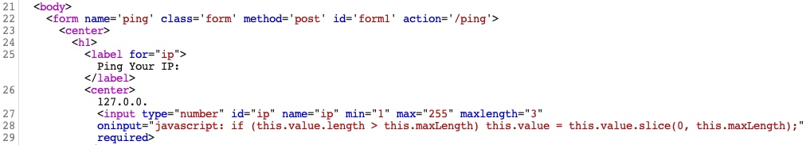

You could change the `type="number"` on line 27 to `type="text"`, which should enable us to write any value we want. We will also change the `maxlength="3"` to `maxlength="100"` so we can enter longer input.

### 1.3.1. Burp

Enable response interception in `Proxy>Options` by enabling `Intercept Response` under `Intercept Server Responses`.

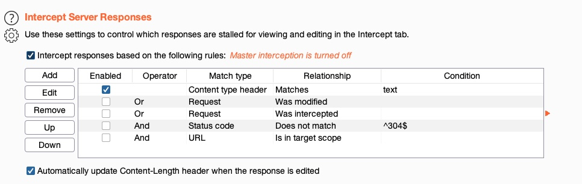

After that we can enable request interception once more and refresh the page with `CTRL+SHIFT+R` in our browser (to force a full refresh). Once we forward the request, we'll see our intercepted response.

:::tip
Burp has a handy feature to `Unhide hidden form fields` under `Proxy>Options>Response modification`.
:::

### 1.3.2. ZAP

ZAP intercepts the response by default, you just need to click on `Step` after intercepting a request.

We can use ZAP HUD also to `Show/Enable` buttons/inputs without needing to intercept the response or refresh the page.

## 1.4. Automatic modification

We may want to apply certain modifications to all outgoing HTTP requests or all incoming HTTP responses in certain situations. In these cases, we can utilize automatic modifications on rules we set.

### 1.4.1. Automatic request modification

We can choose to match any text within our requests, either in request header or request body, and then replace them with different text. For example, replace `User-Agent` with `HackTheBox Agent 1.0`.

Burp provides this in `Proxy>Options>Match and Replace` and click on `Add`.

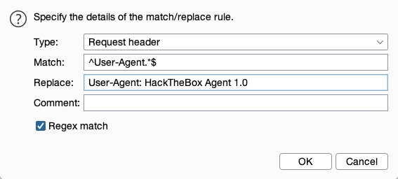

The Match and Replace option will be added and enabled and will start automatically replacing the `User-Agent` header in our requests.

ZAP provides a similar feature called `Replacer`, which we can access by pressing `CTRL+R`.

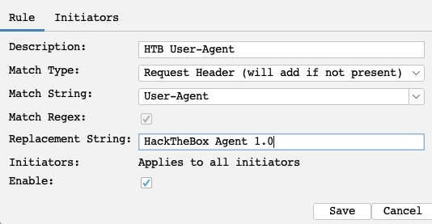

ZAP also provides `Request Header String` that we can use with a Regex pattern and the option to set `Initiators`, which enable us to select where our `Replacer` option will be applied. You can then enable request intercepton by pressing `CTRL+B` and visit any page in the pre-configured ZAP browser.

### 1.4.2. Automatic response modification

In Burp, use `Proxy>Options>Match and Replace` to add a rule. Use `Type: Response body`.

## 1.5. Repeating requests

Request repeating allows us to resend any web request that has previously gone through the web proxy. This allow us to make quick changes to any request before we send it, then get the response within our tools without intercepting and modifying each request.

### 1.5.1. Proxy History

You can view the HTTP requests history in Burp at `Proxy>HTTP History`.

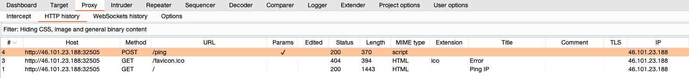

In ZAP HUD, you can find it in the bottom `History` (or the `History` tab at ZAP's main UI).

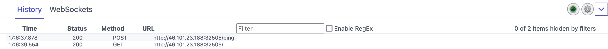

### 1.5.2. Configure repetition

In Burp, press `CTRL+R` in Burp to send it to the `Repeater` tab (navigate to it with `CTRL+SHIFT+R`). Once in `Repeater`, we can click on `Send` to send the request.

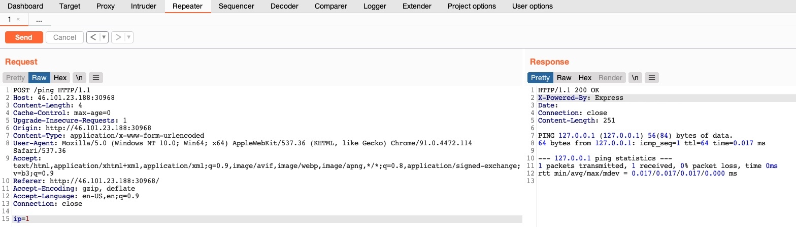

In ZAP, right-click on the request and select `Open/Resend with Request Editor`.

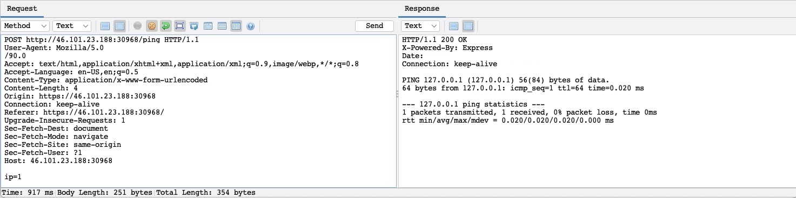

You can achieve the same with `ZAP HUD`, click on a request in the bottom History pane, and the `Request Editor` will be shown. You can select `Replay in Console` to get the response in the same `HUD` window, or select `Replay in Browser` to see the response rendered in the browser.

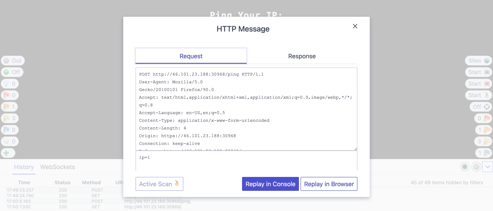

## 1.6. Encoding/Decoding

### 1.6.1. URL Encoding

Request data must be URL-encoded and our request headers correctly set. For example, `Spaces`, `&` and `#` should be encoded.

In Burp Repeater, we can select text and right-click on it, then select `Convert Selection>URL>URL encode key characters` or pressing `CTRL+U`.

On the other hand, ZAP automatically URL-encode all of our request data in the background before sending the request.

### 1.6.2. Encoder/Decoder tool

Web applications commonly encode their data, so we should be able to quickly decode it to exmaine the original text.

In Burp, we can go to the `Decoder` tab.

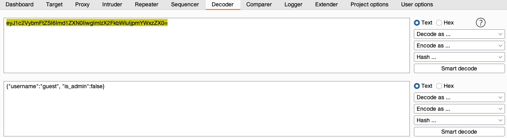

In recent versions of Burp, you can also use the `Burp Inspector` to perform encoding and decoding (in various places like Burp Proxy or Burp Repeater).

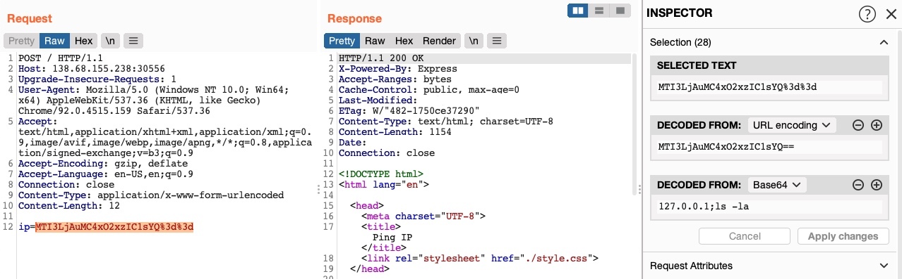

In ZAP, we can use the `Encoder/Decoder/Hash` by pressing `CTRL+E`.

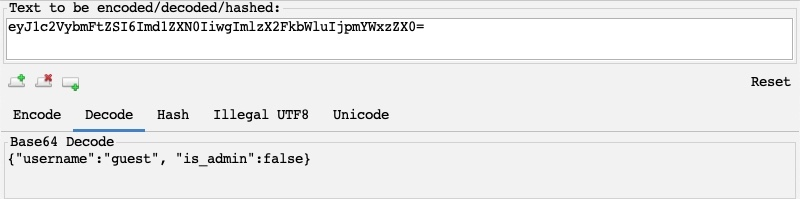

## 1.7. Proxying tools

We might want to intercept HTTP requests made by CLI tool or client applications. To route all requests made by a specific tool through our web proxy tools, we have to set them up as the tool's proxy (i.e., `http://127.0.0.1:8080`), similarly to what we do with our browsers. Each tool may have a different method.

### 1.7.1. Proxychains

A very useful tool in Linux is [](https://github.com/haad/proxychains), which routes all traffic coming from any CLI tool to any proxy we specify.

Simply edit `/etc/proxychains.conf` to look like this

```
#socks4         127.0.0.1 9050
http 127.0.0.1 8080
```

You might want to enable `Quiet Mode` to reduce noise by un-commenting `quiet_mode`.

Afterwards, prepend `proxychains` to any command, and the traffic of that command should be routed through it.

```
proxychains curl http://SERVER_IP:PORT
```

### 1.7.2. Nmap

You can see the proxy configuration for Nmap in its help page:

```
nmap -h | grep -i prox

--proxies <url1,[url2],...>: Relay connections through HTTP/SOCKS4 proxies
```

We should also add the `-Pn` flag to skip host discovery. Also, we'll use the `-sC` flag to examine what an nmap scan does:

```
nmap --proxies http://127.0.0.1:8080 SERVER_IP -pPORT -Pn -sC

Starting Nmap 7.91 ( https://nmap.org )
Nmap scan report for SERVER_IP
Host is up (0.11s latency).

PORT      STATE SERVICE
PORT/tcp open  unknown

Nmap done: 1 IP address (1 host up) scanned in 0.49 seconds
```

### 1.7.3. Metasploit

Using `msfconsole` you can se a proxy for any exploit within Metasplot by using the `set PROXIES` flag. Consider the following example:

```
msfconsole

msf6 > use auxiliary/scanner/http/robots_txt
msf6 auxiliary(scanner/http/robots_txt) > set PROXIES HTTP://127.0.0.1:8080

PROXIES => HTTP://127.0.0.1:8080


msf6 auxiliary(scanner/http/robots_txt) > set RHOST SERVER_IP

RHOST => SERVER_IP

msf6 auxiliary(scanner/http/robots_txt) > set RPORT PORT

RPORT => PORT


msf6 auxiliary(scanner/http/robots_txt) > run

[*] Scanned 1 of 1 hosts (100% complete)
[*] Auxiliary module execution completed
```

## 1.8. Web fuzzer

### 1.8.1. Burp Intruder

Burp Intrucer can be used to fuzz pages, directories, sub-domains, parameters, parameter values, and many other things.

:::warning
Burp community version is throttled at a speed of 1 request per second, making it extremely slow compared to CLI-based web fuzzing tools, which can usually read up to 10k requests per second. The Pro version has unlimited speed.
:::

#### 1.8.1.1. Target

Locate a request in the Proxy History, right-click on it and `Send to intruder` (or press `CTRL+I`). Then go to `Intruder` or press `CTRL+SHIFT+I`.

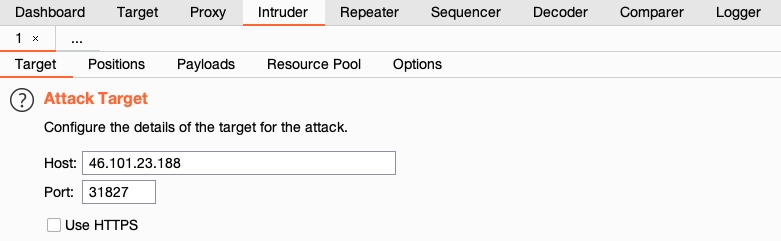

#### 1.8.1.2. Positions

This is where we place the payload position pointer, which is the point where words from our wordlist will be placed and iterated over.

For example, select `DIRECTORY` as the payload position, by either wrapping it with `§` or by selecting the word and clicking on the `Add §` button.

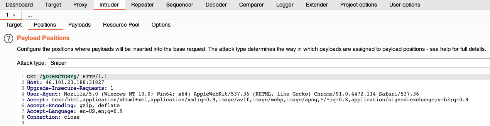

Finally, select in the target tab the `Attack Type` that defines how many payload pointers are used and determines which payload is assigned to which position. For simplicity, awe'll stick to the first type, `Sniper`, which uses only one position.

#### 1.8.1.3. Payloads

On the third tab, `Payloads`, we get to choose and customize our payload/wordlists. There are four things to configure:

- __Payload set__: Identifies the payload number, depending on the type and number of payloads we used in the payload position pointers.
  - _Payload type_: Type of payloads/wordlists to use (e.g., simple list, runtime file, character substitution).

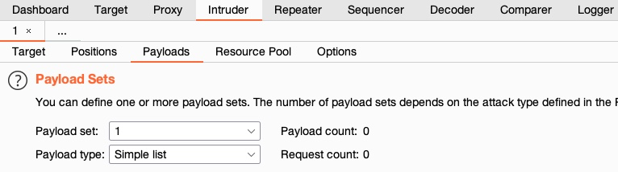

- __Payload options__: It's different for each payload type selected previously. For a _Simple List_, we have to create or load a wordlist (e.g., `/opt/useful/SecLists/Discovery/Web-Content/common.txt`).

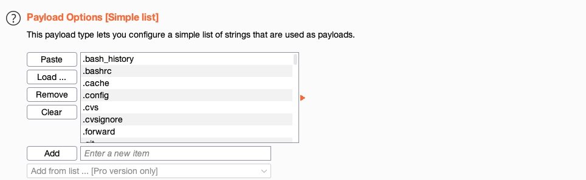

- __Payload processing__: Determines fuzzing rules over the loaded wordlist. For example, if we wanted to add an extension after our payload item, or filter the wordlist based on specific criteria (e.g., skip any lines that start with a `.`).

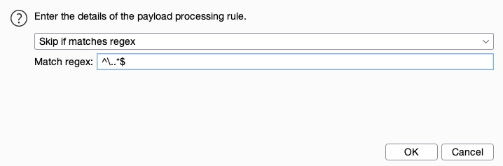

- __Payload encoding__: Enable or disable Payload URL-encoding.

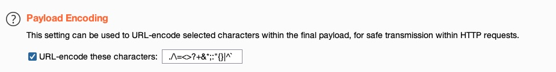

#### 1.8.1.4. Options

Customize attack options from the _Options_ tab.

For example, set the number of `retried on failure` and `pause before retry` to 0.

Another useful option is `Grep - Match`, to flag specific requests depending on their response. For example, match `200 OK` requests and `Exclude HTTP Headers` from string matching.

You may also utilize `Grep - Extract`, which is useful in the HTTP responses are lengthy, and we're only interested in a certain part of the response (e.g., only responses with HTTP Code `200 OK` regardless of ttheir content).

#### 1.8.1.5. Attack

Once everything is properly set up, we can click on `Start Attack` and wait for our attacks to finish.

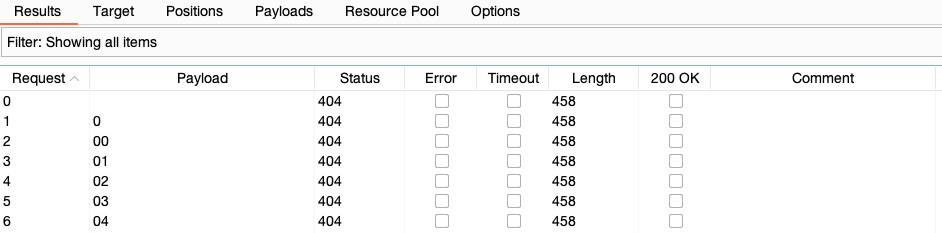

## 1.9. Web Scanner

### 1.9.1. Burp Scanner

A powerful scanner for various types of web vulnerabilities, using a `Crawler` for building the website structure, and `Scanner` for passive and active scanning.

:::warning
Burp Scanner is a pro-only feature, not available in the free community version.
:::

#### 1.9.1.1. Target scope

To start a scan, you have the following options:

1. Start scan on a specific request from Proxy History.
2. Start a new scan on a set of targets.
3. Start a scan on items in-scope.

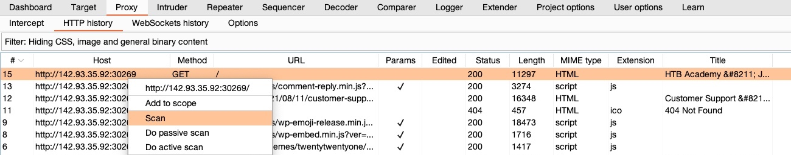

In `Target>Site map`, you'll find a listing of all directories and files Burp has detected in various requests that went through its proxy.

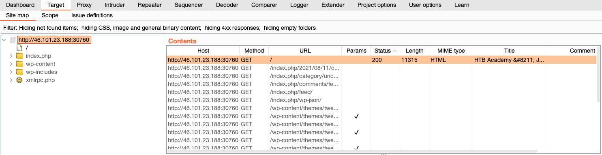

You can add an item to our _target scope_, by right-clicking on it and select `Add to scope`.

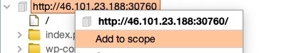

#### 1.9.1.2. Crawler

Once the scope is ready, you can use the web crawler to navigate a website by accessing any links found in its pages, accessing any forms, and examining any requests it makes to build a comprehensive map of the website.

#### 1.9.1.3. Passive Scanner

Once the site map is fully built, you can scan the target for potential vulnerabilities.

Unline an _active scan_, a _passive scan_ does not send any new requests but analyzes the source of pages already visited in the target/scope and then tries to identify _potential_ vulnerabilities.

This is very useful for a quick analysis of a specific target, like missing HTML tags or potential DOM-based XSS vulnerabilities.

#### 1.9.1.4. Active Scanner

An _active scan_ runes a more comprehensive scan than a passive one:

1. Starts by running a crawl and a web fuzzer to identify all possible pages.
2. Runs a passive scan on all identified pages.
3. Checks each of the identified vulnerabilities from the passive scan and sends requests to verify them.
4. Performs a JS analysis to identify further potential vulnerabilities.
5. Fuzzes various identified insertion points and parameters to look for common vulnerabilities like XSS, Command Injection, SQLi, and other common web vulnerabilities.

#### 1.9.1.5. Reporting

Once all of our scans are completed, and all potential issues have been identified, you can go to `Target->Site map`, right-click on our target and select `Issue>Report issues for this host`.

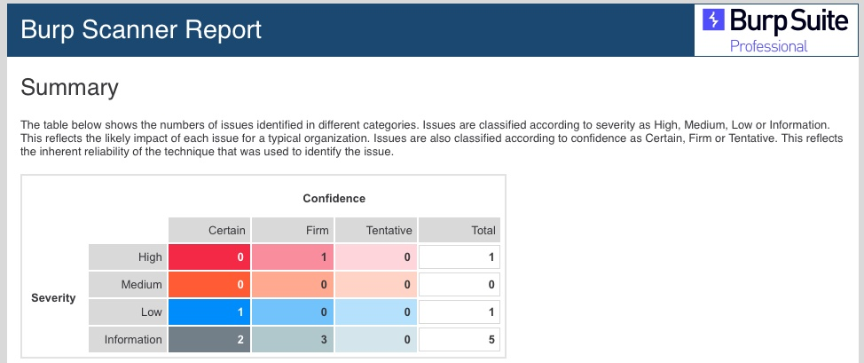

### 1.9.2. ZAP Scanner

#### 1.9.2.1. Spider

To start a Spider scan on any website, you can locate a request from the history tab and select `Attack>Spider` from the right-click menu. Another option is to use the HUD in the pre-configured browser, visit the page we want to start our Spider scan on, and click on the second button on the right pane `Spider Start`.

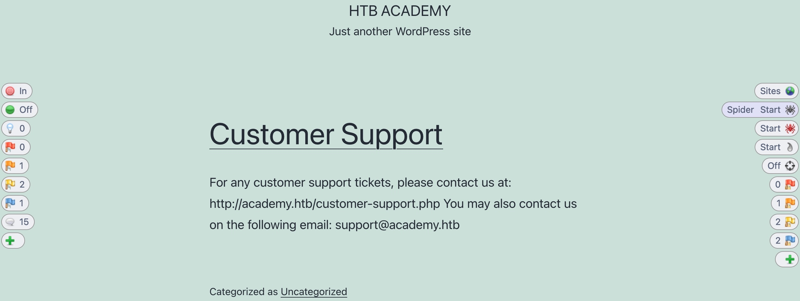

Once the scan is completed, you can check the _Sites_ tab on the main ZAP UI, or we can click on the first button on the right pane `Sites Tree`.

#### 1.9.2.2. Passive scanner

As ZAP Spider runs and makes requests to various end-point, it is automatically running its passive scanner on each response.

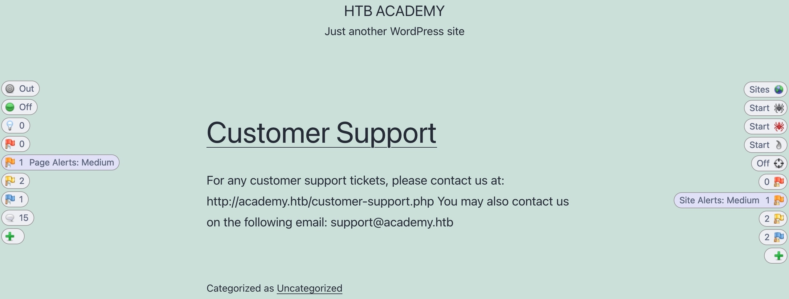

#### 1.9.2.3. Active scanner

Once our site's tree is populated, you can click on the `Active Scan` button on the right pane to start an active scan on all identified pages.

The active scanner will try various types of attacks against all identified pages and HTTP parameters to identify as many vulnerabilities as it can.

#### 1.9.2.4. Reporting

Finally, you can select `Report>Generate HTML Report` from the top bar, which would prompt us for the save location to save the report.

## 1.10. Extensions

### 1.10.1. Burp - BApp Store

Burp allows extensibility through its `Extender` feature and its [BApp Store](https://portswigger.net/bappstore).

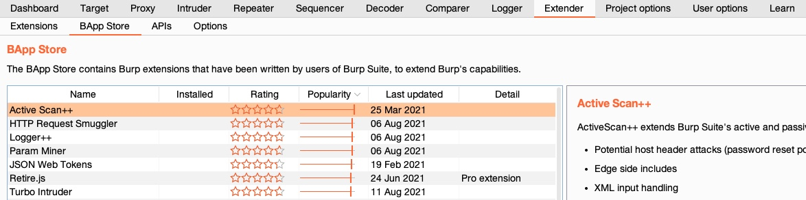

### 1.10.2. ZAP Marketplace

ZAP also has its own extensibility feature with the `Marketplace` that allows us to install various types of community-developed add-ons.

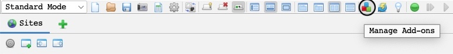
