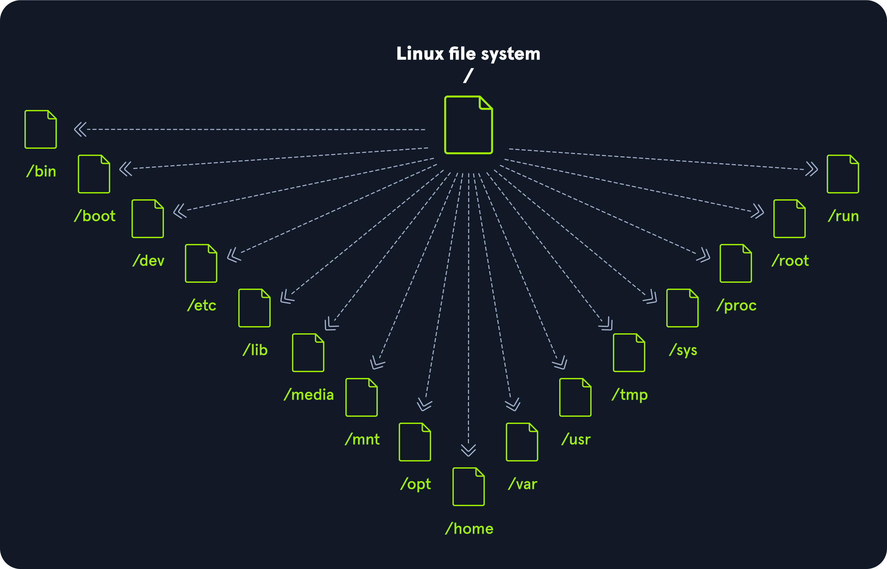
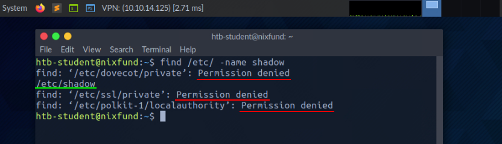

# File system

- [File system](#file-system)
  - [Hierarchy](#hierarchy)
  - [Navigation](#navigation)
  - [Working with files](#working-with-files)
  - [Find files](#find-files)
    - [`which`](#which)
    - [`find`](#find)
  - [File descriptors](#file-descriptors)
    - [Redirect STDERR](#redirect-stderr)
    - [Redirect STDOUT to a file](#redirect-stdout-to-a-file)
    - [Redirect STDIN](#redirect-stdin)
    - [Pipes](#pipes)
  - [Filter contents](#filter-contents)
    - [`more`](#more)
    - [`less`](#less)
    - [`head`](#head)
    - [`tail`](#tail)
    - [`sort`](#sort)
    - [`grep`](#grep)
    - [`cut`](#cut)
    - [`tr`](#tr)
    - [`column`](#column)
    - [`awk`](#awk)
    - [`sed`](#sed)
    - [`wc`](#wc)

## Hierarchy

Linux is structured in a _tree-like hierarchy_ and is documented in the [Filesystem Hierarchy Standard (FHS)](https://www.pathname.com/fhs/).

It's structured with the following standard top-level directories:



| Path | Description |
|---|---|
| `/` | The top-level directory is the root filesystem and contains all of the files required to boot the operating system before other filesystems are mounted as well as the files required to boot the other filesystems. After boot, all of the other filesystems are mounted at standard mount points as subdirectories of the root. |
| `/bin` | Contains essential command binaries. |
| `/boot` | Consists of the static bootloader, kernel executable, and files required to boot the Linux OS. |
| `/dev` | Contains device files to facilitate access to every hardware device attached to the system. |
| `/etc` | Local system configuration files. Configuration files for installed applications may be saved here as well. |
| `/home` | Each user on the system has a subdirectory here for storage. |
| `/lib` | Shared library files that are required for system boot. |
| `/media` | External removable media devices such as USB drives are mounted here. |
| `/mnt` | Temporary mount point for regular filesystems. |
| `/opt` | Optional files such as third-party tools can be saved here. |
| `/root` | The home directory for the root user. |
| `/sbin` | This directory contains executables used for system administration (binary system files). |
| `/tmp` | The operating system and many programs use this directory to store temporary files. This directory is generally cleared upon system boot and may be deleted at other times without any warning. |
| `/usr` | Contains executables, libraries, man files, etc. |
| `/var` | This directory contains variable data files such as log files, email in-boxes, web application related files, cron files, and more. |

## Navigation

- `pwd`: Print current directory.
- `ls`: List all the contents inside a directory.
  - `ls -l`: Print more information about files (e.g., permissions).
  - `ls -la`: List hidden files.
- `cd`: Navigate to a directory.
  - `cd -`: Jump back to the directory we were last in.
- `tree`: Print directory tree.

## Working with files

- `touch`: Create a file.
- `mkdir`: Create a directory.
  - `-mkdir -p`: Create parent directories.
- `mv <file/directory> <renamed file/directory>`: Move/rename file or directory.
- `cp <file/dir> <file/dir>`: Copy a file or directory.
- `rm <file/dir`: Remove a file or directory.

## Find files

### `which`

This tool returns the path to the file or link that should be executed. We can determine if specific programs (e.g., `curl`, `python`) are available on the OS.

```console
$ which python

/user/bin/python
```

### `find`

Besides the function to find files and directories, it also contains the function to filter the results (e.g., by size of the file or the date).

```console
find <location> <options>
```

Here's an example of such command with multiple options:

```console
find / -type f -name "*.conf" -user root -size +20k -newermt 2020-03-03 -exec ls -al {} \; 2>/dev/null
```

| Option | Description |
|---|---|
| -type f | Hereby, we define the type of the searched object. In this case, 'f' stands for 'file'. |
| -name *.conf | With '-name', we indicate the name of the file we are looking for. The asterisk (*) stands for 'all' files with the '.conf' extension. |
| -user root | This option filters all files whose owner is the root user. |
| -size +20k | We can then filter all the located files and specify that we only want to see the files that are larger than 20 KiB. |
| -newermt 2020-03-03 | With this option, we set the date. Only files newer than the specified date will be presented. |
| -exec ls -al {} \; | This option executes the specified command, using the curly brackets as placeholders for each result. The backslash escapes the next character from being interpreted by the shell because otherwise, the semicolon would terminate the command and not reach the redirection. |
| 2>/dev/null | This is a STDERR redirection to the 'null device', which we will come back to in the next section. This redirection ensures that no errors are displayed in the terminal. This redirection must not be an option of the 'find' command. |

## File descriptors

A file descriptor (FD) in Linux is an __indicator of connection maintained by the kernel to perform I/O operations__.

:::note
In Windows-based OS, it's called _filehandle_.
:::

By default, the first three file descriptors in Linux are:

- `STDIN - 0`: Data stream for Input.
- `STDOUT - 1`: Data stream for Output.
- `STDERR - 2`: Data stream for Output that related to an error ocurring.

### Redirect STDERR

For example, the following data marked in red is the standard error:



We can redirect the file descriptor for errors to `/dev/null`. This way, we redirect the resulting errors to the "null device", which discards all data.

```console
<command> 2>/dev/null
```

### Redirect STDOUT to a file

We can redirect standard output to a file (e.g., `results.txt`) by using the `>` operator. With the following command, it'd exclude the standard errors:

```console
<command> 2>/dev/null > results.txt
```

If you want to append standard output instead of creating/overwriting a file, you can use the double greater-than sign `>>`:

```console
<command> >> stdout.txt 2>/dev/null
```

If you wanted to redirect standard errors to a different file:

```console
<command> 2> stderr.txt 1> stdout.txt
```

### Redirect STDIN

We can also redirect standard input.

For example, use `cat` to use the contents of the file `stdout.txt` as `STDIN`:

```console
cat < stdout.txt
```

We can also use the double lower-than character `<<` to add our standard input through a _stream_.

```console
cat << EOF > stream.txt
```

### Pipes

Pipes `|` are another way to redirect `STDOUT` when we want to use it from one program to be processed by another.

For example, using `grep` to filter out results and specify that only the lines containing the pattern "systemd" should be displayed, and `wc` to count the total number of obtained results:

```console
find /etc/ -name *.conf 2>/dev/null | grep systemd | wc -l
```

## Filter contents

### `more`

This is a fundamental `pager` that allow us to scroll through a file in an interactive view. We can leave with the `[Q]` key.

```console
more /etc/passwd
```

### `less`

Although `less` looks pretty much like `more`. It has many more features.

```console
less /etc/passwd
```

### `head`

If we are only interested at the beginning of a file, use `head` to get the first lines of the file. By default, it prints the first ten.

```console
head /etc/passwd
```

### `tail`

If we are only interested at the beginning of a file, use `tail` to get the last lines of the file. By default, it prints the first ten.

### `sort`

This tool can sort alphabetically or numerically.

```console
cat /etc/passwd | sort
```

### `grep`

Use this tool to look for specific results that contain patterns we have defined.

For example, search for users who have the default shell `/bin/bash` as an example:

```console
cat /etc/passwd | grep "/bin/bash"
```

### `cut`

This tool removes specific characters (e.g., delimiters `:` using `cut -d":" -f1`).

### `tr`

This tool replaces certain characters.

```console
tr <character_to_replace> <replacement>
```

### `column`

Column displays result in tabular form using `-t`.

```console
cat /etc/passwd | grep -v "false\|nologin" | tr ":" " " | column -t
```

### `awk`

The `(g)awk` tool allows us to display the first (`$1`) and last (`$NF`) result of the line:

```console
$ cat /etc/passwd | grep -v "false\|nologin" | tr ":" " " | awk '{print $1, $NF}'

root /bin/bash
```

### `sed`

This tool is an _stream editor_ that allow you to change specirfic names in a whole file or standard input. It looks for patterns we have defined in the form of regular expressions and replaces them with another pattern.

For example, if we want to replace `bin` with `HTB`:

```console
cat example.txt | sed 's/bin/HTB/g'
```

### `wc`

This tool is useful to know how many successful matches we have. With the `-l` option, we specify that only lines are counted.
