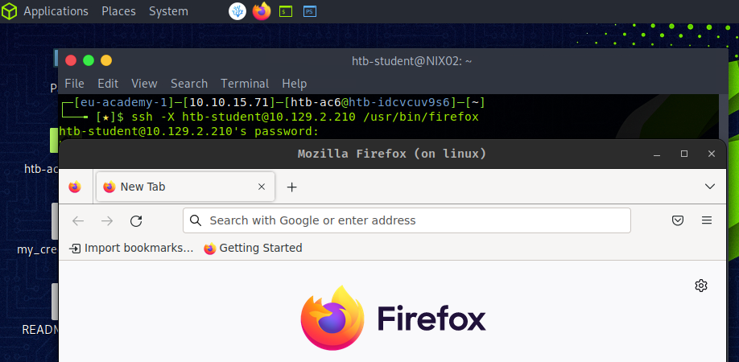

# Networking

## Configuring network interfaces

You can configure local network interfaces using the `ifconfig` or the `ip` command. Also, you can obtain information regarding network interfaces, such as IP addresses, netmasks, and status, by using `ifconfig`.

:::tip
In newer versions of Linux, `ifconfig` has been deprecated and replaced by the `ip` command, which offers more advanced features. 
:::

### Activate network interfaces

```console
sudo ifconfig eth0 up     # OR
sudo ip link set eth0 up
```

### Assign IP address

```console
sudo ifconfig eth0 192.168.1.2
```

### Assign a netmask

```console
sudo ifconfig eth0 netmask 255.255.255.0
```

### Assign a route to an interface

When we want to set the default gateway for a network interface, you can use `route` with the `add` option.

:::note
By setting the default gateway, we are designating the IP address of the router that will be used to send traffic to destinations outside the local network.
:::

```console
sudo route add default gw 192.168.1.1 eth0
```

### Edit interfaces

You can add network configuration settings in the `/etc/network/interfaces` file.

```txt
auto eth0
iface eth0 inet static
  address 192.168.1.2
  netmask 255.255.255.0
  gateway 192.168.1.1
  dns-nameservers 8.8.8.8 8.8.4.4
```

## Edit DNS settings

The file `/etc/resolv.conf` is a plain text file containing the system's DNS information:

```text
nameserver 8.8.8.8
nameserver 8.8.4.4
```

## Restart networking service

```console
sudo systemctl restart networking
```

## Network Access Control (NAC)

NAC is a security system that ensures that only authorized and compliant devices are granted access to the network. The following are different NAC technologies:

- Discretionary access control (DAC)
- Mandatory access control (MAC)
- Role-based access control (RBAC)

## Troubleshooting

### Ping

```console
$ ping 8.8.8.8

PING 8.8.8.8 (8.8.8.8) 56(84) bytes of data.
64 bytes from 8.8.8.8: icmp_seq=1 ttl=119 time=1.61 ms
64 bytes from 8.8.8.8: icmp_seq=2 ttl=119 time=1.06 ms
64 bytes from 8.8.8.8: icmp_seq=3 ttl=119 time=0.636 ms
64 bytes from 8.8.8.8: icmp_seq=4 ttl=119 time=0.685 ms
^C
--- 8.8.8.8 ping statistics ---
4 packets transmitted, 4 received, 0% packet loss, time 3017ms
rtt min/avg/max/mdev = 0.636/0.996/1.607/0.388 ms
```

### Traceroute

It traces the route packets take to reach a remote host.

```console
$ traceroute www.inlanefreight.com

traceroute to www.inlanefreight.com (134.209.24.248), 30 hops max, 60 byte packets
 1  * * *
 2  10.80.71.5 (10.80.71.5)  2.716 ms  2.700 ms  2.730 ms
 3  * * *
 4  10.80.68.175 (10.80.68.175)  7.147 ms  7.132 ms 10.80.68.161 (10.80.68.161)  7.393 ms
```

### Netstat

It's used to display active network connections and their associated ports.

```console
$ netstat -a

Active Internet connections (servers and established)
Proto Recv-Q Send-Q Local Address           Foreign Address         State      
tcp        0      0 localhost:5901          0.0.0.0:*               LISTEN     
tcp        0      0 0.0.0.0:sunrpc          0.0.0.0:*               LISTEN     
tcp        0      0 0.0.0.0:http            0.0.0.0:*               LISTEN     
tcp        0      0 0.0.0.0:ssh             0.0.0.0:*               LISTEN
...SNIP...
```

## Remote desktop protocols

### XServer

The XServer is the user-side part of the `X Window System network protocol` (`X11`/`X`). The `X11` is a fixed system that consists of a collection of protocols and applications that allow us to call application windows on displays in a GUI.

When a desktop is started on a Linux computer, the communication of the GUI with the OS happens via an X server. The computer's internal network is used, even if the computer should not be in a network.

:::note
X protocol has _network transparency_. This protocol mainly uses TCP/IP as a transport base but can also be used on pure Unix sockets. The ports utilized are typically located in the range of `TCP/6001-6009`, allowing communication between the client and server. Starting a new desktop session via X server, the TCP port 6000 would be opened for the first X display `:0`.
:::

An X server is not dependent on the local computer, it can be used to access other computers, and other computers can use the local X server. VNC and RDP protocols generate the graphical output on the remote computer and transport it over the network. Whereas with X11, it is rendered on the local computer. This saves traffic and a load on the reomte computer.

:::warning
X11's significant disadvantage is the unencrypted data transmission. However, it can be overcome by tunneling the SSH protocol. For this, we have to allow X11 forwarding in the SSH configuration file (`/etc/ssh/sshd_config`) on the server that provides the application by changing the `X11Forwarding` option to `yes`.
:::

#### X11Forwarding

```console
$ cat /etc/ssh/sshd_config | grep X11Forwarding

X11Forwarding yes
```

Then, we can start an application from our client with the following command:

```console
$ ssh -X htb-student@10.129.23.11 /usr/bin/firefox

htb-student@10.129.14.130's password: *******
```



#### X11 Security

:::danger
X11 is not a secure protocol since its communication is entirely unencrypted. A completely open X server lets anyone on the network read the contents of its windows and it's not even necessary to sniff the network. This is realized with simple X11 tools like `xwd` and `xgrabsc`. We could read user's keystrokes, obtain screenshots, move the mouse cursor, and send keystrokes from the server over the network. For example, the following vulnerabilities: CVE-2017-2624, CVE-2017-2625, and CVE-2017-2626.
:::

### XDMCP

The `X Display Manager Control Protocol` (`XDMPC`) is used by the `X Display Manager` for communication through `UDP port 177` between X terminals and computers operating under Unix/Linux.

:::warning
XDMCP is an insecure protocol. One potential way to exploit XDMCP could be MITM attacks.
:::

### VNC

`Virtual Network Computing` (`VNC`) is a remote desktop sharing system based on the RFB protocol thaat allows users to control a computer remotly. It allows a user to view and interact with a desktop environment remotely over a netwrok.

VNC is considered to be _secure_. It uses encryption in transit and requires authentication before a user can gain access.

The usual server offers the actual screen of the host computer for user support . The second group of server programs allows users to login to virtual sessions.

:::note
Traditionally, the VNC server listens on `TCP port 5900` and offers its `display 0` there. Other displays can be offered via additional ports, mostly `590[x]`, where `x` is the display number.
:::

To encrypt the connection and make it more secure, we can create an SSH tunnel over which the whole connection is tunneled:

```console
# setup an ssh tunel
ssh -L 5901:127.0.0.1:5901 -N -f -l htb-student 10.129.14.130

# connect to the vnc server with TigerVNC
xtightvncviewer localhost:5901
```
