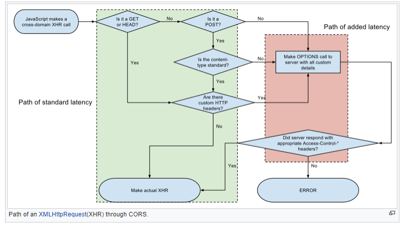

# CORS - Cross-Origin Resource Sharing

CORS is a standarized technique to relax _Same Origin Policy_. It allows restricted resources on a web page to be requested from another domain outside the domain from which the resource was served.

Because of SOP, a web page may freely embed cross-origin images, stylesheets, scripts, iframes and videos, but certain "cross-domain" requests, notably Ajax requests, are forbidden by default. CORS then defines a way in which a browser and server can interact to determine whether it is safe to allow the cross-origin request. It allows more freedom than purely same-origin requests, but is more secure than simply allowing all cross-origin requests.

* [Cross-origin fetches from Google Chrome Developers](https://www.youtube.com/watch?v=vfAHa5GBLio)
* [CORS by Example](https://www.youtube.com/watch?v=Ka8vG5miErk)

## CORS Specification

CORS specification is included as part of the [WHATWG's Fetch Living Standard](https://en.wikipedia.org/wiki/WHATWG), which describes how CORS is currently implemented in browsers.

## How it works

This standard extends HTTP with a new `Origin` request header and a new `Access-Control-Allow-Origin` response header.

It allows servers to use a header to explicitly list origins that may request a file or to use wildcard and allow a file to be requested by any site.

Firefox, Safari and IE (from specific versions) use this headers to allow the cross-origin HTTP requests with XMLHttpRequest that would otherwise have been forbidden by SOP.

For Ajax and HTTP request methods that can modify data, the specification mandates that browsers "preflight" the request, soliciting supported methods from the server with an HTTP OPTIONS, and then, upon "approval" from the server, sending the actual request with actual HTTP request method.