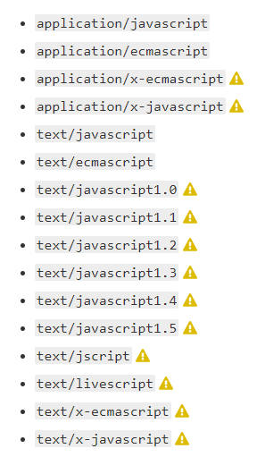

# [MIME Types](https://developer.mozilla.org/en-US/docs/Web/HTTP/Basics_of_HTTP/MIME_types)

A Media Type, also known as a __Multipurpose Internet Mail Extensions/MIME type, is a standard that indicates the nature and format of a ducment, file, or assortment of bytes.

The HTTP `Content-Type` Header field is intentded to indicate te MIME type of an HTTP resposne.

It is defined and standardized in IETF's [RFC 6838](https://developer.mozilla.org/en-US/docs/Web/HTTP/Basics_of_HTTP/MIME_types).

The __IANA, Internet Assigned Nubmers Authority__ is responsible for all offiial MIME types, and you can find the most up-to-date and complete list at their [Media Types Page](https://www.iana.org/assignments/media-types/media-types.xhtml). There's also a [MDN Common MIME types page](https://developer.mozilla.org/en-US/docs/Web/HTTP/Basics_of_HTTP/MIME_types/Common_types).

## Structure of a MIME Type

The simplest MIME tpe consists of a _type_ and a _subtype_, these are each srings which, when concatenated with a slash (`/`) between them, comprise a MIME type. No white space is allowed.

```
type/subtype
```

The __type__ represents the general category into which the data type fails, such as `video` or `text`.

The __subtype__ identifies the exact kind of data of the specified type the MIME type reprents. For exapmle, for the MIME type `text`, the subtype might be `plain`, `html` or `calendar`.

Each type has its own set of possible subtypes, and a MIME type always has both a type and a subtype.

An __optional parameters__ can be added ot provide additonal details, as an _ordered map_ whose keys and values are ASCII strings:

```
type/subtype;parameter=value
```

For example, for any MIME type whose main type is `text`, the optional `charset` parameter can be used to specify the character set used for the characters in the data. If no `charset` is specified, the dafault is ASCII (`US-ASCII`) unless overriden by the user agent's settings.

MIME types are __case-insensitive__ but traditionally written in loercase, with the exception of parameter values.

## Types

There are two classes of type, __discrete__ and __multipart__.

Discrete types are types which represent a single file or medium, such as a single text, a music file, or a single iedo.

Multipart types represent a document that's compromised of multiple component parts, each of which may have its own individual MIME type, or, a multipart type may encapsulate multiple files being sent together in one transaction.

For example, multipart MIME types are used when attaching multiple files to an email.

## Important MIME types for Web Development

#### `application/octet-stream`

This is the default for binary files. As it means _unknown binary file_, browsers usually don't execute it, or even ask if it should be executed.

#### `text/plain`

This is the default for tetual files, even if it realy means "unknown textual file", browsers assume they can display it. This doesn't mean any kind of textual data. If you expect a specific kind of tetual data, it wil likely not be considered as a math (for example css files need a specific MIME type).

#### `text/css`

CSS files used to style a web page __must__ be sent with the `text/css`. If a server doesn't recognize the `.css` suffic for CSS files, it may end them with `text/plain`. If so, they won't be recognizd as CSS by most browsers and will be ignored.

#### `text/html`

All HTML content should be served with this type.

#### `text/javascript`

Per the HTML specification, JavaScript files should always be served using the MIME type `text/javascript`. No other values are considered valid, and using any of thoe may result in scripts that do not load or run.

For historical reasons, the MIME Sniffing Standard (definition of how browsers should interpret mdia tpes and figure out what to do with content that doesn't have a valid one) allows Javascript to be server using any MIME ype that essentially matches any of the following:



#### Image and Audio/Video Types

Please refer to [MDN MIME Types](https://developer.mozilla.org/en-US/docs/Web/HTTP/Basics_of_HTTP/MIME_types) for updated documentation.

#### `multipart/form-data`

This can be used when sending he values of a completed HTML Form from browser to server.

As a multipart document format, it consists of different parts, delimtied by a boundary (string starting with `--`). Each part is its own entity with its own HTTP headers, `Content-Disposition` and `Content-Type` for file uploading fields.

The following `<form>`:

```html
<form action="http://localhost:8000/" method="post" enctype="multipart/form-data">
  <label>Name: <input name="myTextField" value="Test"></label>
  <label><input type="checkbox" name="myCheckBox"> Check</label>
  <label>Upload file: <input type="file" name="myFile" value="test.txt"></label>
  <button>Send the file</button>
</form>
```

```
POST / HTTP/1.1
Host: localhost:8000
User-Agent: Mozilla/5.0 (Macintosh; Intel Mac OS X 10.9; rv:50.0) Gecko/20100101 Firefox/50.0
Accept: text/html,application/xhtml+xml,application/xml;q=0.9,*/*;q=0.8
Accept-Language: en-US,en;q=0.5
Accept-Encoding: gzip, deflate
Connection: keep-alive
Upgrade-Insecure-Requests: 1
Content-Type: multipart/form-data; boundary=---------------------------8721656041911415653955004498
Content-Length: 465

-----------------------------8721656041911415653955004498
Content-Disposition: form-data; name="myTextField"

Test
-----------------------------8721656041911415653955004498
Content-Disposition: form-data; name="myCheckBox"

on
-----------------------------8721656041911415653955004498
Content-Disposition: form-data; name="myFile"; filename="test.txt"
Content-Type: text/plain

Simple file.
-----------------------------8721656041911415653955004498--
```

## Importance of setting the correct MIME type

Most web servers send unrecognized resources as the `application/octet-stream` MIME type. For security reasons, most browsers do not allow setting a custom default action for such resources, forcing the user to save it to disk to use it.

Some common incorrect server configuratinos:

* __RAR-compressed files__: ideal would be the true type of original files, as this is not usually possible, configure the server to send `application/x-rar-compressed`.
* __Audio and Video__: only resources with correct MIME type will be played in `<video>` or `<audio>` elements.
* __Proprietary file types__: A specific type like `application/vnd.mspowerpoint` lets users open files in the presentation software of their choice.

## MIME Sniffing

Please refer to the [MIME Sniffing - Living Standard](https://mimesniff.spec.whatwg.org/) for updated documentation, or check glossary definition.

## Other methods of conveying document type

MIME types are not the only way to convey document type information:

#### Filename Suffixes

Windows sometimes use it, but not all operating systems consider them meaningful, and there is no guarantee they are correct.

#### Magic Numbers

The syntax of different formats allows file-type inference by looking at their byte structure. For example, GIF files start with `47 49 46 38 39` hexadecimal value (`GIF89`), and PNG files with `89 50 4E 47` (`.PNG`). Not all file types have magic numbers, so this is not 100% reliable either.