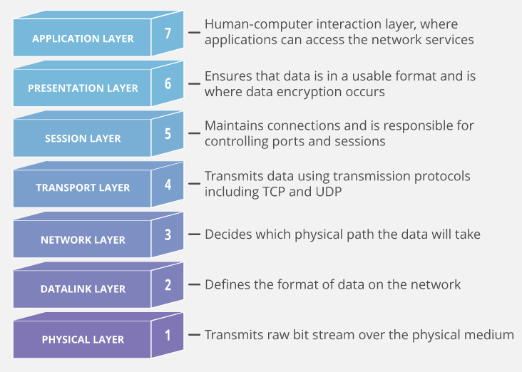
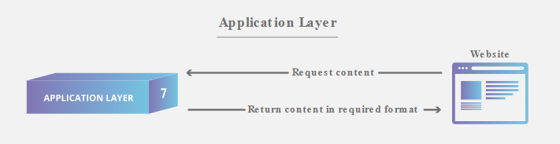
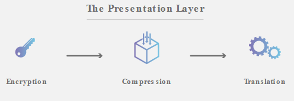
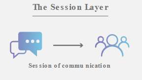
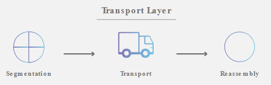
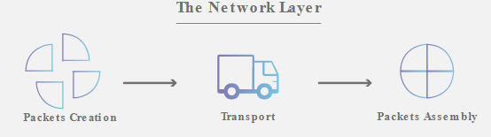
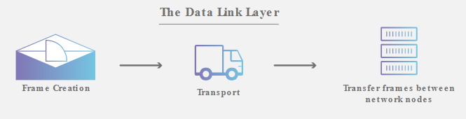
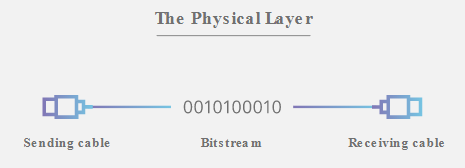

# OSI  - Open Systems Interconnection

Conceptual model created by ISO (International Organizaton for Standarization) which enables diverse communication systems to communicate using standard protocols.

The OSI model can be seen as a universal language for computer networking. It's based on the concept of splitting up a communication system into seven abstract layers, each one stacked upon the last.

Each layer handles a specific jo and communicates with the layers above and below itself.

DDoS attacks target specific layers of a network communication, application layer attacks target layer 7, and protocol layer attacks target layers 3 (network) and 4 (transport).

#### Why does the OSI model matter?

Although the modern Internet doesn't strictly follow the OSI model (it more closely follows the simpler __Internet Protocol Suite__), the OSI model is still very useful for troubleshooting network problems by breaking down te problem and isolate the source of it.

If the problem can be narrowed down to one specific layer of the model, a lot of unnecessary work can be avoided.

## Seven Layers of the OSI model

### 7. Application Layer

Only layer that __directly interacts with data from the user__.

It should be made clear that client software applications are not part of the application layer, rather the application layer is responsible for the protocols and data manipulation that the software relies on to present meaningful data to the user.

Aplication layer protocols include HTTP as well as SMTP.

### 6. Presentation Layer

This layer is primarily responsible for __preparing data__ so that it can be used by the Application Layer. This includes:

* Translation
* Encryption
* Compression

Two communicating devices communicating may be using different encoding methods, so Presentation Layer is responsible for translating incoming data into a syntax that the application layer of the receiving device can understand.

If the devides are communicating over an encrypted connection, Presentation Layer is responsible for adding the encryption on the sender's end as well as decoding the encryption on the receiver's end. 

Finally, the Presentation Layer is also resposnible for compressing data it receives from the application layer before delivering it to next layer. This helps improve the speed and efficiency of communication by minimizing the amount of data that will be transferred.

### 5. Session Layer

This layer is responsible for __opening and closing communication__ between the two devices. The time while communication is ponened is known as the session.

This layer ensures that the session stays open long enough to transfer all the data being exchanged, and then promptly closes the session in order to avoid wasting resources.

The session layer also synchronizes data transfer with checkpoints, in case of disconnections.

### 4. Transport Layer

This layer is responsible for __end-to-end communication__ between the two devices. This includes __taking data from the session layer and breaking it up into chunks called _segments_ before sending it to next layer.__

The Transport Layer on the receiving deice is responsible for __reassembling the segments into data the Session Layer can consume__.

This layer is also responsible for __flow control and error control__. Flow control determines an optimal speed of transmission to ensure that a sender with a fast connection doesn't overwhelm a receiver with a slow connection. Error control on the receiving end ensures that the data received is complete, and requests a retransmission if it isn't.

### 3. Network Layer

This layer is responsible for __facilitating data transfer between two different networks__. If the two devices communicating are on the same network, then this layer is unnecesary.

The Network Layer __breaks up segments from the transport layer into smaller units, called _packets_, on the sender's device, and reassembling these packets on the receiving device__. This Network Layer also __finds the best physical path for the data to reach its destination__, this is known as __routing__.

### 2. Data Link Layer

Data Link Layer is very similar to Network Layer, except the Data Link Layer __facilitates data transfer between two devices on the same network__. It takes __packets from the network layer and breaks them into smaller pieces called frames__.

This layer is also responsible for __flow control and error control in intra-network communication__.

### 1. Phyisical Layer

This layer includes the __physical equipment involved in the data transfer__, such as the cables and switches. This is also the layer where the __data gets converted into a bit stream__.

The Phyisical Layer of both devices must also __agree on a signal convention__.

## One Final Example

Mr. Cooper wants to send Ms. Palmer an email. Mr. Cooper composes his message in an email application on his laptop and then hits ‘send’. His email application will pass his email message over to the application layer, which will pick a protocol (SMTP) and pass the data along to the presentation layer. The presentation layer will then compress the data and then it will hit the session layer, which will initialize the communication session.

The data will then hit the sender’s transportation layer where it will be segmented, then those segments will be broken up into packets at the network layer, which will be broken down even further into frames at the data link layer. The data link layer will then deliver those frames to the physical layer, which will convert the data into a bitstream of 1s and 0s and send it through a physical medium, such as a cable.

Once Ms. Palmer’s computer receives the bit stream through a physical medium (such as her wifi), the data will flow through the same series of layers on her device, but in the opposite order. First the physical layer will convert the bitstream from 1s and 0s into frames that get passed to the data link layer. The data link layer will then reassemble the frames into packets for the network layer. The network layer will then make segments out of the packets for the transport layer, which will reassemble the segments into one piece of data.

The data will then flow into the receiver's session layer, which will pass the data along to the presentation layer and then end the communication session. The presentation layer will then remove the compression and pass the raw data up to the application layer. The application layer will then feed the human-readable data along to Ms. Palmer’s email software, which will allow her to read Mr. Cooper’s email on her laptop screen.