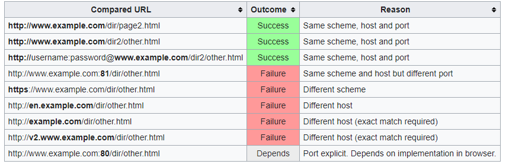

# SOP: Same Origin Policy

Under the poliy, a web browser permits scripts contained in a first web page to access data in a second web page, but only if both web pages have the same _origin_.

This policy prevents a malicious script on one page from obtaining access to sensitive data on another web page through that page's DOM.

It's very important to remember that SOP _applies only to scripts_. This means that resource such as images, CSS, and dynamically-loaded scrips can be accessed across origins via the corresponding HTML tags (with fonts being a notable exception).

__Attackers take advantage of the fact that SOP does not apply to HTLM tags__.

* [CSRF Introduction and what is SOP](https://www.youtube.com/watch?v=KaEj_qZgiKY).

SOP allows simple cross-origin requests (GET/POST/HEAD) with a set of allowed custom headers only:

* Accept
* Accept-Language
* Content-Language
* Content-Type
  * application/x-www-form-urlencoded
  * multipart/form-data
  * text/palin

Also, for cross-origin request, by default JavaScript may only access so-called 'simple' response headers:

* Cache-Control
* Content-Language
* Content-Type
* Expires
* Last-Modified
* Pragma

Any 'non-simple' requests, the browser does not make such requests right away. Before, it sends a preliminary, so-called 'preflight' request `OPTIONS`, asking for permission (is at this point that CORS gets involved).

## TOC:

* Origin
* Details
* SOP Implementation 
* Origin determination rules
* Security Application
* Relaxing SOP Methods
  * Data tainting
  * `document.domain` property
  * CORS: Cross-Origin Resource Sharing
  * Cross-document messaging
  * JSONP
  * WebSockets
* Corner Cases

## Origin

An origin is defined as a combination of

* URI Scheme
* Host Name
* Port Number

## Details

The same-origin policy restricts which network messages one origin can send to another. For example, the same-origin policy allows inter-origin HTTP requests with GET and POST methods but denies inter-origin PUT and DELETE requests.

Additionally, origins can use custom HTTP headers when sending requests to themselves but cannot use custom headers when sending requests to other origins.

## Implementation

Modern browsers implement some form of SOP, but policies are not required to match an exact specifiction, instead they often extend those to define roughly compatible security boundaries for other web technologies, such as Adobe Flash, or for mechanisms other than direct DOM manipulation, such as _XMLHttpRequest_.

## Origin determination rules

The algorithm used to calculate the "Origin" of a URI is specified in [RFC 6454](https://tools.ietf.org/html/rfc6454).

Check the following examples that vie an overview of typical outcomes for checks against the URL: `http://www.example.com/dir/page.html`.

## Security Applications

SOP helps protect sits that uses authenticated sessions. 

See the following example:

Assume that a user is visiting a banking website and doesn't log out. 

Then the user goes to another site that has some malicious Javascript code running in the background that requests data from the banking site.

Because the user is still logged in on the banking site, malicious code could do anything the user could do on the banking site, like get a list of user's last transactions, create a new transaction, etc... This is because the browser cand send and receive session cookies to the banking site based on the domain of the banking site.

The user visit the malicious site would except that the site has no access to the banking session cookie. While it is true that the JavaScript has no diret access to the banking session cookie, it could still send and receive requests to the banking site with the banking site's session cookie, even CSRF protections by the banking site would not be effective.

## Relaxing SOP

In some circunstances, SOP is too restrictive, giving problems for large websites that use multiple _subdomains_. Modern browsers support multiple techniques for relaxing SOP ina controlled manner:

#### Data Taining

If enabled by a user, it would allow websites to attempt to read JS properties of windows and frames belonging to a different domain. The browser would then ask the user whether to permit the access in question.

#### `document.domain`

If two windows/frames contain scripts that set domain to the same value, SOP is relaxed for these two windows and they can interat with te other.

They make their documents appear toh ave the same origni and enabling each documet to read properties of the other.

Settings tis property implicitly sets the port to `null`, which most browsers will interpret differently from port 80 or even an unspecified port.

#### CORS

Standarized technique under the name of _Cross-Origin Resource Sharing_.

This standard extends HTTP with a new `Origin` request header and a new `Access-Control-Allow-Origin` response header.

It allows servers to use a header to explicitly list origins that may request a file or to use wildcard and allow a file to be requested by any site.

Firefox, Safari and IE (from specific versions) use this headers to allow the cross-origin HTTP requests with XMLHttpRequest that would otherwise have been forbidden by SOP.

#### Cross-Document Messaging

Allows a script from one page to pass textual messages to a script on another page regardless of the script origins.

A script in one page still cannot diretly access methods or variables in the other page, but they can communicate safely through this message-passing technique.

#### JSONP

Since HTML `<script>` elements are allowed to retrieve and execute content from other domains, a page can bypass the SOP and receiv JSON data from a different domain by loading a resoruce that returns a JSONP payload, which consists of an internal JSON payload wrapped by a pre-defined function call.

When the script resource is loaded by the browser, the designated callback function will be invokd to process the wrapped JSON payload.

#### WebSockets

Modern browsers will permit a script to connect to a WebSocket address without applying SOP. However, they recognize when a WebSocket URI is used and insert an `Origin` header into the request that indicates the origin of the script requesting the connection.

To ensure cross-site security, the WebSocket server must compare the header data against a whitelsit of origins permited to receive a reploy.

## Corner Cases

The behavior of __same-origin-checks__ and related mechanisms is not well-defined in a number of corner cases such as pseudo-protocols that do not have a clearly defined host name or port associated with thir URLs (`file:`, `data:`, etc...).

This historically caused a fair number of security problems, such as the generally undesirable ability of any locally stored HTML file to access all other files on the disk, or communicate with any site on the Internet.

## Attacks in face of SOP

Even with SOP not being relaxed (by CORS for example) certain cross-origin computer ttacks can be performed.

[WebRTC](https://en.wikipedia.org/wiki/WebRTC) can be used out the internal IP address of a victim.

If attempting to connect to a cross-origin port, responses cannot be read in face of SOP, but even then, Javascript can still make inferences on whether the port is open or closed by checking if the onload/onerror event fires, or if we get a timeout.

Further, Javascript can even fingerprint servicess cross-origin by taking advange of default files. For example, if a Javascript script loaded from the site `evil.com` attempts to open the file `http://127.0.0.1/images/jenkins.png` and the onload event fires, then it can be inferred that the victim runs Jenkins on his own computer. This way the attacker can find potentialy vulnerable ervices for example on the internal network, even in face of the same-origin policy.

Should any service be vulnerable to _CSRF_, they can even be compromised.