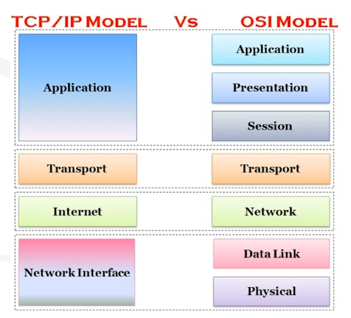

# TCP/IP Model

* [TCP/IP Protocol Suite](https://github.com/herrera-ignacio/tcp-ip)

Open standard networking model.

Differs slightly from OSI model. It combines several layers (into 4 layers) and is much more common today.

* Application (Application, Presentation and Session)
* Transport (Transport)
* Internet (Network)
* Network Interface (Data Link and Physical)
