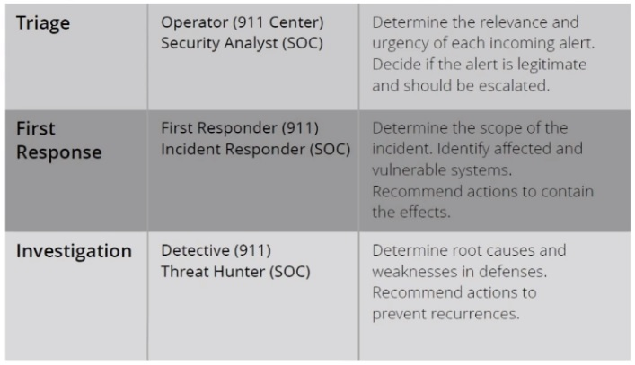
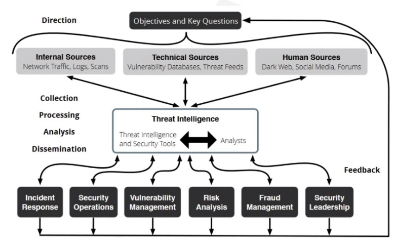

# Cyber Threat Intelligence

> Original lecture by Melinton Navas

* Introduction to CTI
* Security organization
  * SOC
  * IR
* CTI Lifecycle (Intelligence-Driven Security)
    * Tools
* CTI role in SOC, IR and Risk Analysis

---

## Introduction

### What is a Cyber Threat?

> "An event or condition that has the potential for causing asset loss and the undesirable consequences or impact from such loss." (NIST, 2019)

### Vulnerability

> "A weakness of an asset or group of assets that can be exploited by one or more threats." (ISO 27002)

### What is CTI?

* Includes information and analysis from a rich array of resources presented in a way that is easy to understand and use.

* It is valuable for all the major teams in the cyber security organization.

* Can be handled and executed mostly by the existing security staff.

### How CTI approaches an organization?

* No "one size fits all" or recipe.

* Takes into account nature of organization and information.

* Data is everywhere, information can help every organization unit, intelligente can drive the right questions to the right answers.

* The more you know, the more you're capable to learn how to defend yourself and aim your defenses the most efficient way possible.

## Security Organization

### Security Operations Center (SOC)

> "Centralized function within an organization employing people, processes, and technology to continuously monitor and improve an organization's security posture while preventing, detecting, analazying, and responding to cybersecurity incidents." (McAfee, 2019)

* Monitor for potential threats.
* Detect suspicious network activity.
* Contain active threats.
* Remediate using available technology.

### Incident Response Team (IR)

* Part of SOC...
* When SOC detects something not supposed to be happening, IR comes in.
* Vulnerability Management

### Vulnerability Management Cycle

Scan > Prioritize > Assess > Report > Fix > Verify > Start again

### Zero-day vulnerabilities

> "A vulnerability in a system or device that has been disclosed but is not yet patched." (TrendMicro, 2019)

---

## CTI Lifecycle (By Recorded Future)

Direction > Collection > Processing > Analysis > Dissemination > Feedback

### Direction

* Information assets and business processes that needs to be protected.

* Potential impacts of losing those assets or interrupting those processes.

* Types of threat intelligence that the security organization requires.

* Priorities about what to protect.

### Collection

Collection is the process of gathering information to address the most important intelligence requirements.

* Pulling metadata and logs.

* Subscribing to threat data feeds.

* Holding conversations and targeted interviews with knowledgeable sources.

* Scarping and harvesting websites and forums.

#### Media

* Security websites or vender researchs
* For human consumption
* Requires manual procedure
* May be misunderstood
* Should not be first option

#### Social Media

* High probability of misinformation
* Personal point of views may affect information
* Large need for cross-referencing with multiple sources
* Requires manual analysis

#### Threat actor forums

* Host relevant discussions
* Emerging vulnerabilities or latest research
* Heavy analysis and cross-referencing is essential

#### Dark web

* Markets & forums
* Often birthplace of super valuable intelligence
* Hard to access

### Processing

Processing is the transformation of collected information into a format usable by the organization. Almost all raw data collected needs to be processed in some manner, whether by humans or machines.

### Analysis

A human process that turns processed information into intelligence that can inform decisions.

The decisions might involve whether to investigate a potential threat, what actions to take, how to strengthen security controls, or how much investment is justified.

Not all intelligence needs to be digested via a formal report. Continual technical reporting can be done to other teams with external context.

### Dissemination

Get the intelligence output to the places it needs to go.

* What threat intelligence do they need?

* How should intelligence be presented?

* How often should we provide updates and other information?

* Through what media should the intelligence be disseminated?

* How should we follow up if they have any question?

### Feedback

Make further requirements/adjustments based on priorities.

* What types of data to collect.

* How to process and enrich data.

* How to analyze information and present it as actionable intelligence.

* To whom each type of intelligence must be disseminated, how quickly, and how fast respond to questions.

## CTI Lifecycle Tools

Threat intelligence solutions are designed to collect, process, and analyze all types of threat data from internal, technical, and human sources.

There are existing security tools, such as SIEMs (Security Information and Event Management) and analytics tools, which collect and correlate security events and log data.

## CTI Role

Provides __context__, which is a must.

Security analyst are unable to review, prioritize and investigate all the alerts on their own. They are forced to make mistakes:

* Ignore alerts.

* Chase false positives.

### SOC

By enriching internal alerts with external information and context, it helps making risk-based decisions properly.

* Better scoping & filter out false alarms.

* Speed up triage.

* Simplify containing incident & analysis.
