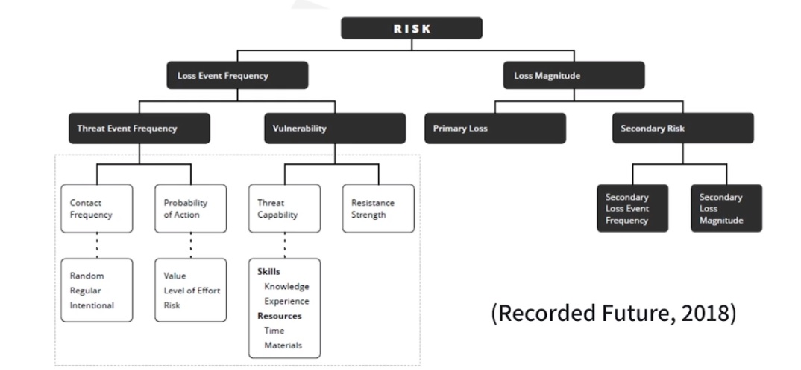
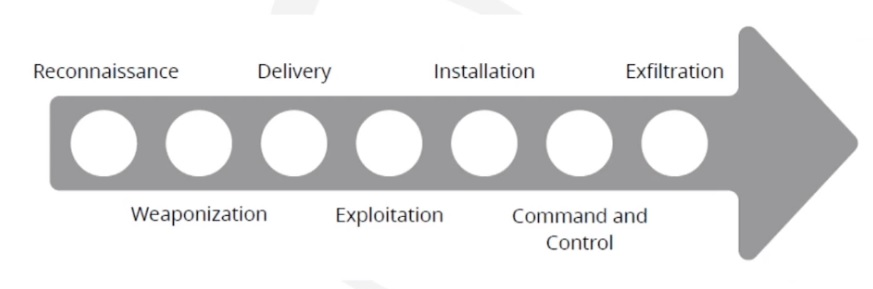
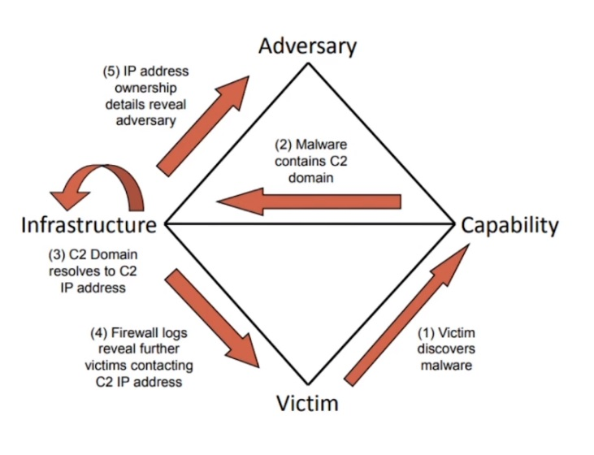
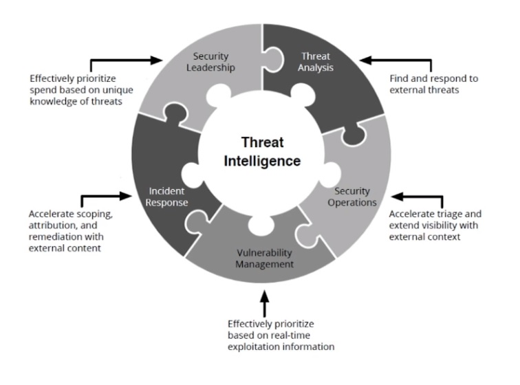
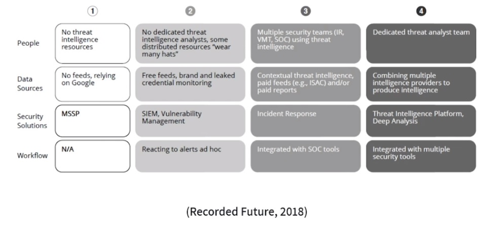
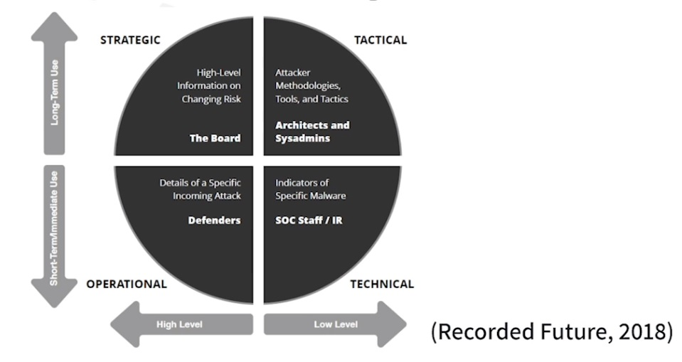

# Cyber Threat Intelligence

> Original lecture by Melinton Navas

* Introduction to CTI
* Security organization
  * SOC
  * IR
* CTI Lifecycle (Intelligence-Driven Security)
    * Tools
* CTI role in SOC, IR and Risk Analysis
* CTI for Fraud Prevention
* CTI Frameworks
  * Lockheed Martin Cyber Kill Chain
  * Diamond Model
  * MITRE ATT&CK
* Developing core of CTI implementation

---

## Introduction

### What is a Cyber Threat?

> "An event or condition that has the potential for causing asset loss and the undesirable consequences or impact from such loss." (NIST, 2019)

### Vulnerability

> "A weakness of an asset or group of assets that can be exploited by one or more threats." (ISO 27002)

### What is CTI?

* Includes information and analysis from a rich array of resources presented in a way that is easy to understand and use.

* It is valuable for all the major teams in the cyber security organization.

* Can be handled and executed mostly by the existing security staff.

### How CTI approaches an organization?

* No "one size fits all" or recipe.

* Takes into account nature of organization and information.

* Data is everywhere, information can help every organization unit, intelligente can drive the right questions to the right answers.

* The more you know, the more you're capable to learn how to defend yourself and aim your defenses the most efficient way possible.

## Security Organization

### Security Operations Center (SOC)

> "Centralized function within an organization employing people, processes, and technology to continuously monitor and improve an organization's security posture while preventing, detecting, analazying, and responding to cybersecurity incidents." (McAfee, 2019)

* Monitor for potential threats.
* Detect suspicious network activity.
* Contain active threats.
* Remediate using available technology.

### Incident Response Team (IR)

* Part of SOC...

* When SOC detects something not supposed to be happening, IR comes in.

* Vulnerability Management

* IR team requires high skill analysts since the topics covered are not entry-level security.

* Timing is critical.

### Vulnerability Management Cycle

Scan > Prioritize > Assess > Report > Fix > Verify > Start again

### Zero-day vulnerabilities

> "A vulnerability in a system or device that has been disclosed but is not yet patched." (TrendMicro, 2019)

---

## CTI Lifecycle (By Recorded Future)

Direction > Collection > Processing > Analysis > Dissemination > Feedback

### Direction

* Information assets and business processes that needs to be protected.

* Potential impacts of losing those assets or interrupting those processes.

* Types of threat intelligence that the security organization requires.

* Priorities about what to protect.

### Collection

Collection is the process of gathering information to address the most important intelligence requirements.

* Pulling metadata and logs.

* Subscribing to threat data feeds.

* Holding conversations and targeted interviews with knowledgeable sources.

* Scarping and harvesting websites and forums.

#### Media

* Security websites or vender researchs
* For human consumption
* Requires manual procedure
* May be misunderstood
* Should not be first option

#### Social Media

* High probability of misinformation
* Personal point of views may affect information
* Large need for cross-referencing with multiple sources
* Requires manual analysis

#### Threat actor forums

* Host relevant discussions
* Emerging vulnerabilities or latest research
* Heavy analysis and cross-referencing is essential

#### Dark web

* Markets & forums
* Often birthplace of super valuable intelligence
* Hard to access

### Processing

Processing is the transformation of collected information into a format usable by the organization. Almost all raw data collected needs to be processed in some manner, whether by humans or machines.

### Analysis

A human process that turns processed information into intelligence that can inform decisions.

The decisions might involve whether to investigate a potential threat, what actions to take, how to strengthen security controls, or how much investment is justified.

Not all intelligence needs to be digested via a formal report. Continual technical reporting can be done to other teams with external context.

### Dissemination

Get the intelligence output to the places it needs to go.

* What threat intelligence do they need?

* How should intelligence be presented?

* How often should we provide updates and other information?

* Through what media should the intelligence be disseminated?

* How should we follow up if they have any question?

### Feedback

Make further requirements/adjustments based on priorities.

* What types of data to collect.

* How to process and enrich data.

* How to analyze information and present it as actionable intelligence.

* To whom each type of intelligence must be disseminated, how quickly, and how fast respond to questions.

## CTI Lifecycle Tools

Threat intelligence solutions are designed to collect, process, and analyze all types of threat data from internal, technical, and human sources.

There are existing security tools, such as SIEMs (Security Information and Event Management) and analytics tools, which collect and correlate security events and log data.

---

## CTI Role

Provides __context__, which is a must.

Security analyst are unable to review, prioritize and investigate all the alerts on their own. They are forced to make mistakes:

* Ignore alerts.

* Chase false positives.

### Essential Values

* Comprehension

* Relevance

* Contextualization

* Integration

#### Comprehension

* Automatic capture of valuable information.

* Easy to understand and accurate information.

* Information can be then correlated with internal information regarding an alert.

#### Relevance

There are two types of false positives to consider:

1. Alerts that are relevant to organization but are inaccurate or unhelpful.
2. Alerts that are accurate but aren't relevant to organization.

#### Contextualization

Provides clues/relevant information to identify if an alert is relevant to organization and/or accurate.

* Corroboration from multiple sources associated with recent attacks.

* Confirmation that it has been associated with threat actors active in the industry.

* Timeline showing alert occurred before or after other events linked with attacks.

#### Integrated

CTI will help to:

* Determine whether each alert should be dismissd as a false positive.

* Score the alert according to its importance.

* Automatically enrich alert with valuable extra context.

### Impact in SOC

By enriching internal alerts with external information and context, it helps making risk-based decisions properly.

* Better scoping & filter out false alarms.

* Speed up triage.

* Simplify containing incident & analysis.

#### Triage

Triage requires a lot of context. Each of the following provide crucial information to determine the flow of a possible attack.

* Internal system logs.

* Network devices.

* Security tools.

#### Monitoring

* Outbound connections.

* Firewall alerts.

* Internal network activity.

* Session activity by user and workstation.

* Accurate time in logs.

### Impact in IR

* Reduce reactiveness by defining proper scope and incident containment.

* Prepare process in advance.

* Remediate data exposure and stolen assets.

#### Reaction timing is key

A typical IR process goes this way:

1. Incident detection
2. Discovery
3. Triage and containment
4. Remediation
5. Going back to normal operations

Each one of these steps requires high reactive response and most of the time it is not done until an alert is flagged.

#### Reduce reactiveness issue

The right preparation can be especially helpful in reducing response times by becoming less reactive.

* Identification of possible threats.
* Prioritizations.

#### CTI Impact on reactiveness, scope and incident containment

* Automatically identifying and dismissing false positive alerts.

* Erinching alerts with real-time context from across open and dark web.

* Assembling and comparing information from internal and external data sources.

* Providing details about threat and insights about attacker TTPs.

* Scoring threats according to the organization's specific needs and infrastructure.

#### Prepare process in advance

* Comprehensive up-to-date picture of threat landscape.

* Information about popular threat actor tactics, techniques, and procedures (TTPs).

* Highlights of industry- and area-specific attack trends.

#### Remediate data exposure and stolen assets

CTI could be capable of alerting when:

* Organization's assets are exposed online.

* Someone is offering the assets for sale.

### Impact in Risk Analysis

Many risk models have a hard time with:

* Vague non-quantified outputs that show threat levels with different colors.
* Threat probabilities and costs based on partial information and riddled with unfounded assumptions.

#### FAIR Risk model (Factor Analysis of Information Risk)

This framework enables organizations to create more efficient risk model by:

* Make defined measurements of risk.

* Transparent about assumptions, variables, and outcomes.

* Show specific loss probabilities in financial terms.

#### Threat Probabilities

A big part of creating a threat model involves __estimating probability of successful attacks__. To do so, CTI can:

1. Create list of threat categories that might affect the business.

2. Estimate probabilities that attacks will happen, and that they will succeed.

And this can be answered by asking the following questions:

* How many enterprises have been suffering this attacks lately and with which frequency?
* How many of those attacks were successful?
* Have we observed us being targeted?
* What type of financial loss those attacks produced?
* Etc...

---

## CTI for Fraud Prevention

* Detect when a breach has happened and security devices & framework didn't detect.
* Detect when regional industries similar to the organization's one are involved in a data breach.

---

## Frameworks

Processes, procedures, and structures to which teams can attach to in order to make everything more effective.

* Cyber Kill Chain
* Diamond Model
* MITRE ATT&CK

### Lockheed Martin: Cyber Kill Chain

* By breaking an attack up, defenders can pinpoint which stage it is in and deploy appropriate countermeasures.

* Security teams can develop standard responses for each stage.

* Cyber Kill Chain also allows organizations to build a defense-in-depth model that targets specific parts of the kill chain.

* One of the critics of this model is that it doesn't take into account how many modern attacks work. Even with this limitation, it creates a good baseline to discuss attacks and where they can be stopped.

#### 1. Reconnaissance

Research, identification and selection of attack vector / threats.

#### 2. Weaponization

Build process of malicious payload, malware, etc.

#### 3. Delivery

Transmission of weapon to the target environment.

Transmission medium can be email attachments, websites, and usb-removable media.

#### 4. Explotaition

Triggers weapon/exploit. It can be automatic or manual.

#### 5. Installation

Installation of backdoor on victim system, allowing attacker to maintain persistence inside the environment.

#### 6. Command and Control

Establish a command and control (persistence) channel, such as a ssh-connection through internet.

#### 7. Exfiltration

Intruders can take actions to achieve original objectives, such as collecting, compromising and extracting assets from target environment.

#### Indicators

* __Atomic__: indicators that cannot be broken down into smaller parts.
* __Computed__: indicators derived from data involved in an incident.
* __Behavioral__: collection of computed and atomic indicators, often subject to qualification by quantity and possibly combinatorial logic.

### Diamond Model

* Created in 2013 by now-defunct CCIATR (Center for Cyber Intelligence Analysis and Threat Research).

* Used to track attack groups over time rather than the progress of indivual attacks.

* In its most basic form, this model describes that an __adversary__ deploys a __capability__ over some __infrastructure__ against a __victim__.

* Advantages:
  * Pivoting.
  * Flexibility.
  * Extensibility.

* Disadvantages:
  * Require a lot of care and feeding.
  * Some aspects of the model, especially infrastructure, change rapidly.
  * Need to update diamond of an attacker constantly or risk of working with outdated information.

#### Pivoting

Diamond model would help you _pivot_ from initial indicators to find information about the attacker associated with an IP address, then research the known capabilities of that attacker.

#### Diamond Event

> "For every intrusion event there exists an adversary taking a step towards an intended goal by using a capability over infrastructure against a victim to produce a result".

Each event feature, has an associated confidence value. This value is left purposefully undefined as each model implementation may understand confidence differently.

#### Flexibility & Extensibility

One of the big advantages of Diamond Model is its flexibility and extensibility. Other features of an attack can be tracked besides the four core ones:

* Phase
* Result
* Direction
* Methodology
* Resources

#### Adversary

> "There exists a set of adversaries (insiders, outsiders, individuals, groups, and organizations) which seek to compromise computer systems or networks to further their intent and satisfy their needs."

#### Capability

* Capability describes tools/techniques of the adversary used in the event.
* All vulnerabilities and exposures that can be utilized by adversary capability regardless of victim are considered its __capacity__.

#### Infrastructure

Describes physical/logical communication structures that adversary uses to deliver a capability, maintain control of capabilities, and effect results from the victim.

#### Victim

> "A victim is the target of the adversary and against whom vulnerabilities and exposures are exploited and capabilities used. As with other features, a victim can be described in whichever way necessary and appropriate: organization, person, target email address, IP address, domain, etc."

#### Vulnerabilities & Exposures

> "Every system, and by extension every victim asset, has vulnerabilities and exposures."

These can be described as broadly as _"lack of user education causing email-borne hyperlinks to be clicked"_, or as specific as a CVE to fit the documentation requirements of the event.

### MITRE ATT&CK

MITRE is a unique organization in the US, responsible for managing federal funding for research projects across multiple federal agencies. It is responsible for the development of __Common Vulnerabilities and Exposures (CVE)__, and also developed specific frameworks for CTI.

ATT&CK stands for __Adversarial Tactics, Techniques, and Common Knowledge__, and it was created to address four main issues:

1. Adversary's behaviors.
2. Lifecycle models that didn't fit.
3. Applicability to real enviornments.
4. Common taxonomy.

#### ATT&CK MATRIX

ATT&CK uses 11 different tactic categories to describe adversary's behavior:

1. Initial access
2. Execution
3. Persistence
4. Privilege escalation
5. Defense evasion
6. Credential access
7. Discovery
8. Lateral movement
9. Collectio
10. Exfiltration
11. Command and control

#### ATT&CK coverage

This clasification of behaviors, allows teams to easily track adversary's behavior and:

* Prioritize incident responses.
* Tie indicators to attackers.
* Identify holes in an organization's security posture.

---

## Developing core of CTI implementation

* Preparing your ground
* Key success factors
* Team and approach
* Technical resources

### Preparing your ground

Clarify each group goals and define a solid start point to provide btter intelligence.

* What are their greatest risk?
* How can CTI help in addressing those risks?
* What is the impact of addressing them?
* What information gaps do they have currently?

### Key Success Factors

* Generating quick wins with monitoring
  * Look for a few types of data that are particularly meaningful for the organization and security strategy.
  * Check for new vulnerabilities that affect your most important assets.
  * Track threat trends that pose potential risks to your business operations.
  * Watch for any leaked information on public sources.

* Automate as much as possible so people can work on making effective, informed decisions.
  * Start by fundamental task like:
    * Data aggregation
    * Comparisong
    * Labeling
    * Contextualization

* Integrate CTI with processes and infrastructure.
  * Make intelligence accessible and usable.
  * Give CTI tools visibility into security events and activities.
  * Combine and correlate internal and external data points.
  * Deliver the most important, specific, relevant and contextualized intelligence to the right group at the right time.

* Get experts help to nurture internal experts
  * Look for partners and consultants that provide both technical capabilities and expertise.

* You don't have to have it all at once to get advantage of CTI capabilities.
  * Start with current staff, data sources, and integration with existing security tools.

#### CTI maturity matrix

### Team and approach

#### Independent CTI team

* Organization independence has greater autonomy and prestige.
* It can come with political issues.
* Start with individuals who are already in cybersecurity and are applying CTI to their particular areas of security.

#### Skill set for furture members

* Correlating external data with internal telemetry.
* Providing threat situational awareness and recommendations.
* Practively hunting internal threats.
* Educating employees and customers on cyber threats.
* Engaging with threat intelligence communities.
* Identifying and managing information sources.

#### Four types of CTI

### Technical Resources

Collecting and enriching threat data:

* Human.
* Technologies.
* Combination of sources.
* CTI with AI.
* CTI communities.
