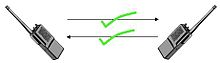
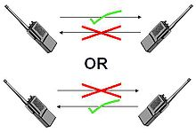

# Duplex

A duplex communication system is a **point-to-point** system composed of two or more connected parties or devices that can communicate with one another in both directions.

> Systems that do not need duplex capabilities may instead use **simplex communication**, in which one device transmits and the others can only listen, such as broadcast radio and television, garage door openers, aby monitors, wireless microphones, and surveillance cameras.

## Full Duplex

In a *full-duplex* system, both parties **can communicate with each other simulateneously**.

> An example is a plain old telephone service; the parties at both ends of a call can speak and be heard by the other party simultaneously.

There is a technical distintion between a full-duplex communication using a single physical communication channel for both directions simultaneously and **dual-simplex** communication that uses two distinct channels, one for each direction.

### No collisions

Full-duplex has several benefits over the use of half-duplex. Since there is only one transmitter on each twisted pair there is **no contention** and **no collisions** so time is not wasted by having to wait or retransmit frames.

### Echo Cancellation

Full-duplex audio systems like telephones can create *echo*, which occurs when the sound originating from the far end comes out of the speaker at the near end, and re-enters the microphone there and, is then sent back to the far end. The sound then reappears at the original source end but delayed.

*Echo cancellation* is a **singal-processing operation** that **substracts the far-end signal from the microphone signal before it is sent back** over the network. It is an important technology allowing modems to achieve good full-duplex performance.

## Half Duplex

In a *half-duplex* or *semiduplex* system, both parties can communicate with each other, but not simultaneously; **the communication is one direction at a time**.

> An example is a walkie-talkie, a two-way radio that has a push-to-talk button, which turns on the transmitter and turns off the receiver.

Half-duplex systems are usuallly used to **conserve bandwith** since only a **single communication channel** is needed and is shared alternately between the two directions.

### Collisions

In half-duplex systems, if more than one party transmits at the same time, a *collision* occurs, rsulting in **lost or distorted messages**.

### Time-division multiplexing

In automatic communications systems suh as two-way data-links, *time-division multiplexing* can be used for time allocations for communications in a half-duplex system.

> For example, station A on one end of the data link could be allowed to transmit for exactly one second, then station B on the other end could be allowed to transmit for exactly one second, and then the cycle repeats. In this scheme, the channel is never left idle.
