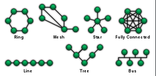

# Network Topologies

> https://en.wikipedia.org/wiki/Network_topology

*Network Topology* is the arrangement of the elements (links, nodes, etc.) of a communication network. It is the *topological* structure of a network and may be depicted **physically**, refering to the placement of the various components of a network (e.g., device location and cable installation) and concerned of the *physical layer* of the *OSI model*, or **logically**, which illustrates how data flows within a network.

> Distance between nodes, physical interconnections, transmission rates, or signal types may differ between two different networks, yet their logical topologies may be identical.

it is an application of *graph theory* wherein communicating devices are modeled as links or lines between the nodes.

## Physical Topology

The **transmission medium layout** used to link devices is the physical topology of the network.

> For conductive or fiber optical mediums, this refers to the layout of cabling, thel ocations of nodes, and the links between the nodes and the cabling.

The physical topology of a network is determined by the capabilities of the network access devices and media, the level of control or fault tolerance desired, and the cost associated with cabling or telecommunication circuits.

## Logical Topology

*Logical Topology* is the way that the signals act on the network media, or the way that the data passes through the network from one device to the next without regard to the physical interconnection of the devices.

> A network's logical topology is not necessarily the same as its physical topology. For example, the original twisted pair *Ethernet* using *repeater hubs* was a logical bus topology carried on a physical star topology. *Token Ring* is a logical ring topology, but is wired as a physical star from the *media access unit*;.

Logical topologies are often closely associated with *Media Access Controll* methods and protocols.

Some networks are able to dynamically .
change their logical topology through configuration changes to their routers and switches.
