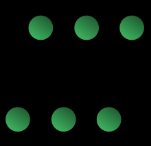

# Bus Network Topology

* Nodes are directly connected to a **common half-duplex link** called a **bus**.

* A *host* on a bus network is called a *station*. Every *station* will receive all network traffic, and the traffic generated by each station has equal transmission priority.

* A bus network forms a **single network segment** and **collision domain**.

* In order for nodes to share the bus, they use a *Medium Access Control* technology such as *carrier-sense-multiple access (CSMA)* or a *bus master*.

## Advantages

* Works well for small networks. It's very easy to connect a computer or peripheral to a linear bus.

* Requires less cable length (lower costs) than other networks.

* Linear architecture is very simple and reliable.

* Easy to extend by joining cable with connector or repeater.

## Disadvantages

* **Collisions**, resulting in packet loss.

* Bandwith is shared among nodes; performance may degrade with many nodes.

* Difficult to isolate faults.

* If there's a break in the main cable, the entire network shuts down or is divided into two separate networks.

* If any link or segment of the bus is severed, all network transmissions may fail due to a *signal reflection* caused by the lack of *electrical termination*.

