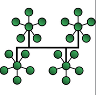

# Tree / Star-Bus Network

**Hybrid** network topology in which **star networks are interconnected via bus networks**. Tree networks are **hierarchical**, and each node can have an arbitrary number of child nodes.
