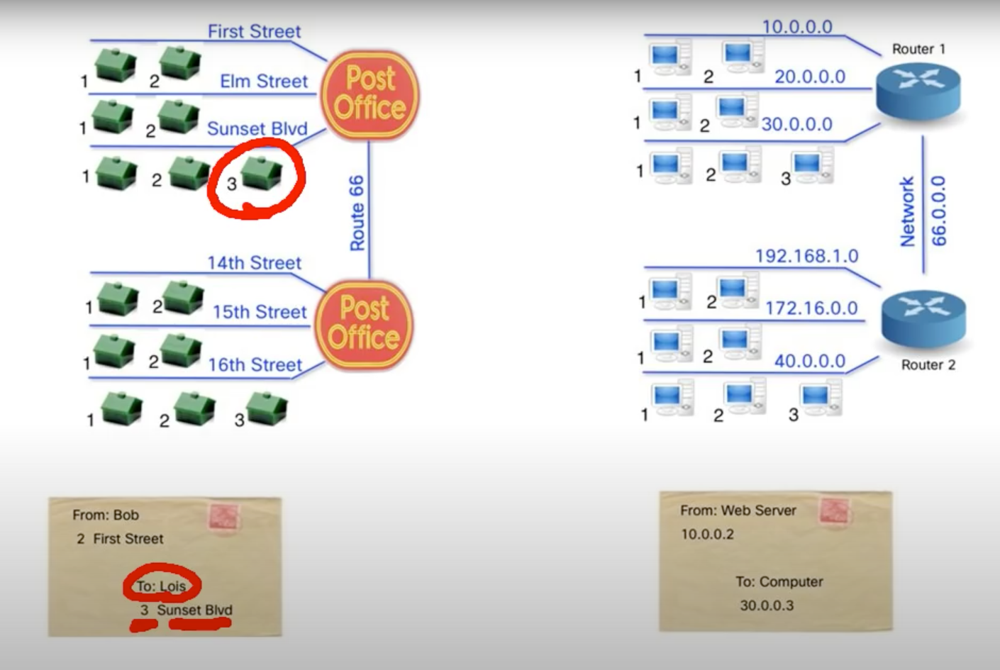

# Subnetting

Subnetting is creating multiple logical networks that exist within a single Class A, B, or C network.

Without subnetting you would only be able to use one network, which is unrealistic.

* (Intro into IPv4 Subnetting with Keith Barker & Anthony Tokalty](https://www.youtube.com/watch?v=UCoVs1Ri1IA)

## Importance of Subnetting

### Improve network performance and speed

A single broadcast packet sends out information that reaches every device connected to that network. Subnettin enables you to ensure that information remains in the subnetted network or broadcast domain, maximizing other subnets' speed and effectiveness, better controlling traffic flow thus increasing network performance.

### Reduce network congestion

Traffic destined for a device within a subnet stays in that subnet.

### Boost network security

You can set up so that devices in a subnet are unable to access the entire network, control the flow of traffic, identify threats, close points of entry, and target your responses more easily.

### Control network growth

You can set the number of possible host addresses.

### Ease administration

Subnetted networks generally are easier to manage and troubleshoot.

## IPv4 Addressing Overview

* 32 bits.
* Each address can be broken down into 4 octets of 8 bits each.
* IPv4 addresses can range from 0-255 in decimal, 0000 0000 - 1111 1111 in binary.
* 192.169.0.26 in decimal can be represented as `1100 0000 . 1010 1000 . 0000 0000 . 0001 1010`.

## Basic IPv4 Subnetting

* IPv4 address can be broken into a network and host portion.
* Each Private Address Class has a default subnet mask, which can be changed.
* Class A Subnet Mask: 255.0.0.0 or /8 (CIDR), then network address is like 10.0.0.0 (127 possibilities with 16,777,214 hosts each)
* Class B Subnet Mask: 255.255.0.0 or /16 (CIDR), then network address is like 172.16.0.0 (16,384 possibilities, with 65,534 hosts each)
* Class C Subnet Mask: 255.255.255.0 or /24 (CIDR), then network address is like 192.168.0.0 (2,097,152 possibilities, with 254 hosts each)
