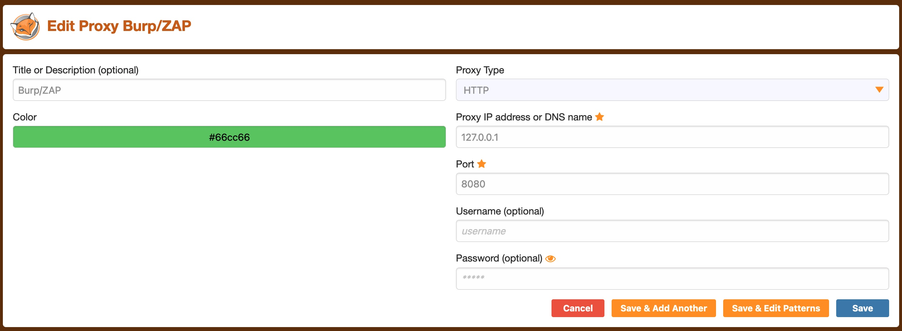
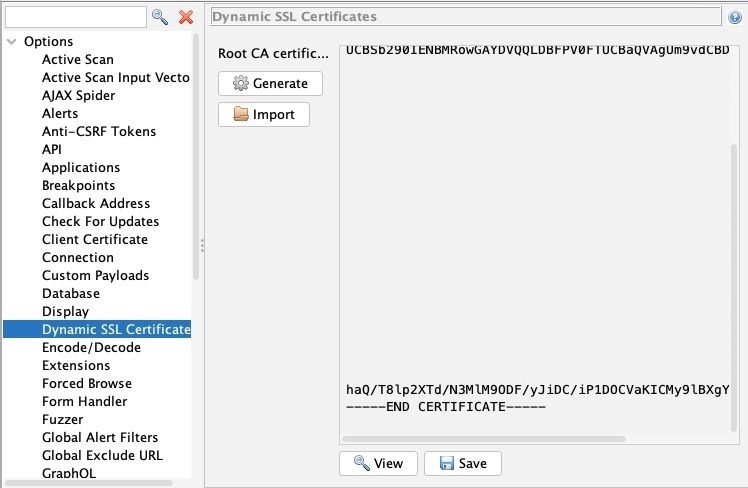
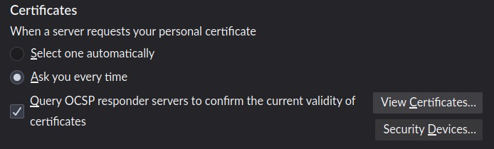
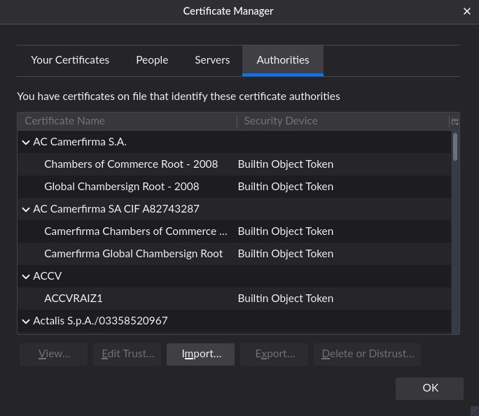
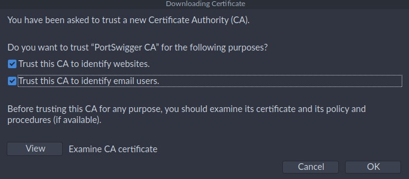

# Web proxies

## Introduction

### What ara web proxies?

Specialized tools that can be set up between a browser/mobile application and a backend server to capture and view all the web requests being sent between both ends, essentially acting as _main-in-the-middle_ (MITM) tools.

While other _network sniffing_ applications, like _Wireshark_, operate by analyzing all local traffic to see what is passing through a network, web proxies mainly work with web ports such as, but not limited to, `HTTP/80` and `HTTPS/443`.

### [Burp suite](https://portswigger.net/burp)

Burp is the most common web proxy for web penetration testing. It has various features and provides a built-in Chromium browser to test web applications.

The _community free_ version should be enough for most penetration testers.

:::tip
For Firefox, you can use [Foxy Proxy](https://addons.mozilla.org/en-US/firefox/addon/foxyproxy-standard/) to easily and quickly change the Firefox proxy.
:::

### [ZAP: OWASP zed attack proxy](https://www.zaproxy.org/)

ZAP is a free and open-source project initiated by the OWASP and maintained by the community.

The main advantage is that we will not face any throttiling or limitations in our scans that are only lifted with a paid subscription.

### CA Certificates

:::warning
Install the proxy's CA certificates. Otherwise, some HTTPS traffic may not get properly routed, or we may need to click _accept_ every time Firefox needs to send an HTTPS request
:::

For Burp, you can install it as soon as you configured it in _Foxy Proxy_ by browsing to `http://burp` and download the certificate from there.

To get's ZAP CA certificate, you can go to `Tools>Options>Dynamic SSL Certificate`.

Once you have your certificates, you can install them within Firefox by navigating to , and clicking `View Certificates`.

Then, select the `Authorities` tab, and then click on `import`.

Finally, mark the options as checked:

